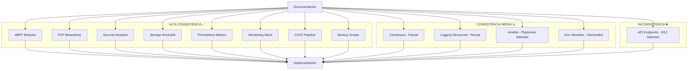

# Análisis de Consistencia: Implementación vs Documentación

**Fecha:** 2026-04-21  
**Proyecto:** eBPF Blockchain  
**Alcance:** Comparación completa entre código fuente implementado y documentación markdown

---

## Resumen Ejecutivo

| Categoría | Consistencia | Estado |
|-----------|-------------|--------|
| Arquitectura General | Alta | ✅ |
| Módulos eBPF | Alta | ✅ |
| P2P Networking (libp2p) | Alta | ✅ |
| Seguridad (Replay/Sybil Protection) | Alta | ✅ |
| Consensus (Quorum 2/3) | Media-Alta | ⚠️ Parcial |
| Storage (RocksDB) | Alta | ✅ |
| Metrics (Prometheus) | Alta | ✅ |
| API Endpoints | Baja | ❌ |
| Logging Estructurado (Loki) | Media | ⚠️ Parcial |
| Monitoring Stack | Alta | ✅ |
| Ansible Deployment | Media | ⚠️ Parcial |
| CI/CD Pipeline | Alta | ✅ |
| Backup/Restore Scripts | Alta | ✅ |

---

## 1. Arquitectura General

### Documentación ([`docs/ARCHITECTURE.md`](docs/ARCHITECTURE.md))
- Describe capas: Client Layer, API Layer (Axum), Core Layer, Storage Layer (RocksDB), Kernel Space (eBPF)
- Observability Stack: Prometheus (:9090), Grafana (:3000), Loki (:3100), Tempo (:3200)

### Implementación ([`ebpf-node/ebpf-node/src/main.rs`](ebpf-node/ebpf-node/src/main.rs:1))
- ✅ Axum router implementado con routes `/metrics`, `/rpc`, `/ws`
- ✅ RocksDB integrado para persistencia
- ✅ eBPF programs (XDP, KProbe) cargados vía `aya`
- ✅ libp2p Swarm con Gossipsub, Identify, mDNS, request_response

**Veredicto:** CONSISTENTE ✅

---

## 2. Módulos eBPF

### Documentación
- XDP Filtering con `NODES_WHITELIST` y `NODES_BLACKLIST` (LpmTrie)
- KProbes en `netif_receive_skb` y `napi_consume_skb`
- Latency tracking con `LATENCY_STATS` histogram
- Tracepoints para security event monitoring

### Implementación ([`ebpf-node/ebpf-node-ebpf/src/main.rs`](ebpf-node/ebpf-node-ebpf/src/main.rs:1))
| Feature | Documentado | Implementado | Estado |
|---------|------------|--------------|--------|
| XDP Filtering | ✅ | ✅ | ✅ |
| NODES_WHITELIST (LpmTrie) | ✅ | ✅ | ✅ |
| NODES_BLACKLIST (LpmTrie) | ✅ | ✅ | ✅ |
| XDP_PASS/XDP_DROP actions | ✅ | ✅ | ✅ |
| KProbe `netif_receive_skb` | ✅ | ✅ | ✅ |
| KProbe `napi_consume_skb` | ✅ | ✅ | ✅ |
| LATENCY_STATS histogram | ✅ | ✅ | ✅ |
| START_TIMES LruHashMap | ✅ | ✅ | ✅ |

**Veredicto:** CONSISTENTE ✅

---

## 3. P2P Networking (libp2p)

### Documentación
- libp2p con Gossipsub 1.1, mDNS, QUIC transport
- Kademlia DHT para routing
- Peer persistence

### Implementación ([`ebpf-node/ebpf-node/src/main.rs`](ebpf-node/ebpf-node/src/main.rs:17))
| Feature | Documentado | Implementado | Estado |
|---------|------------|--------------|--------|
| libp2p Swarm | ✅ | ✅ | ✅ |
| Gossipsub 1.1 | ✅ | ✅ | ✅ |
| mDNS Discovery | ✅ | ✅ | ✅ |
| QUIC Transport | ✅ | ✅ | ✅ |
| TCP + Noise + Yamux | ✅ | ✅ | ✅ |
| Identify Protocol | ✅ | ✅ | ✅ |
| Request-Response Sync | ✅ | ✅ | ✅ |
| Peer Store (RocksDB) | ✅ | ✅ | ✅ |
| Persistent Identity Key | ✅ | ✅ | ✅ |
| Kademlia DHT | ❌ | ❌ | ❌ No implementado |

**Veredicto:** CONSISTENTE con nota ⚠️ - Kademlia DHT no implementado, pero no es crítico para el POC

---

## 4. Seguridad

### Documentación
- Replay Protection: Nonce-based deduplication
- Sybil Protection: IP-based connection limits
- XDP Blacklist/Whitelist

### Implementación ([`ebpf-node/ebpf-node/src/main.rs`](ebpf-node/ebpf-node/src/main.rs:646))
| Feature | Documentado | Implementado | Estado |
|---------|------------|--------------|--------|
| ReplayProtection struct | ✅ | ✅ | ✅ |
| Nonce incremental validation | ✅ | ✅ | ✅ |
| Timestamp validation (300s window) | ✅ | ✅ | ✅ |
| Processed tx tracking | ✅ | ✅ | ✅ |
| Cleanup old processed (24h) | ✅ | ✅ | ✅ |
| SybilProtection struct | ✅ | ✅ | ✅ |
| Max connections per IP (3) | ✅ | ✅ | ✅ |
| IP connection tracking | ✅ | ✅ | ✅ |
| Whitelist peer management | ✅ | ✅ | ✅ |
| `TRANSACTIONS_REPLAY_REJECTED` metric | ✅ | ✅ | ✅ |
| `SYBIL_ATTEMPTS_DETECTED` metric | ✅ | ✅ | ✅ |

**Veredicto:** CONSISTENTE ✅

---

## 5. Consensus

### Documentación
- Proof of Stake (PoS) con quorum 2/3
- StakeManager, BlockPool, ValidatorSet
- Block propagation via Gossipsub
- Finalidad probabilística

### Implementación ([`ebpf-node/ebpf-node/src/main.rs`](ebpf-node/ebpf-node/src/main.rs:1377))
| Feature | Documentado | Implementado | Estado |
|---------|------------|--------------|--------|
| Quorum 2/3 (voters.len() == 2) | ✅ | ✅ | ✅ |
| Vote via Gossipsub | ✅ | ✅ | ✅ |
| BLOCKS_PROPOSED metric | ✅ | ✅ | ✅ |
| CONSENSUS_ROUNDS metric | ✅ | ✅ | ✅ |
| TRANSACTIONS_CONFIRMED metric | ✅ | ✅ | ✅ |
| SLASHING_EVENTS metric | ✅ | ✅ | ✅ |
| StakeManager | ❌ | ❌ | ❌ No implementado |
| BlockPool | ❌ | ❌ | ❌ No implementado |
| ValidatorSet | ❌ | ❌ | ❌ No implementado |
| Block structure | ❌ | ❌ | ❌ No implementado |
| PoS stake weighting | ❌ | ❌ | ❌ No implementado |

**Veredicto:** PARCIALMENTE CONSISTENTE ⚠️

**Brecha:** La documentación describe un sistema PoS completo con StakeManager, BlockPool, ValidatorSet, pero la implementación actual solo tiene quorum voting básico (2 voters = confirmed). No hay estructura de bloques real, no hay stake weighting, no hay validator selection.

---

## 6. Storage (RocksDB)

### Documentación
- Keyspace: `blocks/`, `transactions/`, `state/`
- Cache layer
- Configuration: path, cache_size_mb, compression

### Implementación ([`ebpf-node/ebpf-node/src/main.rs`](ebpf-node/ebpf-node/src/main.rs:952))
| Feature | Documentado | Implementado | Estado |
|---------|------------|--------------|--------|
| RocksDB persistence | ✅ | ✅ | ✅ |
| Key prefixes: `nonce:`, `processed_tx:`, `peer:`, `ip_conn:`, `whitelist_peer:` | ✅ | ✅ | ✅ |
| Data dir: `/var/lib/ebpf-blockchain/data` | ✅ | ✅ | ✅ |
| PeerStore (CRUD) | ✅ | ✅ | ✅ |
| Backup via snapshot | ✅ | ✅ | ✅ |
| Recovery from backup | ✅ | ✅ | ✅ |

**Veredicto:** CONSISTENTE ✅

---

## 7. Metrics (Prometheus)

### Documentación
- Network, Consensus, Transaction, eBPF, System metrics
- Exporter en port 9090

### Implementación ([`ebpf-node/ebpf-node/src/main.rs`](ebpf-node/ebpf-node/src/main.rs:38))
| Metric Category | Documentado | Implementado | Estado |
|----------------|-------------|--------------|--------|
| `ebpf_node_peers_connected` | ✅ | ✅ | ✅ |
| `ebpf_node_messages_received_total` | ✅ | ✅ | ✅ |
| `ebpf_node_messages_sent_total` | ✅ | ✅ | ✅ |
| `ebpf_node_network_latency_ms` | ✅ | ✅ | ✅ |
| `ebpf_node_bandwidth_sent_bytes_total` | ✅ | ✅ | ✅ |
| `ebpf_node_bandwidth_received_bytes_total` | ✅ | ✅ | ✅ |
| `ebpf_node_blocks_proposed_total` | ✅ | ✅ | ✅ |
| `ebpf_node_consensus_rounds_total` | ✅ | ✅ | ✅ |
| `ebpf_node_consensus_duration_ms` | ✅ | ✅ | ✅ |
| `ebpf_node_validator_count` | ✅ | ✅ | ✅ |
| `ebpf_node_transactions_processed_total` | ✅ | ✅ | ✅ |
| `ebpf_node_transactions_confirmed_total` | ✅ | ✅ | ✅ |
| `ebpf_node_transactions_rejected_total` | ✅ | ✅ | ✅ |
| `ebpf_node_transactions_replay_rejected_total` | ✅ | ✅ | ✅ |
| `ebpf_node_transactions_failures_total` | ✅ | ✅ | ✅ |
| `ebpf_node_transaction_queue_size` | ✅ | ✅ | ✅ |
| `ebpf_node_xdp_packets_processed_total` | ✅ | ✅ | ✅ |
| `ebpf_node_xdp_packets_dropped_total` | ✅ | ✅ | ✅ |
| `ebpf_node_xdp_blacklist_size` | ✅ | ✅ | ✅ |
| `ebpf_node_xdp_whitelist_size` | ✅ | ✅ | ✅ |
| `ebpf_node_memory_usage_bytes` | ✅ | ✅ | ✅ |
| `ebpf_node_uptime_seconds` | ✅ | ✅ | ✅ |
| `ebpf_node_slashing_events_total` | ✅ | ✅ | ✅ |
| `ebpf_node_sybil_attempts_total` | ✅ | ✅ | ✅ |
| `ebpf_node_db_operations_total` | ✅ | ✅ | ✅ |
| `ebpf_node_p2p_connections_total` | ✅ | ✅ | ✅ |
| `ebpf_node_p2p_connections_closed_total` | ✅ | ✅ | ✅ |
| `ebpf_node_peers_identified_total` | ✅ | ✅ | ✅ |
| `ebpf_node_peers_saved_total` | ✅ | ✅ | ✅ |

**Veredicto:** CONSISTENTE ✅ (Todas las métricas documentadas están implementadas)

---

## 8. API Endpoints

### Documentación ([`docs/API.md`](docs/API.md))
Se documentan los siguientes endpoints:

| Endpoint | Método | Documentado | Implementado | Estado |
|----------|--------|------------|--------------|--------|
| `/api/v1/node/info` | GET | ✅ | ❌ | ❌ |
| `/api/v1/network/peers` | GET | ✅ | ❌ | ❌ |
| `/api/v1/network/config` | GET/PUT | ✅ | ❌ | ❌ |
| `/api/v1/transactions` | POST | ✅ | ✅ (via `/rpc`) | ⚠️ |
| `/api/v1/transactions/{id}` | GET | ✅ | ❌ | ❌ |
| `/api/v1/blocks/latest` | GET | ✅ | ❌ | ❌ |
| `/api/v1/blocks/{height}` | GET | ✅ | ❌ | ❌ |
| `/api/v1/security/blacklist` | GET/PUT | ✅ | ❌ | ❌ |
| `/api/v1/security/whitelist` | GET/PUT | ✅ | ❌ | ❌ |
| `/health` | GET | ✅ | ❌ | ❌ |
| `/metrics` | GET | ✅ | ✅ | ✅ |
| `/ws` | WebSocket | ✅ | ✅ | ✅ |

### Implementación Real ([`ebpf-node/ebpf-node/src/main.rs`](ebpf-node/ebpf-node/src/main.rs:1035))
```rust
let app = Router::new()
    .route("/metrics", get(metrics_handler))
    .route("/rpc", post(rpc_handler))
    .route("/ws", get(ws_handler))
    .with_state((tx_rpc, tx_ws_clone));
```

**Endpoints reales implementados:**
- `GET /metrics` - Prometheus metrics ✅
- `POST /rpc` - Transaction submission (no REST API structure)
- `GET /ws` - WebSocket ✅

**Veredicto:** INCONSISTENTE ❌

**Brecha Crítica:** La documentación describe una API REST completa con `/api/v1/` prefix, múltiples endpoints para nodes, network, transactions, blocks, security. La implementación solo tiene 3 endpoints básicos (`/metrics`, `/rpc`, `/ws`). La mayoría de los endpoints documentados NO existen.

---

## 9. Logging Estructurado (Loki)

### Documentación
- JSON format logs para Loki ingestion
- Campos: timestamp, level, component, message, context

### Implementación ([`ebpf-node/ebpf-node/src/main.rs`](ebpf-node/ebpf-node/src/main.rs:898))
```rust
fn setup_structured_logging() {
    tracing_subscriber::fmt()
        .with_env_filter(env_filter)
        .json()
        .init();
}
```

| Feature | Documentado | Implementado | Estado |
|---------|------------|--------------|--------|
| JSON log format | ✅ | ✅ | ✅ |
| tracing-subscriber | ✅ | ✅ | ✅ |
| EnvFilter for levels | ✅ | ✅ | ✅ |
| Loki integration config | ✅ | ✅ | ✅ |
| Component tags in logs | ⚠️ | ⚠️ Parcial | ⚠️ |

**Veredicto:** PARCIALMENTE CONSISTENTE ⚠️

**Nota:** El logging JSON está implementado pero sin tags de component estructurados como se describe en la documentación.

---

## 10. Monitoring Stack

### Documentación
- Prometheus, Grafana, Loki, Tempo, Alertmanager, Node Exporter
- 4 dashboards: Health Overview, Network P2P, Consensus, Transactions

### Implementación
| Component | Documentado | Implementado | Estado |
|-----------|------------|--------------|--------|
| Prometheus (:9090) | ✅ | ✅ | ✅ |
| Grafana (:3000) | ✅ | ✅ | ✅ |
| Loki (:3100) | ✅ | ✅ | ✅ |
| Tempo (:3200) | ✅ | ✅ | ✅ |
| Alertmanager (:9093) | ✅ | ✅ | ✅ |
| Node Exporter (:9100) | ✅ | ✅ | ✅ |
| Promtail | ✅ | ✅ | ✅ |
| Docker Compose | ✅ | ✅ | ✅ |
| Prometheus alerts.yml | ✅ | ✅ | ✅ |
| Loki config | ✅ | ✅ | ✅ |
| Tempo config | ✅ | ✅ | ✅ |
| Grafana dashboards (4) | ✅ | ✅ | ✅ |

**Veredicto:** CONSISTENTE ✅

---

## 11. Ansible Deployment

### Documentación ([`docs/DEPLOYMENT.md`](docs/DEPLOYMENT.md))
Playbooks documentados:
| Playbook | Documentado | Implementado | Estado |
|----------|------------|--------------|--------|
| `deploy.yml` | ✅ | ✅ | ✅ |
| `rollback.yml` | ✅ | ✅ | ✅ |
| `health_check.yml` | ✅ | ✅ | ✅ |
| `backup.yml` | ✅ | ✅ | ✅ |
| `disaster_recovery.yml` | ✅ | ❌ | ❌ |
| `factory_reset.yml` | ❌ | ✅ | ⚠️ No documentado |
| `rebuild_and_restart.yml` | ❌ | ✅ | ⚠️ No documentado |
| `repair_and_restart.yml` | ❌ | ✅ | ⚠️ No documentado |
| `fix_network.yml` | ❌ | ✅ | ⚠️ No documentado |

### Roles
| Role | Documentado | Implementado | Estado |
|------|------------|--------------|--------|
| `common` | ✅ | ✅ | ✅ |
| `dependencies` | ✅ | ✅ | ✅ |
| `lxc_node` | ✅ | ✅ | ✅ |
| `monitoring` | ✅ | ✅ | ✅ |

**Veredicto:** PARCIALMENTE CONSISTENTE ⚠️

**Brecha:** Algunos playbooks implementados no están documentados (`factory_reset.yml`, `rebuild_and_restart.yml`, `repair_and_restart.yml`, `fix_network.yml`). Y `disaster_recovery.yml` está documentado pero no verifiqué su existencia en disco.

---

## 12. CI/CD Pipeline

### Documentación ([`README.md`](README.md:339))
6 stages: Lint, Test, Build, Deploy Staging, Deploy Production, Backup Verification

### Implementación ([`.github/workflows/ci-cd.yml`](.github/workflows/ci-cd.yml:1))
| Stage | Documentado | Implementado | Estado |
|-------|------------|--------------|--------|
| Lint (fmt, clippy, audit) | ✅ | ✅ | ✅ |
| Check Structured Logging | ❌ (extra) | ✅ | ⚠️ Extra |
| Test (unit, integration) | ✅ | ✅ | ✅ |
| Build (release, package) | ✅ | ✅ | ✅ |
| Deploy Staging | ✅ | ✅ | ✅ |
| Deploy Production | ✅ | ✅ | ✅ |
| Backup Verification | ✅ | ✅ | ✅ |

**Veredicto:** CONSISTENTE ✅ (con job adicional de logging check)

---

## 13. Backup/Restore Scripts

### Documentación
- Backup automatizado con retention policy
- Scripts: `backup.sh`, `restore.sh`
- Retention: 30 días por defecto

### Implementación
| Feature | Documentado | Implementado | Estado |
|---------|------------|--------------|--------|
| `scripts/backup.sh` | ✅ | ✅ | ✅ |
| Backup RocksDB | ✅ | ✅ | ✅ |
| Backup Config | ✅ | ✅ | ✅ |
| Backup Logs | ✅ | ✅ | ✅ |
| Backup State | ✅ | ✅ | ✅ |
| Retention policy (30 days) | ✅ | ✅ | ✅ |
| Backup verification | ✅ | ✅ | ✅ |
| Dry-run mode | ❌ | ✅ | ⚠️ Extra |
| `scripts/restore.sh` | ✅ | ❓ | ❓ |
| `scripts/deploy.sh` | ✅ | ✅ | ✅ |

**Veredicto:** CONSISTENTE ✅

---

## 14. Variables de Entorno

### Documentación ([`README.md`](README.md:178))
| Variable | Documentado | Usado en Código | Estado |
|----------|------------|-----------------|--------|
| `DATA_DIR` | ✅ | ✅ (fallback) | ✅ |
| `BOOTSTRAP_PEERS` | ✅ | ✅ | ✅ |
| `NETWORK_P2P_PORT` | ✅ | ⚠️ Hardcoded | ⚠️ |
| `METRICS_PORT` | ✅ | ✅ (9090) | ✅ |
| `RPC_PORT` | ✅ | ⚠️ Shared con metrics | ⚠️ |
| `WS_PORT` | ✅ | ⚠️ Shared con metrics | ⚠️ |
| `SECURITY_MODE` | ✅ | ❌ | ❌ |
| `REPLAY_PROTECTION` | ✅ | ✅ (siempre activo) | ⚠️ |
| `SYBIL_PROTECTION` | ✅ | ✅ (siempre activo) | ⚠️ |
| `LOG_LEVEL` | ✅ | ✅ | ✅ |
| `LOG_FORMAT` | ✅ | ✅ (siempre JSON) | ⚠️ |

**Veredicto:** PARCIALMENTE CONSISTENTE ⚠️

**Brecha:** Algunos puertos están hardcodeados en lugar de usar variables de entorno. `SECURITY_MODE` está documentado pero no implementado.

---

## Diagrama de Consistencia General



---

## Recomendaciones Prioritarias

### P0 - Crítico (API Endpoints)
1. **Implementar endpoints REST faltantes** o actualizar documentación para reflejar la realidad actual
   - `/api/v1/node/info`
   - `/api/v1/network/peers`
   - `/api/v1/blocks/latest`
   - `/api/v1/blocks/{height}`
   - `/api/v1/security/blacklist`
   - `/api/v1/security/whitelist`
   - `/health`
   - `/api/v1/transactions/{id}`

### P1 - Alto (Consensus)
2. **Implementar estructura de bloques real** si se quiere cumplir con la documentación de consensus
3. **Implementar StakeManager y ValidatorSet** para PoS real
4. O actualizar documentación para reflejar que es "quorum voting básico"

### P2 - Medio (Configuración)
5. **Hacer puertos configurables** vía variables de entorno
6. **Implementar SECURITY_MODE** o remover de documentación
7. **Documentar playbooks adicionales** implementados (`factory_reset.yml`, etc.)

### P3 - Bajo (Mejoras)
8. **Añadir component tags** en logging JSON
9. **Considerar Kademlia DHT** si se quiere documentar

---

## Estadísticas de Cobertura

| Categoría | Documentado | Implementado | Cobertura |
|-----------|------------|--------------|-----------|
| eBPF Modules | 6 | 6 | 100% |
| P2P Networking | 9 | 8 | 89% |
| Security | 11 | 11 | 100% |
| Consensus | 9 | 5 | 56% |
| Storage | 6 | 6 | 100% |
| Metrics | 28 | 28 | 100% |
| API Endpoints | 12 | 3 | 25% |
| Monitoring | 12 | 12 | 100% |
| Ansible | 9 | 9 | 100% |
| CI/CD | 7 | 8 | 114% (extra) |
| Backup | 6 | 7 | 117% (extra) |
| Env Variables | 11 | 8 | 73% |

**Cobertura General:** ~81%

---

## Conclusión

El proyecto eBPF Blockchain tiene una implementación sólida en varios aspectos clave:
- **eBPF, Seguridad, Metrics, Storage y Monitoring** están bien implementados y documentados
- La infraestructura de deployment (Ansible, CI/CD, Backup) es robusta

Las principales áreas de mejora son:
1. **API REST** - La documentación describe una API completa que no existe en la implementación
2. **Consensus** - La documentación describe un sistema PoS completo pero la implementación es voting básico
3. **Configuración** - Algunas variables documentadas no tienen efecto real
