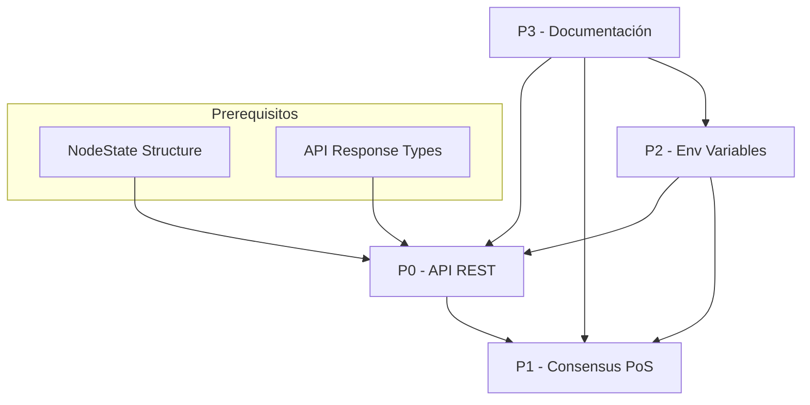

# Plan de Implementación - Recomendaciones Prioritarias

**Fecha:** 2026-04-21  
**Proyecto:** eBPF Blockchain  
**Base:** Análisis de consistencia [`plans/CONSISTENCY_ANALYSIS.md`](plans/CONSISTENCY_ANALYSIS.md)

---

## Resumen del Plan

Este plan detalla la implementación de las recomendaciones prioritarias para lograr consistencia entre la documentación y el código implementado.

### Prioridades

| Prioridad | Categoría | Impacto | Estado Actual |
|-----------|-----------|---------|---------------|
| P0 | API REST Endpoints | Crítico | 25% (3/12) |
| P1 | Estructura Consensus PoS | Alto | 56% |
| P2 | Variables de Entorno (puertos) | Medio | 73% |
| P3 | Documentación Ansible | Bajo | Parcial |

---

## FASE P0 - API REST Endpoints (Crítico)

### Objetivo
Implementar los 9 endpoints REST faltantes documentados en [`docs/API.md`](docs/API.md) para lograr consistencia completa con la documentación.

### Análisis de Estado Actual

**Estado actual del Router Axum:**
```rust
// Línea 1035-1039 de main.rs
let app = Router::new()
    .route("/metrics", get(metrics_handler))
    .route("/rpc", post(rpc_handler))
    .route("/ws", get(ws_handler))
    .with_state((tx_rpc, tx_ws_clone));
```

**AppState actual:**
```rust
// Línea 306 de main.rs
type AppState = (mpsc::Sender<Transaction>, broadcast::Sender<String>);
```

**Problema detectado:** El `AppState` actual solo contiene canales de comunicación internos. Para implementar los endpoints REST se necesita:
1. Acceso a la base de datos RocksDB
2. Acceso al swarm de libp2p (para información de peers)
3. Acceso a los security managers (ReplayProtection, SybilProtection)
4. Variables de configuración (puertos, interfaz)
5. Timestamp de inicio para calcular uptime

### Solución Propuesta

#### 1. Nuevo AppState Shared State

Crear una estructura `AppState` compartida que contenga todos los recursos necesarios:

```rust
use std::sync::Arc;
use tokio::sync::{Mutex, broadcast, mpsc};
use libp2p::Swarm;
use rocksdb::DB;

struct NodeState {
    start_time: std::time::Instant,
    db: Arc<DB>,
    peer_store: Arc<PeerStore>,
    replay_protection: Arc<ReplayProtection>,
    sybil_protection: Arc<SybilProtection>,
    swarm_state: Arc<Mutex<SwarmState>>,
    tx_rpc: mpsc::Sender<Transaction>,
    tx_ws: broadcast::Sender<String>,
    config: NodeConfig,
}

struct SwarmState {
    peers: Vec<PeerInfo>,
    connected_count: usize,
}

struct NodeConfig {
    iface: String,
    network_p2p_port: u16,
    metrics_port: u16,
    rpc_port: u16,
    ws_port: u16,
}
```

#### 2. Estructuras de Respuesta API

Definir estructuras para responses consistentes con [`docs/API.md`](docs/API.md):

```rust
#[derive(Serialize, Deserialize, Clone)]
pub struct NodeInfoResponse {
    pub node_id: String,
    pub version: String,
    pub uptime_seconds: u64,
    pub peers_connected: usize,
    pub blocks_proposed: u64,
    pub blocks_validated: u64,
    pub transactions_processed: u64,
    pub current_height: u64,
    pub is_validator: bool,
    pub stake: u64,
    pub reputation_score: f64,
}

#[derive(Serialize, Deserialize, Clone)]
pub struct PeerInfo {
    pub peer_id: String,
    pub address: String,
    pub transport: String,
    pub latency_ms: f64,
    pub reputation: f64,
    pub is_validator: bool,
    pub connected_since: String,
    pub messages_sent: u64,
    pub messages_received: u64,
}

#[derive(Serialize, Deserialize, Clone)]
pub struct BlockResponse {
    pub height: u64,
    pub hash: String,
    pub parent_hash: String,
    pub proposer: String,
    pub timestamp: String,
    pub transactions: Vec<Transaction>,
    pub quorum_votes: u64,
    pub total_validators: u64,
}

#[derive(Serialize, Deserialize, Clone)]
pub struct HealthResponse {
    pub status: String,
    pub uptime_seconds: u64,
    pub version: String,
    pub checks: HealthChecks,
}

#[derive(Serialize, Deserialize, Clone)]
pub struct HealthChecks {
    pub service: String,
    pub database: String,
    pub network: String,
    pub consensus: String,
}

#[derive(Serialize, Deserialize, Clone)]
pub struct ErrorResponse {
    pub error: String,
    pub message: String,
    pub code: String,
    pub timestamp: u64,
}
```

#### 3. Endpoints a Implementar

| # | Endpoint | Método | Handler | Descripción |
|---|----------|--------|---------|-------------|
| 1 | `/health` | GET | `health_handler` | Health check básico |
| 2 | `/api/v1/node/info` | GET | `node_info_handler` | Información del nodo |
| 3 | `/api/v1/network/peers` | GET | `network_peers_handler` | Lista de peers conectados |
| 4 | `/api/v1/network/config` | GET | `network_config_get_handler` | Obtener config de red |
| 5 | `/api/v1/network/config` | PUT | `network_config_put_handler` | Actualizar config de red |
| 6 | `/api/v1/transactions` | POST | `transactions_create_handler` | Crear transacción (reemplaza `/rpc`) |
| 7 | `/api/v1/transactions/{id}` | GET | `transactions_get_handler` | Buscar transacción por ID |
| 8 | `/api/v1/blocks/latest` | GET | `blocks_latest_handler` | Último bloque |
| 9 | `/api/v1/blocks/{height}` | GET | `blocks_by_height_handler` | Bloque por altura |
| 10 | `/api/v1/security/blacklist` | GET | `security_blacklist_get_handler` | Lista de blacklist |
| 11 | `/api/v1/security/blacklist` | PUT | `security_blacklist_put_handler` | Modificar blacklist |
| 12 | `/api/v1/security/whitelist` | GET | `security_whitelist_get_handler` | Lista de whitelist |

**Nota:** El endpoint `/rpc` actual será reemplazado por `/api/v1/transactions` (POST) para mantener consistencia con la documentación.

#### 4. Handlers Individualizados

Cada handler seguirá este patrón:

```rust
async fn health_handler(State(state): State<NodeState>) -> impl IntoResponse {
    let uptime = state.start_time.elapsed().as_secs();
    let response = HealthResponse {
        status: "healthy".to_string(),
        uptime_seconds: uptime,
        version: "1.0.0".to_string(),
        checks: HealthChecks {
            service: "ok".to_string(),
            database: check_database(&state.db),
            network: check_network(&state.swarm_state),
            consensus: check_consensus(),
        },
    };
    
    if response.status == "unhealthy" {
        (axum::http::StatusCode::SERVICE_UNAVAILABLE, Json(response))
    } else {
        (axum::http::StatusCode::OK, Json(response))
    }
}
```

#### 5. Router Actualizado

```rust
let app = Router::new()
    // Health check
    .route("/health", get(health_handler))
    // Metrics (Prometheus)
    .route("/metrics", get(metrics_handler))
    // REST API v1
    .route("/api/v1/node/info", get(node_info_handler))
    .route("/api/v1/network/peers", get(network_peers_handler))
    .route("/api/v1/network/config", get(network_config_get_handler))
    .route("/api/v1/network/config", put(network_config_put_handler))
    .route("/api/v1/transactions", post(transactions_create_handler))
    .route("/api/v1/transactions/:id", get(transactions_get_handler))
    .route("/api/v1/blocks/latest", get(blocks_latest_handler))
    .route("/api/v1/blocks/:height", get(blocks_by_height_handler))
    .route("/api/v1/security/blacklist", get(security_blacklist_get_handler))
    .route("/api/v1/security/blacklist", put(security_blacklist_put_handler))
    .route("/api/v1/security/whitelist", get(security_whitelist_get_handler))
    // Legacy (mantener compatibilidad)
    .route("/rpc", post(rpc_handler))
    .route("/ws", get(ws_handler))
    .with_state(state);
```

### Verificación por Etapa

Cada endpoint se implementará y verificará individualmente:

1. **Etapa 0.1:** `NodeState` y estructuras de respuesta
   - [ ] Compilación exitosa
   - [ ] Estructuras serializables

2. **Etapa 0.2:** Health endpoint (`/health`)
   - [ ] Response correcto con status "healthy"
   - [ ] Uptime calculado correctamente

3. **Etapa 0.3:** Node info (`/api/v1/node/info`)
   - [ ] node_id desde swarm.local_peer_id()
   - [ ] Métricas actualizadas correctamente

4. **Etapa 0.4:** Network peers (`/api/v1/network/peers`)
   - [ ] Lista de peers desde swarm.connected_peers()
   - [ ] Total count correcto

5. **Etapa 0.5:** Transactions (`/api/v1/transactions` POST + GET)
   - [ ] POST valida nonce y timestamp
   - [ ] GET busca en RocksDB

6. **Etapa 0.6:** Blocks (`/api/v1/blocks/latest` + `/api/v1/blocks/:height`)
   - [ ] Implementación básica con datos de consensus
   - [ ] Response 404 si no encontrado

7. **Etapa 0.7:** Security (`/api/v1/security/blacklist` + `/api/v1/security/whitelist`)
   - [ ] GET lee desde maps eBPF / DB
   - [ ] PUT modifica blacklist/whitelist

### Inconsistencias Detectadas y Alternativas

#### Problema 1: No hay estructura de Block real
**Inconsistencia:** La documentación describe bloques con hash, parent_hash, transactions, quorum_votes, pero la implementación actual solo guarda tx_ids con sets de voters.

**Alternativas:**
1. **A (Recomendada):** Implementar estructura Block mínima que mapee a datos existentes
2. **B:** Adaptar los endpoints de blocks para devolver datos de consenso actuales (voters por tx_id)
3. **C:** Documentar que blocks es una abstracción sobre transactions confirmadas

#### Problema 2: No hay StakeManager ni ValidatorSet
**Inconsistencia:** `NodeInfoResponse` incluye `stake`, `reputation_score`, `is_validator`, pero no existen.

**Alternativas:**
1. **A:** Implementar estructuras mínimas de stake/validator
2. **B:** Devolver valores default (stake=0, reputation=1.0, is_validator=true) temporalmente
3. **C:** Remover estos campos de la respuesta hasta implementar PoS completo

#### Problema 3: No hay API Key authentication
**Inconsistencia:** Documentación menciona `X-API-Key` header pero no implementado.

**Alternativas:**
1. **A:** Implementar middleware de API key
2. **B:** Remover referencia de documentación hasta implementarlo
3. **C:** Agregar TODO comment indicando que es pendiente

#### Problema 4: Puertos hardcodeados
**Inconsistencia:** Documentación menciona puertos configurables pero están hardcodeados.

**Alternativas:** Ver Fase P2.

---

## FASE P1 - Estructura Consensus PoS (Alto)

### Objetivo
Implementar estructura de bloques, StakeManager y ValidatorSet para consistencia con [`docs/ARCHITECTURE.md`](docs/ARCHITECTURE.md).

### Estructuras a Implementar

#### 1. Block Structure

```rust
#[derive(Clone, Serialize, Deserialize, Debug)]
pub struct Block {
    pub height: u64,
    pub hash: String,
    pub parent_hash: String,
    pub proposer: String,
    pub timestamp: u64,
    pub transactions: Vec<String>, // tx_ids
    pub quorum_votes: u64,
    pub total_validators: u64,
    pub state_root: String,
}

impl Block {
    pub fn compute_hash(&self) -> String {
        // Hash simple basado en serialización
        let content = format!("{}{}{}{}{}{}", 
            self.height, self.parent_hash, self.proposer, 
            self.timestamp, self.transactions.len(), self.state_root
        );
        // Usar sha2 o similar
        format!("0x{}", content) // Simplificado
    }
}
```

#### 2. StakeManager

```rust
struct StakeManager {
    db: Arc<DB>,
}

impl StakeManager {
    fn stake_get(&self, peer_id: &str) -> u64
    fn stake_set(&self, peer_id: &str, amount: u64)
    fn stake_total(&self) -> u64
    fn get_weighted_validator(&self) -> Option<String>
}
```

#### 3. ValidatorSet

```rust
struct ValidatorSet {
    validators: Vec<Validator>,
}

#[derive(Clone)]
struct Validator {
    peer_id: String,
    stake: u64,
    reputation: f64,
    is_active: bool,
}

impl ValidatorSet {
    fn add_validator(&mut self, validator: Validator)
    fn remove_validator(&mut self, peer_id: &str)
    fn get_proposer(&self) -> Option<String>
    fn get_quorum_size(&self) -> usize
}
```

### Verificación por Etapa

- [ ] Block struct compilado
- [ ] Block persistido en RocksDB
- [ ] StakeManager CRUD funcional
- [ ] ValidatorSet gestión de validators
- [ ] Quorum weighted implementado

---

## FASE P2 - Variables de Entorno para Puertos (Medio)

### Objetivo
Hacer configurables los puertos vía variables de entorno.

### Variables a Implementar

```rust
fn get_port_from_env(key: &str, default: u16) -> u16 {
    std::env::var(key)
        .ok()
        .and_then(|v| v.parse().ok())
        .unwrap_or(default)
}

// En main():
let network_p2p_port = get_port_from_env("NETWORK_P2P_PORT", 9000);
let metrics_port = get_port_from_env("METRICS_PORT", 9090);
let rpc_port = get_port_from_env("RPC_PORT", 9091);
let ws_port = get_port_from_env("WS_PORT", 9092);
```

### Verificación

- [ ] `NETWORK_P2P_PORT` lee de env
- [ ] `METRICS_PORT` lee de env
- [ ] `RPC_PORT` lee de env  
- [ ] `WS_PORT` lee de env
- [ ] Defaults correctos si no definido

---

## FASE P3 - Documentación Ansible (Bajo)

### Objetivo
Documentar playbooks adicionales implementados pero no documentados.

### Playbooks a Documentar

| Playbook | Descripción |
|----------|-------------|
| `factory_reset.yml` | Reset completo del nodo |
| `rebuild_and_restart.yml` | Reconstruir y reiniciar |
| `repair_and_restart.yml` | Reparar y reiniciar |
| `fix_network.yml` | Corregir problemas de red |
| `disaster_recovery.yml` | Recuperación de desastre |
| `backup.yml` | Backup automatizado |
| `deploy_cluster.yml` | Deployment cluster |

### Verificación

- [ ] README.md de ansible actualizado
- [ ] Sección para cada nuevo playbook
- [ ] Ejemplos de uso

---

## Diagrama de Dependencias entre Fases



### Orden de Implementación Recomendado

1. **P2 primero** - Variables de entorno (más simple, afecta menos código)
2. **P0 etapa 0.1-0.2** - NodeState + Health endpoint
3. **P0 etapa 0.3-0.4** - Node info + Network peers
4. **P0 etapa 0.5** - Transactions endpoints
5. **P0 etapa 0.6** - Blocks endpoints (depende de P1 parcial)
6. **P1** - Estructura Block + StakeManager + ValidatorSet
7. **P0 etapa 0.7** - Security endpoints
8. **P3** - Documentación Ansible

---

## Checklist de Verificación Final

### Compilación
- [ ] `cargo check` sin errores
- [ ] `cargo fmt` aplicado
- [ ] `cargo clippy` sin warnings críticos

### Funcionalidad
- [ ] Todos los 12 endpoints documentados están implementados
- [ ] Health endpoint retorna 200/503 correctamente
- [ ] Node info retorna datos actualizados
- [ ] Network peers lista peers conectados
- [ ] Transactions POST valida nonce
- [ ] Transactions GET busca por ID
- [ ] Blocks endpoints retornan datos
- [ ] Security endpoints gestionan blacklist/whitelist
- [ ] Puertos configurable vía env vars

### Consistencia Documentación
- [ ] [`docs/API.md`](docs/API.md) coincide con endpoints implementados
- [ ] [`docs/ARCHITECTURE.md`](docs/ARCHITECTURE.md) coincide con estructuras
- [ ] [`README.md`](README.md) actualizado con endpoints
- [ ] Variables de entorno documentadas coinciden con código

---

## Notas de Implementación

### Convención de Código
- Mantener estilo existente del proyecto
- Usar `tracing` para logging (consistente con logging estructurado)
- Usar `anyhow::Result` para error handling
- Mantener estructura modular (handlers en funciones separadas)

### Compatibilidad
- Mantener endpoints legacy (`/rpc`, `/metrics`, `/ws`)
- No romper comunicación libp2p existente
- No modificar eBPF programs

### Testing Manual
- `curl http://localhost:9091/health`
- `curl http://localhost:9091/api/v1/node/info`
- `curl http://localhost:9091/api/v1/network/peers`
- `curl -X POST http://localhost:9091/api/v1/transactions -d '{"id":"test","data":"hello","nonce":1}'`
