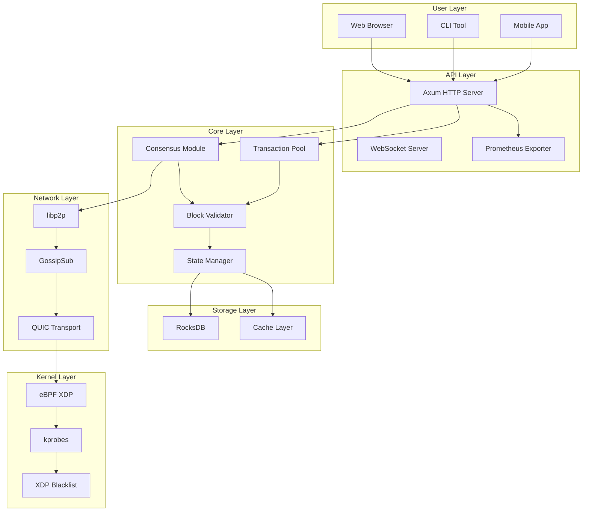

# ETAPA 5: DOCUMENTACIÓN

**Estado:** Pendiente  
**Duración estimada:** 1 semana  
**Prioridad:** 📚 BAJA  
**Meta:** Documentación completa y actualizada del proyecto

---

## 1. Resumen Ejecutivo

Esta etapa se enfoca en documentar todo el sistema para mantenimiento y expansión futura. La documentación es crucial para el crecimiento del proyecto, onboarding de nuevos desarrolladores y mantenimiento a largo plazo.

### Métricas Actuales vs. Objetivo

| Área | Estado Actual | Meta PoC | Crítica |
|------|---------------|----------|---------|
| README actualizado | 40% | 100% | 🟡 |
| API Documentation | 30% | 100% | 🟡 |
| Architecture docs | 50% | 100% | 🟠 |
| Runbook | 20% | 100% | 🟡 |
| Contributing guide | 0% | 100% | 🟡 |

---

## 2. Problemas de Documentación Identificados

### 2.1 README Incompleto (40% completitud)

**Problema:** El README no tiene información suficiente para nuevos usuarios o desarrolladores.

**Impacto:**
- Dificultad para nuevos desarrolladores para empezar
- Falta de información sobre instalación y configuración
- Sin ejemplos de uso
- Sin link a documentación más detallada

**Requisitos:**
- Guía de inicio rápido completa
- Requisitos del sistema detallados
- Ejemplos de instalación y configuración
- Enlaces a documentación adicional

### 2.2 API Documentation Incompleta (30% completitud)

**Problema:** La documentación de la API no es completa ni actualizada.

**Impacto:**
- Dificultad para integrar con la API
- Sin ejemplos de uso
- Sin especificación OpenAPI/Swagger
- Sin documentación de endpoints

**Requisitos:**
- Documentación OpenAPI completa
- Ejemplos de requests/responses
- Autenticación y autorización documentados
- Error codes documentados

### 2.3 Architecture Docs Incompletas (50% completitud)

**Problema:** Los diagramas de arquitectura no están actualizados ni completos.

**Impacto:**
- Dificultad para entender la arquitectura del sistema
- Sin diagramas de componentes
- Sin descripción de flujos de datos
- Sin documentación de decisiones arquitectónicas

**Requisitos:**
- Diagramas de arquitectura actualizados
- Descripción de componentes
- Flujos de datos documentados
- ADRs (Architecture Decision Records)

### 2.4 Runbook de Operaciones Ausente (20% completitud)

**Problema:** No existe documentación para operaciones del equipo DevOps.

**Impacto:**
- Dificultad para operaciones diarias
- Sin troubleshooting guide
- Sin procedimientos de escalado
- Sin procedimientos de recuperación de desastres

**Requisitos:**
- Runbook de operaciones diarias
- Troubleshooting guide
- Procedimientos de escalado
- Disaster recovery plan

---

## 3. Soluciones de Documentación Propuestas

### 3.1 README.md Completo

#### 3.1.1 Estructura del README

```markdown
# eBPF Blockchain


## 📋 Table of Contents

- [Overview](#overview)
- [Features](#features)
- [Quick Start](#quick-start)
- [Architecture](#architecture)
- [Installation](#installation)
- [Configuration](#configuration)
- [Usage](#usage)
- [API Documentation](#api-documentation)
- [Contributing](#contributing)
- [License](#license)

## Overview

[eBPF Blockchain](https://github.com/your-org/ebpf-blockchain) es un blockchain experimental implementado en Rust que combina:

- **eBPF** para observabilidad a nivel de kernel
- **libp2p** para networking P2P
- **Rust** para alto rendimiento y seguridad de memoria

## Features

- ✅ Consenso Proof of Stake
- ✅ Persistencia de datos con RocksDB
- ✅ Observabilidad con Prometheus + Grafana
- ✅ eBPF XDP para blacklist proactivo
- ✅ Networking P2P con libp2p
- ✅ API REST y WebSocket

## Quick Start

### Requisitos

- Linux kernel ≥ 5.10 con BTF
- Rust Nightly
- LXD ≥ 4.0 (opcional)
- Docker ≥ 20.10 (alternativa)

### Instalación Rápida

```bash
# Clonar repository
git clone https://github.com/your-org/ebpf-blockchain.git
cd ebpf-blockchain

# Build
cargo build --release

# Ejecutar
./target/release/ebpf-node
```

### Configuración con Docker

```bash
# Pull images
docker-compose pull

# Start services
docker-compose up -d

# Check status
docker-compose ps
```

## Architecture

[Diagrama de arquitectura](docs/ARCHITECTURE.md)

### Componentes Principales

1. **eBPF Node** - Nodo principal de la red
2. **RocksDB** - Storage persistente
3. **Prometheus** - Métricas y monitoring
4. **Grafana** - Dashboards de visualización
5. **Loki** - Logging centralizado

## Installation

### desde Source

```bash
# Instalar Rust
curl --proto '=https' --tlsv1.2 -sSf https://sh.rustup.rs | sh

# Clonar repository
git clone https://github.com/your-org/ebpf-blockchain.git
cd ebpf-blockchain

# Build release
cargo build --release
```

### desde Pre-built Binaries

```bash
# Descargar binary
wget https://github.com/your-org/ebpf-blockchain/releases/latest/download/ebpf-node-linux-x86_64.tar.gz

# Extraer
tar -xzf ebpf-node-linux-x86_64.tar.gz

# Agregar a PATH
export PATH=$PATH:$PWD/bin
```

### con Ansible

```bash
# Configurar inventory
cp ansible/inventory/production.yml.example ansible/inventory/production.yml

# Ejecutar deployment
ansible-playbook ansible/playbooks/deploy.yml \
  -i ansible/inventory/production.yml
```

## Configuration

### Variables de Entorno

```bash
# Node configuration
ROCKSDB_PATH=/var/lib/ebpf-blockchain/data
NETWORK_P2P_PORT=9000
NETWORK_QUIC_PORT=9001
METRICS_PORT=9090

# Security
SECURITY_MODE=strict
MINIMUM_STAKE=10000
REPLAY_PROTECTION=true

# Logging
LOG_LEVEL=info
LOG_FORMAT=json
```

### Configuration Files

```toml
# config/config.toml
[consensus]
mode = "proof_of_stake"
minimum_stake = 10000

[storage]
path = "/var/lib/ebpf-blockchain/data"
```

## Usage

### Command Line Interface

```bash
# Ver información del nodo
./bin/ebpf-blockchain-cli node info

# Ver peers conectados
./bin/ebpf-blockchain-cli network peers

# Ver métricas
./bin/ebpf-blockchain-cli metrics

# Ver logs en tiempo real
./bin/ebpf-blockchain-cli logs --follow

# Backup de datos
./bin/ebpf-blockchain-cli backup
```

### API Examples

```bash
# Obtener información del nodo
curl http://localhost:9090/api/v1/node/info

# Enviar transacción
curl -X POST http://localhost:9090/api/v1/transactions \
  -H "Content-Type: application/json" \
  -d '{"from": "addr1", "to": "addr2", "amount": 100}'

# Ver bloque por número
curl http://localhost:9090/api/v1/blocks/1
```

## API Documentation

[Documentación completa de la API](docs/API.md)

### Endpoints Principales

- `GET /api/v1/node/info` - Información del nodo
- `GET /api/v1/network/peers` - Lista de peers
- `POST /api/v1/transactions` - Crear transacción
- `GET /api/v1/blocks/:height` - Obtener bloque
- `GET /api/v1/metrics` - Métricas Prometheus

## Contributing

[Guía de contribución](docs/CONTRIBUTING.md)

## License

[MIT License](LICENSE)

```

### 3.2 API Documentation OpenAPI

#### 3.2.1 Especificación OpenAPI 3.0

```yaml
# docs/openapi.yml
openapi: 3.0.3
info:
  title: eBPF Blockchain API
  description: API para interactuar con el nodo eBPF Blockchain
  version: 1.0.0
  contact:
    name: eBPF Blockchain Team
    email: dev@ebpf-blockchain.example.com

servers:
  - url: http://localhost:9090
    description: Development server
  - url: https://api.ebpf-blockchain.example.com
    description: Production server

paths:
  /api/v1/node/info:
    get:
      summary: Get node information
      operationId: getNodeInfo
      tags:
        - Node
      responses:
        '200':
          description: Successful response
          content:
            application/json:
              schema:
                $ref: '#/components/schemas/NodeInfo'

  /api/v1/network/peers:
    get:
      summary: Get list of connected peers
      operationId: getPeers
      tags:
        - Network
      responses:
        '200':
          description: Successful response
          content:
            application/json:
              schema:
                $ref: '#/components/schemas/PeersList'

  /api/v1/transactions:
    post:
      summary: Create new transaction
      operationId: createTransaction
      tags:
        - Transactions
      requestBody:
        required: true
        content:
          application/json:
            schema:
              $ref: '#/components/schemas/Transaction'
      responses:
        '201':
          description: Transaction created
          content:
            application/json:
              schema:
                $ref: '#/components/schemas/TransactionResult'
        '400':
          description: Invalid transaction

components:
  schemas:
    NodeInfo:
      type: object
      properties:
        node_id:
          type: string
          format: uuid
        version:
          type: string
        uptime_seconds:
          type: integer
          format: int64
        peers_connected:
          type: integer
        blocks_proposed:
          type: integer

    Transaction:
      type: object
      required:
        - from
        - to
        - amount
      properties:
        from:
          type: string
          format: address
        to:
          type: string
          format: address
        amount:
          type: integer
          format: int64
        nonce:
          type: integer
          format: uint64
        signature:
          type: string
          format: byte

    TransactionResult:
      type: object
      properties:
        hash:
          type: string
          format: byte
        status:
          type: string
          enum: [pending, confirmed, failed]
        block_number:
          type: integer
          format: int64
```

#### 3.2.2 Documentación de Endpoints

```markdown
# API Documentation

## Authentication

Todos los endpoints requieren autenticación mediante API key.

```bash
curl -H "X-API-Key: your-api-key" http://localhost:9090/api/v1/node/info
```

## Endpoints

### Node

#### GET /api/v1/node/info

Obtener información del nodo.

**Response:**

```json
{
  "node_id": "550e8400-e29b-41d4-a716-446655440000",
  "version": "1.0.0",
  "uptime_seconds": 3600,
  "peers_connected": 5,
  "blocks_proposed": 100
}
```

### Network

#### GET /api/v1/network/peers

Obtener lista de peers conectados.

**Response:**

```json
{
  "peers": [
    {
      "peer_id": "12D3Koo...",
      "address": "192.168.1.100:9000",
      "transport": "QUIC",
      "latency_ms": 50,
      "reputation": 0.95
    }
  ]
}
```

### Transactions

#### POST /api/v1/transactions

Crear una nueva transacción.

**Request:**

```json
{
  "from": "addr1",
  "to": "addr2",
  "amount": 100,
  "nonce": 1
}
```

**Response:**

```json
{
  "hash": "0xabc123...",
  "status": "pending",
  "block_number": null
}
```

## Error Codes

| Code | Description |
|------|-------------|
| 400 | Bad Request - Invalid input |
| 401 | Unauthorized - Invalid API key |
| 403 | Forbidden - Insufficient permissions |
| 404 | Not Found - Resource not found |
| 500 | Internal Server Error |

```

### 3.3 Architecture Documentation

#### 3.3.1 Architecture Decision Records (ADRs)

```markdown
# ADR-001: Elección de Rust para implementación

**Estado:** Aceptado

**Contexto:**
Se requiere un lenguaje que ofrezca:
- Seguridad de memoria sin GC
- Alto rendimiento
- Fiable concurrency
- Interop con eBPF

**Decisión:**
Elegir Rust como lenguaje principal porque:
1. Memory safety sin garbage collector
2. High performance comparable a C/C++
3. Excellent concurrency primitives
4. Growing ecosystem (Aya, Tokio, libp2p)

**Consecuencias:**
- Curva de aprendizaje más pronunciada
- Build times más largos
- Mayor seguridad y confiabilidad
```

#### 3.3.2 Diagramas de Arquitectura



### 3.4 Runbook de Operaciones

#### 3.4.1 Operaciones Diarias

```markdown
# Runbook - Operaciones Diarias

## Check Health

```bash
# Ver estado del servicio
systemctl status ebpf-blockchain

# Ver health endpoint
curl http://localhost:9090/health

# Ver métricas clave
./bin/ebpf-blockchain-cli metrics summary
```

## Monitorizar

```bash
# Ver logs en tiempo real
journalctl -u ebpf-blockchain -f

# Ver métricas de red
./bin/ebpf-blockchain-cli network stats

# Ver estado del consenso
./bin/ebpf-blockchain-cli consensus status
```

## Troubleshooting Común

### Problema: Nodo no se conecta a peers

**Solución:**

1. Verificar firewall:
```bash
sudo firewall-cmd --list-ports
```

2. Verificar configuración de red:
```bash
./bin/ebpf-blockchain-cli network config
```

3. Verificar logs:
```bash
journalctl -u ebpf-blockchain -n 100 --no-pager
```

### Problema: Alto uso de CPU

**Solución:**

1. Identificar proceso:
```bash
top -p $(pgrep ebpf-node)
```

2. Ver métricas de consenso:
```bash
./bin/ebpf-blockchain-cli consensus metrics
```

3. Ajustar configuración si es necesario:
```toml
# config/config.toml
[consensus]
validator_timeout_ms = 5000
```

```

#### 3.4.2 Procedimientos de Escalado

```markdown
# Escalado Horizontal

## Añadir nuevo nodo

```bash
# 1. Configurar nuevo nodo
ansible-playbook ansible/playbooks/deploy.yml \
  -i ansible/inventory/new_node.yml

# 2. Configurar balanceo de carga
# Editar configuration del load balancer

# 3. Verificar integración
./bin/ebpf-blockchain-cli network peers
```

## Escalar base de datos

```bash
# 1. Hacer backup
./bin/ebpf-blockchain-cli backup

# 2. Detener servicio
systemctl stop ebpf-blockchain

# 3. Aumentar recursos
# Editar configuration de RocksDB
cat >> config/config.toml << EOF
[storage]
cache_size_mb = 2048
EOF

# 4. Reiniciar
systemctl start ebpf-blockchain
```

```

### 3.5 Contributing Guide

```markdown
# Guía de Contribución

## Cómo Contribuir

### 1. Reportar Bugs

Antes de reportar un bug, por favor:
- Busca issues existentes
- Proporciona información completa
- Incluye steps para reproducir

### 2. Sugerir Features

Las feature requests deben:
- Tener un problema claro
- Proporcionar ejemplos de uso
- Explicar el valor para el proyecto

### 3. Pull Requests

#### Antes de empezar

1. Fork del repository
2. Crea una branch (`feature/nombre-feature`)
3. Discute la feature en issues primero

#### Desarrollo

1. Sigue el código existente
2. Escribe tests para tu código
3. Documenta tus cambios
4. Actualiza CHANGELOG

#### Envío del PR

1. Haz push a tu branch
2. Abre Pull Request
3. Completa la PR template
4. Espera review

### Código de Conducta

- Sé respetuoso con otros contribuidores
- Sé inclusivo y acogedor
- Enfócate en lo mejor para la comunidad

### Estructura del Proyecto

```
ebpf-node/
├── src/
│   ├── consensus/      # Módulo de consenso
│   ├── network/        # Networking P2P
│   ├── storage/        # Storage con RocksDB
│   ├── ebpf/           # Programas eBPF
│   ├── metrics/        # Métricas Prometheus
│   └── api/            # API REST
├── tests/              # Tests
└── Cargo.toml
```

### Commit Guidelines

```
feat: nueva feature
fix: corrección de bug
docs: documentación
style: formato y estilo
refactor: refactorización
test: tests
chore: mantenimiento
```

### Estándares de Código

- Sigue Rust style guidelines
- Usa clippy: `cargo clippy --all-targets`
- Formatea código: `cargo fmt`
- Mantén coverage > 80%

```

---

## 4. Plan de Implementación

### 4.1 Semana: Documentación Completa

#### Día 1: README y Quick Start

**Tareas:**
1. Escribir README completo con todas las secciones
2. Agregar badges de CI/CD y license
3. Crear ejemplos de uso
4. Agregar enlaces a documentación adicional

**Criterios de aceptación:**
- [ ] README con todas las secciones requeridas
- [ ] Ejemplos de instalación funcionales
- [ ] Badges de CI/CD funcionando
- [ ] Links a documentación interna

#### Día 2: API Documentation

**Tareas:**
1. Crear especificación OpenAPI completa
2. Documentar todos los endpoints
3. Agregar ejemplos de requests/responses
4. Configurar Swagger UI

**Criterios de aceptación:**
- [ ] OpenAPI 3.0 specification completa
- [ ] Todos los endpoints documentados
- [ ] Ejemplos de requests y responses
- [ ] Swagger UI funcionando

#### Día 3: Architecture Documentation

**Tareas:**
1. Crear diagramas de arquitectura
2. Escribir descripciones de componentes
3. Documentar ADRs
4. Crear diagramas de flujo de datos

**Criterios de aceptación:**
- [ ] Diagramas de arquitectura actualizados
- [ ] Documentación de componentes
- [ ] ADRs documentados
- [ ] Diagramas de flujo funcionales

#### Día 4: Runbook de Operaciones

**Tareas:**
1. Escribir runbook de operaciones diarias
2. Crear troubleshooting guide
3. Documentar procedimientos de escalado
4. Escribir disaster recovery plan

**Criterios de aceptación:**
- [ ] Runbook completo de operaciones
- [ ] Troubleshooting guide detallada
- [ ] Procedimientos de escalado
- [ ] Disaster recovery plan

#### Día 5: Contributing Guide

**Tareas:**
1. Escribir guía de contribución completa
2. Definir standards de código
3. Crear templates de PR e issues
4. Documentar workflow de contribución

**Criterios de aceptación:**
- [ ] Contributing guide completa
- [ ] Standards de código documentados
- [ ] Templates de PR e issues
- [ ] Workflow de contribución claro

#### Día 6: Revisión y Refinamiento

**Tareas:**
1. Revisar toda la documentación
2. Actualizar con cambios recientes
3. Verificar enlaces y referencias
4. Mejorar claridad y legibilidad

**Criterios de aceptación:**
- [ ] Documentación revisada por pares
- [ ] Todos los enlaces funcionando
- [ ] Lenguaje claro y conciso
- [ ] Ejemplos actualizados

#### Día 7: Pruebas y Finalización

**Tareas:**
1. Probar con nuevo desarrollador
2. Recoger feedback
3. Hacer ajustes finales
4. Crear release notes

**Criterios de aceptación:**
- [ ] Pruebas con nuevos usuarios
- [ ] Feedback incorporado
- [ ] Documentación finalizada
- [ ] Release notes actualizados

---

## 5. Estructura de Documentación

```
docs/
├── ARCHITECTURE.md         # Arquitectura del sistema
├── API.md                  # Documentación de API
├── CONTRIBUTING.md         # Guía de contribución
├── DEVELOPMENT.md          # Guía de desarrollo
├── OPERATIONS.md           # Runbook de operaciones
├── SECURITY.md             # Documentación de seguridad
├── DEPLOYMENT.md           # Guía de deployment
├── OPENAPI.md              # Especificación OpenAPI
├── adr/                    # Architecture Decision Records
│   ├── 0001-rust-implementation.md
│   ├── 0002-consensus-algorithm.md
│   └── ...
└── diagrams/               # Diagramas de arquitectura
    ├── system-overview.svg
    ├── component-diagram.svg
    └── sequence-diagrams/
```

---

## 6. Herramientas de Documentación

### 6.1 Generación de Documentación

```bash
# Generar documentación de código
cargo doc --open

# Generar docs con rustdoc
cargo rustdoc -- --document-private-items

# Validar enlaces rotos
markdown-link-check docs/**/*.md
```

### 6.2 Diagramas

```bash
# Generar diagramas desde Mermaid
mermaid-cli input.md -o output.svg

# Generar desde PlantUML
plantuml -tpng diagram.puml
```

### 6.3 API Documentation

```bash
# Generar Swagger UI desde OpenAPI
swagger-ui-dist openapi.yml

# Validar OpenAPI specification
spectral lint openapi.yml
```

---

## 7. Mantenimiento de Documentación

### 7.1 Checklist de Mantenimiento

- [ ] Verificar todos los enlaces mensualmente
- [ ] Actualizar ejemplos si hay cambios
- [ ] Revisar y actualizar ADRs
- [ ] Actualizar screenshots y diagramas
- [ ] Revisar y mejorar claridad

### 7.2 Versionamiento

La documentación debe:
- Seguir versionamiento semántico
- Incluir changelog por versión
- Mantener documentación de versiones anteriores

---

## 8. Criterios de Aceptación

La Etapa 5 se considera completada cuando:

1. ✅ **README:** Completo con todas las secciones requeridas
2. ✅ **API Docs:** OpenAPI specification completa y funcionando
3. ✅ **Architecture:** Diagramas y documentación actualizados
4. ✅ **Runbook:** Operaciones diarias y troubleshooting documentados
5. ✅ **Contributing:** Guía completa para contribuidores
6. ✅ **ADRs:** Decisiones arquitectónicas documentadas
7. ✅ **Tests:** Documentación probada con nuevos usuarios
8. ✅ **Mantenimiento:** Processos de mantenimiento establecidos

---

## 9. Referencias

- [Documento 01_ESTRUCTURA_PROYECTO.md](../01_ESTRUCTURA_PROYECTO.md)
- [Etapa 1: Estabilización](../01_estabilizacion/01_ESTABILIZACION.md)
- [Etapa 2: Seguridad](../02_seguridad/02_CONSENSO_SEGURO.md)
- [Etapa 3: Observabilidad](../03_observabilidad/03_OBSERVABILIDAD.md)
- [Etapa 4: Automatización](../04_automatizacion/04_AUTOMATIZACION.md)
- [GitHub Documentation Best Practices](https://docs.github.com/en)
- [OpenAPI Specification](https://spec.openapis.org/oas/v3.0.3)
- [Markdown Guide](https://www.markdownguide.org/)

---

## 10. Historial de Cambios

| Versión | Fecha | Cambios | Autor |
|---------|-------|---------|-------|
| 1.0 | 2026-01-26 | Creación inicial del documento | @ebpf-dev |

---

*Documento bajo revisión para Etapa 5 de la mejora del proyecto ebpf-blockchain*