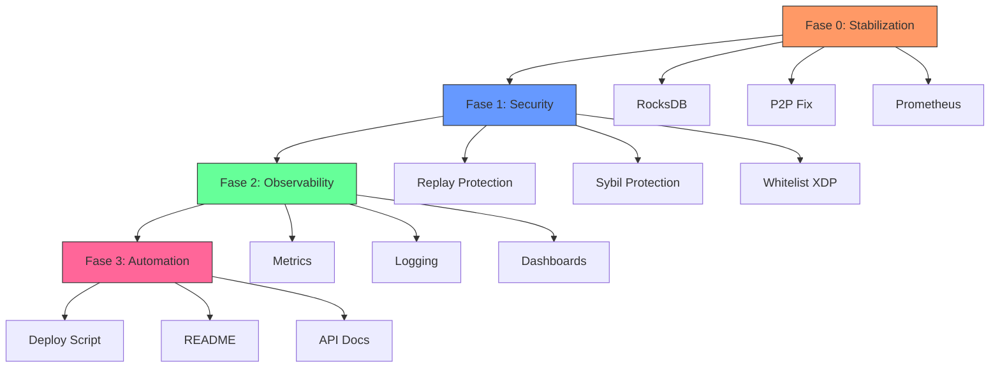

# Plan de PoC Trascendente: De Laboratorio Experimental a Sistema Demostrable

## 1. Redefinición de Criterios para una PoC Trascendente

### 1.1 Cambio de Paradigma

El plan original `plan_mejora/` sigue un enfoque **secuencial** (Etapa 1 → 2 → 3 → 4 → 5). Para una PoC trascendente, este enfoque tiene un problema fundamental: **el sistema nunca es demostrable hasta la etapa final**.

**Nuevo criterio: "Vertical Slices Demostrables"**

En lugar de completar todas las etapas horizontalmente, se deben crear **slices verticales** que puedan demostrarse de forma incremental:

```
Slice 0 (Estado Actual): Sistema que corre pero con problemas
Slice 1: Consenso funcional + Persistencia confiable
Slice 2: Seguridad básica + Observabilidad mínima
Slice 3: Automatización + Documentación
```

### 1.2 Criterios de Éxito Redefinidos

| Criterio Original | Criterio Redefinido |
|-------------------|---------------------|
| Completar etapas secuenciales | Cada slice es demostrable |
| 80%+ métricas Prometheus | Métricas críticas funcionando |
| Ansible playbook completo | Deploy automatizado mínimo |
| Documentación completa | README + API docs funcionales |
| Tests unitarios | Tests de integración críticos |

### 1.3 Principios de Diseño para PoC Trascendente

1. **Principio de Demostrabilidad**: Cada incremento debe permitir una demo funcional
2. **Principio de Seguridad Mínima**: Consenso seguro es no-negociable
3. **Principio de Persistencia Confiable**: Datos sobreviven reinicios
4. **Principio de Observabilidad Útil**: Métricas que revelan problemas reales
5. **Principio de Automatización Práctica**: Deploy reproducible

## 2. Análisis de Prioridades Redefinido

### 2.1 Matriz de Impacto vs. Esfuerzo

| Componente | Impacto en Demo | Esfuerzo | Prioridad |
|------------|-----------------|----------|-----------|
| Consenso Seguro | Alto | Medio | **CRÍTICA** |
| Persistencia RocksDB | Alto | Bajo | **CRÍTICA** |
| Whitelist XDP | Medio | Medio | **ALTA** |
| Métricas Prometheus | Medio | Bajo | **ALTA** |
| Logging Estructurado | Bajo | Medio | Media |
| Grafana Dashboards | Alto | Medio | Media |
| Ansible Playbooks | Medio | Alto | Baja |
| CI/CD Pipeline | Bajo | Alto | Baja |
| Documentación | Medio | Bajo | Alta |

### 2.2 Nuevo Orden de Implementación

```
Fase 0: Stabilization (1 semana)
  ├─ RocksDB persistencia confiable
  ├─ Corrección de bugs críticos
  └─ Métricas Prometheus básicas

Fase 1: Security Foundation (1 semana)
  ├─ Replay Protection
  ├─ Sybil Protection mínima
  └─ Whitelist XDP

Fase 2: Observability (1 semana)
  ├─ Métricas completas
  ├─ Logging estructurado
  └─ Dashboards mínimos

Fase 3: Automation & Docs (1 semana)
  ├─ Deploy script automatizado
  ├─ README funcional
  └─ API documentation
```

## 3. Plan de Implementación Detallado

### 3.1 Fase 0: Stabilization (Semana 1)

#### 3.1.1 RocksDB Persistencia Confiable

**Problema Actual**: RocksDB configurado en `/tmp` se pierde en reinicio.

**Solución**:
- Mover RocksDB a `/var/lib/ebpf-blockchain/`
- Crear directorios con `mkdir -p` en build.rs
- Configurar permissions correctos
- Implementar backup automático

**Archivos a modificar**:
- [`ebpf-node/ebpf-node/src/storage/mod.rs`](ebpf-node/ebpf-node/src/storage/mod.rs)
- [`ebpf-node/ebpf-node/build.rs`](ebpf-node/ebpf-node/build.rs)

**Criterio de Éxito**:
- Datos sobreviven reinicio del nodo
- Backup automático cada 6 horas
- Restore funcional

#### 3.1.2 Corrección de Bugs Críticos

**Problemas Identificados**:
1. Conexiones P2P fallan → Debug TCP/mDNS
2. Métricas no se generan → Verificar Prometheus registration
3. Procesos no persisten → Systemd service

**Solución**:
- Implementar bootstrap peers config
- Corregir registro de métricas Prometheus
- Crear service file systemd

**Archivos a modificar**:
- [`ebpf-node/ebpf-node/src/main.rs`](ebpf-node/ebpf-node/src/main.rs)
- `ansible/playbooks/deploy_cluster.yml`

**Criterio de Éxito**:
- 2 nodos se conectan via TCP
- Métricas Prometheus scrapables
- Nodo corre como servicio systemd

#### 3.1.3 Métricas Prometheus Básicas

**Métricas Críticas**:
- `ebpf_node_peers_total`
- `ebpf_transactions_processed_total`
- `ebpf_blockchain_height`
- `ebpf_latency_ms`

**Archivos a modificar**:
- Módulo de metrics existente

**Criterio de Éxito**:
- `/metrics` endpoint responde
- Prometheus scrapea correctamente
- 4+ métricas visibles en Grafana

### 3.2 Fase 1: Security Foundation (Semana 2)

#### 3.2.1 Replay Protection

**Implementación**:
- Add `nonce` a transacciones
- Validar nonce por sender
- Almacenar nonces usados en RocksDB

**Archivos a modificar**:
- [`ebpf-node/ebpf-node-common/src/lib.rs`](ebpf-node/ebpf-node-common/src/lib.rs)
- Módulo de validación de transacciones

**Criterio de Éxito**:
- Transacción duplicada es rechazada
- Nonce incrementa correctamente

#### 3.2.2 Sybil Protection Mínima

**Implementación**:
- Limitar peers por IP (max 3)
- Implementar handshake con signature
- Whitelist de peers conocidos

**Archivos a modificar**:
- Módulo P2P/swarm
- XDP program

**Criterio de Éxito**:
- Nodo rechaza >3 conexiones misma IP
- Solo peers autenticados se conectan

#### 3.2.3 Whitelist XDP

**Mejora**:
- Cambiar de blacklist reactiva a whitelist preventiva
- Añadir reglas por defecto
- Hot-update de reglas

**Archivos a modificar**:
- [`ebpf-node/ebpf-node-ebpf/src/lib.rs`](ebpf-node/ebpf-node-ebpf/src/lib.rs)
- Mapas eBPF NODES_BLACKLIST → NODES_WHITELIST

**Criterio de Éxito**:
- Solo tráfico de whitelist pasa
- Reglas se actualizan sin reload

### 3.3 Fase 2: Observability (Semana 3)

#### 3.3.1 Métricas Completas

**Métricas a Añadir**:
- Consenso: `ebpf_consensus_votes_total`
- Red: `ebpf_messages_sent_total`, `ebpf_messages_received_total`
- Sistema: `ebpf_cpu_usage`, `ebpf_memory_usage`

#### 3.3.2 Logging Estructurado

**Implementación**:
- Formato JSON para logs
- Correlation IDs para tracing
- Niveles de log configurables

**Criterio de Éxito**:
- Logs en formato JSON parseable
- Loki capture estructura
- Search por correlation ID

#### 3.3.3 Dashboards Mínimos

**Dashboards a Crear**:
1. Node Health (CPU, memory, peers)
2. Network (connections, messages)
3. Consensus (votes, blocks)

**Criterio de Éxito**:
- 3 dashboards funcionales
- Alertas configuradas
- Gráficos con datos reales

### 3.4 Fase 3: Automation & Docs (Semana 4)

#### 3.4.1 Deploy Script Automatizado

**Implementación**:
- Script `scripts/deploy.sh`
- Variables configurables
- Health checks post-deploy

**Criterio de Éxito**:
- Deploy de 3 nodos con un comando
- Health checks pasan
- Rollback funcional

#### 3.4.2 README Funcional

**Secciones Mínimas**:
- Quick start (3 pasos)
- Architecture overview
- API endpoints
- Troubleshooting

**Criterio de Éxito**:
- Nuevo usuario puede deploy en 15 min
- Todos los links funcionan
- Ejemplos funcionales

#### 3.4.3 API Documentation

**Implementación**:
- OpenAPI spec (`docs/openapi.yml`)
- Ejemplos de curl
- Error codes

**Criterio de Éxito**:
- Spec valida con `openapi-cli`
- Todos los endpoints documentados
- Ejemplos probados

## 4. Diagrama de Dependencias



## 5. Riesgos y Mitigaciones

| Riesgo | Impacto | Mitigación |
|--------|---------|------------|
| RocksDB corruption | Alto | Backup antes de cambios |
| XDP program crash | Crítico | Safe unload mechanism |
| P2P connections still fail | Alto | Debug con tcpdump |
| Prometheus scrape fails | Medio | Verificar metrics registration |
| Build times largos | Bajo | Parallel compilation |

## 6. Criterios de Aceptación Globales

La PoC se considera lista cuando:

1. **Demo funcional**: 3 nodos corriendo, conectados, procesando transacciones
2. **Persistencia**: Datos sobreviven reinicio
3. **Seguridad**: Replay protection funciona, Sybil protection activa
4. **Observabilidad**: Grafana muestra métricas en tiempo real
5. **Automatización**: Deploy de 3 nodos con un comando
6. **Documentación**: README permite setup en 15 min

## 7. Comparación con Plan Original

| Aspecto | Plan Original | Plan Redefinido |
|---------|---------------|-----------------|
| Enfoque | Horizontal (todas las etapas) | Vertical (slices demostrables) |
| Demo primera vez | Semana 8+ | Semana 2 |
| Riesgo principal | Bloqueo al final | Feedback continuo |
| Valor al cliente | Todo o nada | Incremental |
| Flexibilidad | Rígido (secuencial) | Ágil (adaptativo) |

## 8. Recomendaciones Finales

1. **Empezar con RocksDB**: Es el cambio con mayor impacto y menor riesgo
2. **Validar P2P temprano**: Si las conexiones no funcionan, nada más importa
3. **Seguridad desde el inicio**: No deferir replay protection
4. **Observabilidad incremental**: Métricas básicas primero, dashboards después
5. **Documentación continua**: No dejar para el final
