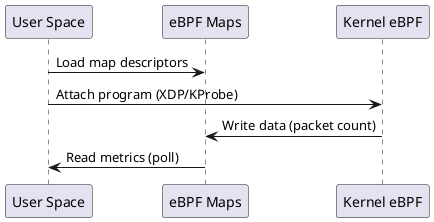

# Tutorial: Programación eBPF con AYA

## Introducción a AYA

**AYA** es un framework de Rust para escribir programas eBPF sin escribir código C. Permite desarrollar programas eBPF kernel-space y user-space en Rust puro.

### Características Principales
- ✅ Programación eBPF en Rust puro
- ✅ Compilación separada de user-space y kernel-space
- ✅ APIs type-safe para mapas eBPF
- ✅ Integración con libbpf
- ✅ Soporte para XDP, tc, kprobes, uprobes

---

## 1. Arquitectura de un Programa AYA

```
ebpf-node/
├── ebpf-node/           # User Space (Rust)
│   ├── src/main.rs      # Programa principal
│   └── Cargo.toml
├── ebpf-node-ebpf/      # Kernel Space (eBPF)
│   ├── src/main.rs      # Programas eBPF
│   └── Cargo.toml
└── ebpf-node-common/    # Código compartido
    └── src/lib.rs
```

### 1.1 Estructura del Proyecto

```toml
# ebpf-node/Cargo.toml
[package]
name = "ebpf-node"
version = "0.1.0"
edition = "2021"

[dependencies]
aya = { version = "0.13", features = ["async-runtime-tokio"] }
aya-log = "0.2"
tokio = { version = "1", features = ["full"] }
libbpf-sys = "1.4"
clap = { version = "4", features = ["derive"] }
anyhow = "1"
log = "0.4"

[[bin]]
name = "ebpf-node"
path = "src/main.rs"
```

```toml
# ebpf-node-ebpf/Cargo.toml
[package]
name = "ebpf-node-ebpf"
version = "0.1.0"
edition = "2021"

[dependencies]
aya-ebpf = "0.2"
aya-ebpf-macros = "0.2"
network-types = "0.1"
linux-ebpf = "0.1"

[lib]
crate-type = ["static"]
path = "src/main.rs"
```

---

## 2. Tu Primer Programa eBPF con AYA

### 2.1 Programa Kernel (ebpf-node-ebpf)

```rust
// ebpf-node-ebpf/src/main.rs
#![no_std]
#![no_main]

use aya_ebpf::{
    bindings::xdp_action,
    macros::{kprobe, xdp},
    programs::XdpContext,
};

// Map para contar paquetes
use aya_ebpf::maps::HashMap;

#[map]
static PACKET_COUNTER: HashMap<u64, u64> = HashMap::with_max_entries(256, 0);

#[xdp]
pub fn my_first_xdp(ctx: XdpContext) -> u32 {
    match process_packet(ctx) {
        Ok(ret) => ret,
        Err(_) => xdp_action::XDP_ABORTED,
    }
}

fn process_packet(ctx: XdpContext) -> Result<u32, ()> {
    // Incrementar contador
    let key: u64 = 0;
    let count = unsafe { PACKET_COUNTER.get(&key).copied().unwrap_or(0) };
    unsafe { PACKET_COUNTER.insert(&key, &(count + 1), 0) };

    Ok(xdp_action::XDP_PASS)
}

#[cfg(not(test))]
#[panic_handler]
fn panic(_info: &core::panic::PanicInfo) -> ! {
    loop {}
}

#[unsafe(link_section = "license")]
#[unsafe(no_mangle)]
static LICENSE: [u8; 13] = *b"Dual MIT/GPL\0";
```

### 2.2 Programa User Space (ebpf-node)

```rust
// ebpf-node/src/main.rs
use aya::{programs::Xdp, Ebpf};
use aya_log::EbpfLogger;
use clap::Parser;
use log::{info, warn};
use tokio::signal;

#[derive(Debug, Parser)]
struct Opt {
    #[clap(short, long, default_value = "eth0")]
    iface: String,
}

#[tokio::main]
async fn main() -> anyhow::Result<()> {
    let opt = Opt::parse();
    env_logger::init();

    // Cargar eBPF
    let mut ebpf = Ebpf::load(aya::include_bytes_aligned!(concat!(
        env!("OUT_DIR"),
        "/ebpf-node-ebpf"
    )))?;

    // Logger de eBPF
    if let Err(e) = EbpfLogger::init(&mut ebpf) {
        warn!("eBPF logger error: {}", e);
    }

    // Adjuntar XDP
    let prog: &mut Xdp = ebpf.program_mut("my_first_xdp").unwrap().try_into()?;
    prog.load()?;
    prog.attach(&opt.iface, Default::default())?;

    info!("XDP program attached to {}", opt.iface);

    signal::ctrl_c().await?;
    Ok(())
}
```

### 2.3 Compilar y Ejecutar

```bash
# Compilar
cargo build

# Verificar que el binario se generó
ls -la target/debug/ebpf-node

# Ejecutar (requiere privilegios o contenedor privilegiado)
sudo ./target/debug/ebpf-node --iface eth0
```

---

## 3. Implementando un Sistema de Streaming (Tipo Turbine)

**Turbine** en Solana es un protocolo de retransmisión de bloques que usa "turbine trees" para distribuir datos eficientemente. Vamos a implementar un sistema similar:

### 3.1 Concepto: Broadcast Tree

```
Bloque Nuevo
     │
     ├─────────────────────────────────┐
     │                                 │
     ▼                                 ▼
  Peer A ──────────────────────► Peer B
     │                                 │
     ├────────────────┐                │
     ▼                ▼                ▼
  Peer C ───────► Peer D          Peer E
```

### 3.2 Mapas para Broadcast Tracking

```rust
// Agregar a ebpf-node-ebpf/src/main.rs

use aya_ebpf::maps::RingBuf;

/// Tracking de peers conectados por subred (ej: /24)
#[map]
static PEER_SUBNETS: HashMap<u32, PeerInfo> = HashMap::with_max_entries(1024, 0);

/// Buffer circular para eventos de broadcast
#[map]
static BROADCAST_EVENTS: RingBuf<BlkEvent> = RingBuf::with_size(8192);

#[derive(Clone, Copy)]
#[repr(C)]
struct PeerInfo {
    last_seen: u64,
    blocks_received: u64,
    latency_ns: u64,
}

#[derive(Clone, Copy)]
#[repr(C)]
struct BlkEvent {
    block_hash: u64,
    peer_subnet: u32,
    timestamp: u64,
}
```

### 3.3 KProbe para Tracking de Conexiones

```rust
// Monitorear cuando un peer se conecta (TCP accept)
#[kprobe]
pub fn tcp_v4_connect(ctx: ProbeContext) -> u32 {
    let _ = try_tcp_v4_connect(ctx);
    0
}

fn try_tcp_v4_connect(ctx: ProbeContext) -> Result<(), ()> {
    // Capturar dirección IP del peer
    let sock_addr: *const SockAddr = ctx.arg(1).ok_or(())?;
    let addr = unsafe { (*sock_addr).sin_addr };
    
    let ip_u32 = u32::from_be_bytes(addr.s_addr);
    
    let peer = PeerInfo {
        last_seen: unsafe { bpf_ktime_get_ns() },
        blocks_received: 0,
        latency_ns: 0,
    };
    
    PEER_SUBNETS.insert(&ip_u32, &peer, 0).map_err(|_| ())?;
    
    Ok(())
}

use aya_ebpf::bindings::sockaddr_in;
use core::mem::size_of;

#[repr(C)]
struct SockAddr {
    sin_family: u16,
    sin_port: u16,
    sin_addr: in_addr,
}

#[repr(C)]
struct in_addr {
    s_addr: [u8; 4],
}
```

---

## 4. Métodos de Debugging

### 4.1 Debug con `bpf_printk` (Kernel)

```rust
use aya_ebpf::macros::kprobe;

// Imprimir en /sys/kernel/debug/tracing/trace_pipe
#[kprobe]
pub fn tcp_v4_connect_debug(ctx: ProbeContext) -> u32 {
    let _ = try_tcp_v4_connect_debug(ctx);
    0
}

fn try_tcp_v4_connect_debug(ctx: ProbeContext) -> Result<(), ()> {
    let sock_addr: *const SockAddr = ctx.arg(1).ok_or(())?;
    let addr = unsafe { (*sock_addr).sin_addr };
    
    // Usar bpf_printk (máximo 3 argumentos)
    bpf_printk!("TCP connect from: %d.%d.%d.%d\n",
        addr.s_addr[0], addr.s_addr[1],
        addr.s_addr[2], addr.s_addr[3]);
    
    Ok(())
}

// Hint: Importar el helper
extern "C" {
    fn bpf_printk(fmt: *const u8, ...) -> u64;
}
```

### 4.2 Ver Logs en User Space

```bash
# Ver tracepipe
sudo cat /sys/kernel/debug/tracing/trace_pipe

# Filtrar por proceso
sudo cat /sys/kernel/debug/tracing/trace_pipe | grep ebpf-node

# Limpiar buffer
sudo echo > /sys/kernel/debug/tracing/trace_pipe
```

### 4.3 Debug con bpftool

```bash
# Listar programas cargados
sudo bpftool prog list

# Ver detalles de un programa
sudo bpftool prog show id <id>

# Listar mapas
sudo bpftool map list

# Ver contenido de un mapa
sudo bpftool map dump id <map_id>

# Ver mapa de forma amigable
sudo bpftool -p map dump name PACKET_COUNTER
```

### 4.4 Debug con println! (User Space)

```rust
// En user space, puedes usar println! normalmente
fn main() {
    println!("Debug: Loading eBPF program...");
    
    let map = HashMap::<_, u64, u64>::try_from(
        ebpf.map("PACKET_COUNTER").unwrap()
    ).unwrap();
    
    for (key, value) in map.iter().enumerate() {
        println!("  [{}] Key: {:?}, Value: {:?}", 
            key, key, value);
    }
}
```

### 4.5 Debug con rBPF (Emulator)

```rust
// Test unitarios con rBPF
#[cfg(test)]
mod tests {
    use aya_ebpf::ebpf::{register, run_rbpf};
    
    #[test]
    fn test_packet_counter() {
        // Cargar programa
        let prog = include_bytes!("../target/bpfel-unknown-none/debug/ebpf-node");
        
        // Ejecutar en emulador (requiere setup específico)
        let result = run_rbpf(prog);
        assert!(result.is_ok());
    }
}
```

### 4.6 Debug Visual con BCC tools

```bash
# Instalar bpfcc-tools
sudo apt install bpfcc-tools linux-headers-$(uname -r)

# Ver todas las llamadas a una función
sudo /usr/share/bcc/tools/funccount 'tcp_v4_connect'

# Tracing en tiempo real
sudo /usr/share/bcc/tools/trace 'tcp_v4_connect "%d.%d.%d.%d"'
```

### 4.7 Tabla de Métodos de Debug

| Método | Uso | Limitación |
|--------|-----|------------|
| `bpf_printk` | Logs en trace_pipe | Máximo 3 args, solo kernel |
| `println!` | Debug user space | Solo user space |
| `bpftool prog dump` | Ver código bytecode | Difícil de interpretar |
| `bpftool map dump` | Ver estado mapas | Solo lectura |
| `Wireshark` | Capturar paquetes | Solo red, no eBPF internals |
| `perf` | Profiling CPU | Solo overhead del sistema |

---

## 5. Herramientas de Desarrollo

### 5.1 rust-analyzer (IDE Support)

```json
// .vscode/settings.json
{
    "rust-analyzer.checkOnSave.command": "clippy",
    "rust-analyzer.cargo.features": ["all"],
    "rust-analyzer.procMacro.enable": true
}
```

### 5.2 cargo-watch (Hot Reload)

```bash
# Instalar
cargo install cargo-watch

# Ejecutar con watch
cargo watch -x check -x test -x run
```

### 5.3 cargo-flamegraph (Profiling)

```bash
# Instalar
cargo install cargo-flamegraph

# Generar flamegraph
sudo cargo flamegraph --bin ebpf-node -- --iface eth0

# Ver resultado
firefox flamegraph.svg
```

### 5.4 cargo-bisect-rustc (Bisecting)

```bash
# Instalar
cargo install cargo-bisect-rustc

# Encontrar cuando un bug fue introducido
cargo bisect-rustc --start 2024-01-01 --end 2024-06-01 \
    --test test_packet_counter
```

### 5.5 Plantuml para Diagramas



---

## 6. Patrones Comunes en AYA

### 6.1 Patrón: Contador de Paquetes

```rust
#[map]
static PACKET_COUNT: HashMap<u32, u64> = HashMap::with_max_entries(256, 0);

fn count_packet(ctx: &XdpContext) -> Result<(), ()> {
    // Extraer IP fuente
    let ethhdr: *const EthHdr = ptr_at(ctx, 0)?;
    match unsafe { (*ethhdr).ether_type } {
        EtherType::Ipv4 => {
            let ipv4hdr: *const Ipv4Hdr = ptr_at(ctx, ETH_HDR_LEN)?;
            let src = unsafe { (*ipv4hdr).src_addr };
            
            // Incrementar contador por IP
            let count = unsafe { PACKET_COUNT.get(&src).copied().unwrap_or(0) };
            unsafe { PACKET_COUNT.insert(&src, &(count + 1), 0) };
        }
        _ => {}
    }
    Ok(())
}
```

### 6.2 Patrón: Rate Limiter

```rust
#[map]
static RATE_LIMIT: HashMap<u32, TokenBucket> = HashMap::with_max_entries(1024, 0);

#[derive(Clone, Copy)]
#[repr(C)]
struct TokenBucket {
    tokens: u64,
    last_update: u64,
}

fn check_rate_limit(ctx: &XdpContext) -> Result<bool, ()> {
    let ethhdr: *const EthHdr = ptr_at(ctx, 0)?;
    let ipv4hdr: *const Ipv4Hdr = ptr_at(ctx, ETH_HDR_LEN)?;
    let src = unsafe { (*ipv4hdr).src_addr };
    
    let now = unsafe { bpf_ktime_get_ns() };
    
    let mut bucket = unsafe { RATE_LIMIT.get(&src).copied() }
        .unwrap_or(TokenBucket { tokens: 1000, last_update: now });
    
    // Regenerar tokens (100 tokens por segundo)
    let elapsed = now - bucket.last_update;
    let tokens_to_add = elapsed / 10_000_000; // 100 tokens/sec
    bucket.tokens = (bucket.tokens + tokens_to_add).min(1000);
    bucket.last_update = now;
    
    if bucket.tokens > 0 {
        bucket.tokens -= 1;
        unsafe { RATE_LIMIT.insert(&src, &bucket, 0) };
        Ok(true) // Permitido
    } else {
        Ok(false) // Rate limited
    }
}
```

### 6.3 Patrón: Bloom Filter para Deduplicación

```rust
#[map]
static BLOOM_FILTER: PerCPUHashMap<u64, u8> = PerCPUHashMap::with_max_entries(65536, 0);

fn check_and_set_bloom(ctx: &XdpContext) -> Result<bool, ()> {
    // Hash del paquete (simple XOR de headers)
    let hash = compute_packet_hash(ctx)?;
    
    // Verificar si ya fue visto
    if unsafe { BLOOM_FILTER.get(&hash).is_some() } {
        return Ok(false); // Duplicado
    }
    
    // Marcar como visto
    unsafe { BLOOM_FILTER.insert(&hash, &1, 0) };
    Ok(true) // Nuevo
}

fn compute_packet_hash(ctx: &XdpContext) -> Result<u64, ()> {
    let ethhdr: *const EthHdr = ptr_at(ctx, 0)?;
    let ipv4hdr: *const Ipv4Hdr = ptr_at(ctx, ETH_HDR_LEN)?;
    
    let src = unsafe { (*ipv4hdr).src_addr };
    let dst = unsafe { (*ipv4hdr).dst_addr };
    let proto = unsafe { (*ipv4hdr).protocol };
    
    // Simple hash XOR
    let mut hash = src;
    hash ^= dst;
    hash ^= (proto as u32) << 24;
    
    Ok(hash as u64)
}
```

### 6.4 Patrón: LPM Trie para CIDR Matching

```rust
use aya_ebpf::maps::lpm_trie::{Key, LpmTrie};

#[map]
static ROUTING_TABLE: LpmTrie<u32, RoutingEntry> = 
    LpmTrie::with_max_entries(1024, BPF_F_NO_PREALLOC);

#[derive(Clone, Copy)]
#[repr(C)]
struct RoutingEntry {
    next_hop: u32,
    interface: u32,
    metric: u32,
};

// route_lookup devuelve el next_hop para una IP
fn route_lookup(ip: u32) -> Option<RoutingEntry> {
    let key = Key::new(32, ip);
    unsafe { ROUTING_TABLE.get(&key).copied() }
}

// route_lookup_longest_prefix devuelve el match más específico
fn route_lookup_cidr(ip: u32) -> Option<RoutingEntry> {
    // Probar desde /32 hasta /0
    for prefix_len in (0..=32).rev() {
        let key = Key::new(prefix_len, ip);
        if let Some(entry) = unsafe { ROUTING_TABLE.get(&key).copied() } {
            return Some(entry);
        }
    }
    None
}
```

---

## 7. Integración con User Space

### 7.1 Lectura de Mapas desde Rust

```rust
use aya::maps::{HashMap, LpmTrie};

async fn read_counters(ebpf: &mut Ebpf) -> anyhow::Result<()> {
    let packet_count: HashMap<_, u32, u64> = 
        HashMap::try_from(ebpf.map("PACKET_COUNT")?)?;
    
    println!("=== Packet Counters ===");
    for (ip, count) in packet_count.iter() {
        println!("  {:15} -> {} packets", 
            Ipv4Addr::from(ip.to_be_bytes()), count);
    }
    
    Ok(())
}
```

### 7.2 Escritura a Mapas desde Rust

```rust
use aya::maps::{LpmTrie, lpm_trie::Key};

fn block_ip(ebpf: &mut Ebpf, ip: &str) -> anyhow::Result<()> {
    let blacklist: LpmTrie<_, u32, u32> = 
        LpmTrie::try_from(ebpf.map_mut("NODES_BLACKLIST")?)?;
    
    let ip_addr: Ipv4Addr = ip.parse()?;
    let ip_u32 = u32::from(ip_addr);
    
    let key = Key::new(32, ip_u32);
    blacklist.insert(&key, &1, 0)?;
    
    println!("Blocked IP: {}", ip);
    Ok(())
}
```

### 7.3 Notificaciones Asíncronas con RingBuf

```rust
// Kernel: Enviar evento
use aya_ebpf::maps::RingBuf;

#[map]
static EVENTS: RingBuf<UserEvent> = RingBuf::with_size(256);

#[repr(C)]
struct UserEvent {
    event_type: u32,
    timestamp: u64,
    data: [u8; 48],
};

fn emit_event(event_type: u32, data: &[u8]) {
    let mut evt = UserEvent {
        event_type,
        timestamp: unsafe { bpf_ktime_get_ns() },
        data: [0; 48],
    };
    evt.data[..data.len().min(48)].copy_from_slice(data);
    unsafe { EVENTS.output(&evt, 0) };
}

// User Space: Recibir eventos
use aya::maps::RingBuf;

async fn poll_events(ebpf: &mut Ebpf) -> anyhow::Result<()> {
    let events: RingBuf<_, UserEvent> = 
        RingBuf::try_from(ebpf.map("EVENTS")?)?;
    
    while let Some(event) = events.pop() {
        match event.event_type {
            1 => println!("Block received: {:?}", &event.data[..8]),
            2 => println!("Peer connected"),
            _ => println!("Unknown event type: {}", event.event_type),
        }
    }
    
    Ok(())
}
```

---

## 8. Ejemplo Completo: Packet Filter con Rate Limiting

### 8.1 Código eBPF Completo

```rust
// ebpf-node-ebpf/src/main.rs
#![no_std]
#![no_main]

use aya_ebpf::{
    bindings::{xdp_action, BPF_F_NO_PREALLOC},
    helpers::bpf_ktime_get_ns,
    macros::{kprobe, map, xdp},
    maps::{HashMap, PerCPUArray, RingBuf},
    programs::XdpContext,
};
use core::mem;
use network_types::{
    eth::{EthHdr, EtherType},
    ip::Ipv4Hdr,
    tcp::TcpHdr,
};

#[map]
static RATE_LIMITER: HashMap<u32, TokenBucket> = 
    HashMap::with_max_entries(10240, BPF_F_NO_PREALLOC);

#[map]
static PACKET_STATS: PerCPUArray<Stats> = PerCPUArray::with_max_entries(1, 0);

#[map]
static BLOCK_EVENTS: RingBuf<Event> = RingBuf::with_size(1024);

#[derive(Clone, Copy)]
#[repr(C)]
struct TokenBucket {
    tokens: u64,
    last_refill: u64,
}

#[derive(Clone, Copy)]
#[repr(C)]
struct Stats {
    packets_allowed: u64,
    packets_dropped: u64,
    bytes_allowed: u64,
    bytes_dropped: u64,
}

#[derive(Clone, Copy)]
#[repr(C)]
struct Event {
    timestamp: u64,
    src_ip: u32,
    reason: u32,
}

const RATE_LIMIT: u64 = 1000; // tokens por segundo
const BURST_SIZE: u64 = 100;  // tokens maximos

#[inline(always)]
unsafe fn ptr_at<T>(ctx: &XdpContext, offset: usize) -> Result<*const T, ()> {
    let start = ctx.data();
    let end = ctx.data_end();
    let len = mem::size_of::<T>();
    if start + offset + len > end {
        return Err(());
    }
    Ok((start + offset) as *const T)
}

#[xdp]
pub fn packet_filter(ctx: XdpContext) -> u32 {
    match process_packet(ctx) {
        Ok(ret) => ret,
        Err(_) => xdp_action::XDP_ABORTED,
    }
}

fn process_packet(ctx: XdpContext) -> Result<u32, ()> {
    let ethhdr: *const EthHdr = unsafe { ptr_at(&ctx, 0)? };
    match unsafe { (*ethhdr).ether_type } {
        EtherType::Ipv4 => {}
        _ => return Ok(xdp_action::XDP_PASS),
    }

    let ipv4hdr: *const Ipv4Hdr = unsafe { ptr_at(&ctx, mem::size_of::<EthHdr>())? };
    let src_ip = unsafe { (*ipv4hdr).src_addr };
    let dst_ip = unsafe { (*ipv4hdr).dst_addr };
    let protocol = unsafe { (*ipv4hdr).protocol };
    let total_len = u16::from_be(unsafe { (*ipv4hdr).total_len });

    let now = unsafe { bpf_ktime_get_ns() };
    let bucket = unsafe { RATE_LIMITER.get(&src_ip).copied() }
        .unwrap_or(TokenBucket { tokens: BURST_SIZE, last_refill: now });

    let mut tokens = bucket.tokens;
    let elapsed = now - bucket.last_refill;
    let refill = elapsed * RATE_LIMIT / 1_000_000_000;
    tokens = (tokens + refill).min(BURST_SIZE);
    
    let packet_len = total_len as u64;
    
    if tokens >= packet_len {
        // Permitido
        tokens -= packet_len;
        let mut new_bucket = TokenBucket { tokens, last_refill: now };
        unsafe { RATE_LIMITER.insert(&src_ip, &new_bucket, 0) };
        
        // Actualizar stats
        if let Some(stats) = unsafe { PACKET_STATS.get_ptr_mut(0) } {
            unsafe { (*stats).packets_allowed += 1 };
            unsafe { (*stats).bytes_allowed += packet_len };
        }
        
        Ok(xdp_action::XDP_PASS)
    } else {
        // Bloqueado por rate limit
        if let Some(stats) = unsafe { PACKET_STATS.get_ptr_mut(0) } {
            unsafe { (*stats).packets_dropped += 1 };
            unsafe { (*stats).bytes_dropped += packet_len };
        }
        
        // Emitir evento
        let event = Event {
            timestamp: now,
            src_ip,
            reason: 1, // Rate limit
        };
        unsafe { BLOCK_EVENTS.output(&event, 0) };
        
        Ok(xdp_action::XDP_DROP)
    }
}

#[cfg(not(test))]
#[panic_handler]
fn panic(_info: &core::panic::PanicInfo) -> ! {
    loop {}
}

#[unsafe(link_section = "license")]
#[unsafe(no_mangle)]
static LICENSE: [u8; 13] = *b"Dual MIT/GPL\0";
```

---

## 9. Recursos y Referencias

### Documentación
- [AYA Documentation](https://aya-rs.dev/)
- [AYA Examples](https://github.com/aya-rs/aya-examples)
- [eBPF Documentation](https://ebpf.io/)
- [libbpf Bootstrap](https://github.com/libbpf/libbpf-bootstrap)

### Herramientas
- [bpftool](https://github.com/libbpf/bpftool)
- [bpftrace](https://github.com/iovisor/bpftrace)
- [ply](https://github.com/iovisor/ply)

### Comunidad
- [eBPF Summit](https://ebpf.io/summit)
- [IO Visor Mailing List](https://lists.iovisor.org/)
- r/ebpf en Reddit

---

## 10. Errores Comunes y Soluciones

| Error | Causa | Solución |
|-------|-------|----------|
| `failed to attach: permission denied` | Sin privilegios | Usar sudo o contenedor privilegiado |
| `map type not supported` | Tipo incorrecto | Verificar tipo de mapa en AYA |
| `relocation failed` | Compilación separada | Asegurar que cargo build genera ambos targets |
| `invalid program context` | Offset incorrecto | Usar ptr_at con verificación de límites |
| `map lookup failed` | Key no existe | Usar `.get(&key).copied().unwrap_or(default)` |
