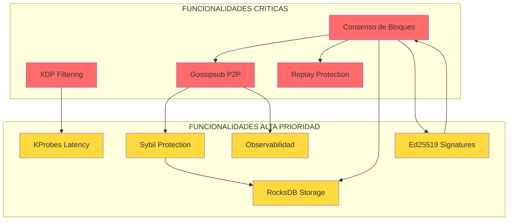

# Análisis Profundo del Sistema - eBPF Blockchain

**Fecha:** 2026-05-03
**Versión:** 1.0
**Tipo:** Auditoría Estratégica con Propuestas de Mejora

---

## Tabla de Contenidos

1. [Visión General del Sistema](#1-visión-general-del-sistema)
2. [Arquitectura y Componentes](#2-arquitectura-y-componentes)
3. [Matriz de Madurez por Módulo](#3-matriz-de-madurez-por-módulo)
4. [Funcionalidades Críticas para el Objetivo del Sistema](#4-funcionalidades-críticas-para-el-objetivo-del-sistema)
5. [Análisis de Riesgos](#5-análisis-de-riesgos)
6. [Brechas Identificadas](#6-brechas-identificadas)
7. [Plan de Mejoras - Propuestas Estratégicas](#7-plan-de-mejoras---propuestas-estratégicas)
8. [Roadmap de Implementación y Automatización](#8-roadmap-de-implementación-y-automatización)

---

## 1. Visión General del Sistema

### Propósito

**eBPF Blockchain** es un laboratorio experimental que combina tres tecnologías fundamentales:

| Tecnología | Propósito | Estado |
|------------|-----------|--------|
| **eBPF** | Observabilidad y seguridad a nivel kernel (XDP, KProbes) | ✅ 90% |
| **Proof of Stake** | Consenso distribuido con rotación de proposistas y slashing | ⚠️ 30% |
| **libp2p** | Networking P2P descentralizado (gossipsub, DHT, QUIC) | ✅ 85% |

### Topología del Cluster

```
┌─────────────────────────────────────────────────────────────────┐
│                    HOST (Linux + LXD)                           │
│                                                                 │
│  ┌──────────────┐  ┌──────────────┐  ┌──────────────┐          │
│  │ ebpf-node-1  │  │ ebpf-node-2  │  │ ebpf-node-3  │          │
│  │ 192.168.2.10 │  │ 192.168.2.11 │  │ 192.168.2.12 │          │
│  │ Validator    │  │ Validator    │  │ Validator    │          │
│  │ :9090 metrics│  │ :9090 metrics│  │ :9090 metrics│          │
│  │ :8080 API    │  │ :8080 API    │  │ :8080 API    │          │
│  └──────┬───────┘  └──────┬───────┘  └──────┬───────┘          │
│         │                 │                 │                   │
│         └─────────────────┼─────────────────┘                   │
│                           │ P2P (QUIC/TCP)                      │
│                           ▼                                     │
│  ┌──────────────────────────────────────────────────┐          │
│  │         MONITORING STACK (Docker)                │          │
│  │  Prometheus(:9090) → Grafana(:3000)              │          │
│  │  Loki(:3100)    → Tempo(:3200)                   │          │
│  └──────────────────────────────────────────────────┘          │
└─────────────────────────────────────────────────────────────────┘
```

---

## 2. Arquitectura y Componentes

### 2.1 Capas del Sistema

```
┌─────────────────────────────────────────────────────────────┐
│  CAPA CLIENTE                                                │
│  CLI → API REST (:8080) → WebSocket (:9092)                 │
└────────────────────────┬────────────────────────────────────┘
                         │
┌────────────────────────▼────────────────────────────────────┐
│  CAPA API (Axum)                                             │
│  HTTP API, WebSocket, Prometheus Exporter (:9090)           │
│  13 endpoints REST                                           │
└────────────────────────┬────────────────────────────────────┘
                         │
┌────────────────────────▼────────────────────────────────────┐
│  CAPA CORE (Rust/Tokio)                                      │
│  ┌──────────┐ ┌──────────┐ ┌──────────┐ ┌──────────┐       │
│  │Consensus │ │  P2P     │ │ Security │ │  eBPF    │       │
│  │ ⚠️ 30%   │ │ ✅ 85%   │ │ ✅ 80%   │ │ ✅ 90%   │       │
│  └──────────┘ └──────────┘ └──────────┘ └──────────┘       │
└────────────────────────┬────────────────────────────────────┘
                         │
┌────────────────────────▼────────────────────────────────────┐
│  CAPA STORAGE                                                │
│  RocksDB (blocks/, txs/, state/, nonce/, whitelist/)        │
│  ✅ 100% - Backups programados                               │
└────────────────────────┬────────────────────────────────────┘
                         │
┌────────────────────────▼────────────────────────────────────┐
│  KERNEL SPACE (eBPF)                                         │
│  XDP Filtering → KProbes (latency) → Ringbuf (disabled)     │
│  ✅ 90% - Tracepoints incompletos                            │
└─────────────────────────────────────────────────────────────┘
```

### 2.2 Flujo de Datos Principal

```
Cliente ──▶ API REST ──▶ Transaction Pool ──▶ Gossipsub Broadcast
                                              │
                                              ▼
                                         Todos los Nodos
                                              │
                           ┌──────────────────┼──────────────────┐
                           ▼                 ▼                  ▼
                    Replay Protection   Sybil Check        Vote Creation
                           │                 │                  │
                           └─────────────────┼──────────────────┘
                                             ▼
                                    Quorum Check (2/3)
                                             │
                                             ▼
                                    RocksDB Storage
                                             │
                                             ▼
                                    Block Finalization
```

---

## 3. Matriz de Madurez por Módulo

| Módulo | Estado | % | Fortalezas | Debilidades |
|--------|--------|---|------------|-------------|
| **eBPF Core** | ✅ | 90% | XDP, KProbes, Ringbuf migrado, CO-RE | `detach_all()` stub, Ringbuf disabled por verifier |
| **P2P Networking** | ✅ | 85% | libp2p completo, Gossipsub, Kademlia, QUIC | Código duplicado (gossip.rs vs event_loop.rs) |
| **API REST** | ✅ | 100% | 13 endpoints, WebSocket, Prometheus | Bloques retornan datos sintéticos |
| **Seguridad** | ✅ | 80% | Replay, Sybil, PeerStore, XDP filtering | Sin verificación de firma en votos recibidos |
| **Observabilidad** | ⚠️ | 81% | Prometheus+Grafana+Loki+Tempo, 11 dashboards | 3 métricas nunca actualizadas, alerta NodeDown rota |
| **Consenso PoS** | ⚠️ | 30% | Tx proposal, voting, signed votes Ed25519 | Sin bloques formales, quorum hardcoded, sin proposer selection |
| **Storage** | ✅ | 100% | RocksDB, backups, recovery | Iteración completa DB para queries simples |
| **Deploy** | ✅ | 90% | 11 playbooks Ansible, LXC management | Paths hardcoded, conflictos puertos |
| **Documentación** | ⚠️ | 70% | ADRs, ARCHITECTURE, API docs | Dispersa, parcialmente desactualizada |
| **Tests** | ❌ | 0% | - | Sin suite de tests automatizados |

---

## 4. Funcionalidades Críticas para el Objetivo del Sistema

### 4.1 Clasificación por Criticidad

La criticidad se evalúa en función de:
- **Impacto en el objetivo principal**: ¿Es esencial para que el sistema cumpla su propósito?
- **Dependencias**: ¿Otros módulos dependen de esta funcionalidad?
- **Riesgo de fallo**: ¿Qué pasa si esta funcionalidad falla?

#### CRÍTICA (Sin esto, el sistema no cumple su propósito)

| # | Funcionalidad | Módulo | Justificación |
|---|---------------|--------|---------------|
| **C1** | **Consenso Formal de Bloques** | Consensus | El proyecto se llama "Blockchain" pero no tiene consenso de bloques real. Solo hay propuesta/votación de transacciones sin estructura de bloques formal. |
| **C2** | **eBPF XDP Filtering** | eBPF | Es la propuesta de valor única del proyecto: filtrado de paquetes a nivel kernel. Sin esto, es solo un sistema P2P genérico. |
| **C3** | **P2P Networking (Gossipsub)** | P2P | La descentralización es fundamental. Sin P2P funcional, no hay blockchain distribuida. |
| **C4** | **Replay Protection** | Security | Sin protección contra replay, el sistema es vulnerable a ataques de retransmisión. Crítico para integridad. |

#### ALTA (Degradación significativa si falla)

| # | Funcionalidad | Módulo | Justificación |
|---|---------------|--------|---------------|
| **H1** | **Sybil Protection** | Security | Sin esto, un atacante puede crear múltiples identidades falsas y manipular el consenso. |
| **H2** | **Observabilidad (Prometheus/Grafana)** | Monitoring | Sin métricas y dashboards, es imposible detectar problemas, ataques o degradación del sistema. |
| **H3** | **Storage (RocksDB)** | Storage | Persistencia de estado. Sin esto, se pierde toda la historia de la blockchain al reiniciar. |
| **H4** | **Ed25519 Vote Signatures** | Security | Las firmas criptográficas en votos son esenciales para la autenticidad del consenso. |
| **H5** | **KProbes Latency Monitoring** | eBPF | Medición de latencia a nivel kernel es parte fundamental de la propuesta de observabilidad. |

#### MEDIA (Mejora la calidad pero no es bloqueante)

| # | Funcionalidad | Módulo | Justificación |
|---|---------------|--------|---------------|
| **M1** | **Hot Reload eBPF** | eBPF | Recarga de programas sin reinicio. Útil pero no crítico. |
| **M2** | **Proposer Rotation** | Consensus | Rotación de proposistas es parte del PoS pero el sistema funciona sin ella. |
| **M3** | **Backups automáticos** | Storage | Recuperación ante fallos. Importante pero no bloqueante. |
| **M4** | **Kademlia DHT** | P2P | Descubrimiento de peers. mDNS ya proporciona descubrimiento local. |
| **M5** | **API REST completa** | API | Interfaz de gestión. Útil para operaciones pero no esencial. |

#### BAJA (Nice to have)

| # | Funcionalidad | Módulo | Justificación |
|---|---------------|--------|---------------|
| **L1** | **WebSocket** | API | Tiempo real para clientes. No esencial. |
| **L2** | **Tempo Tracing** | Monitoring | Traces distribuidos. Útil pero sin dashboards configurados. |
| **L3** | **Legacy RPC endpoint** | API | Compatibilidad retro. No aporta valor nuevo. |

### 4.2 Diagrama de Dependencias Críticas



---

## 5. Análisis de Riesgos

### 5.1 Riesgos Críticos

| ID | Riesgo | Severidad | Probabilidad | Impacto | Mitigación |
|----|--------|-----------|--------------|---------|------------|
| **R1** | Consenso incompleto - valor principal no funcional | CRÍTICA | 100% | ALTO | Implementar consenso formal de bloques |
| **R2** | Datos simulados en APIs de bloques | CRÍTICA | 100% | ALTO | Conectar APIs con datos reales de RocksDB |
| **R3** | Sin suite de tests - riesgo de regresiones | ALTA | 80% | ALTO | Implementar tests unitarios e integración |
| **R4** | Métricas nunca actualizadas | ALTA | 100% | MEDIO | Conectar métricas con fuentes reales |
| **R5** | Verificación de firmas en votos ausente | ALTA | 90% | ALTO | Implementar validación Ed25519 en votos recibidos |
| **R6** | Quorum hardcoded a 2 nodos | MEDIA | 100% | MEDIO | Calcular 2/3 dinámicamente |
| **R7** | Hot reload no funcional | MEDIA | 90% | BAJO | Implementar detach_all correctamente |
| **R8** | Alerta NodeDown rota | MEDIA | 100% | BAJO | Corregir job name en Prometheus |

### 5.2 Análisis de Superficie de Ataque

```
Ataque Externo
     │
     ├─▶ Sybil Attack ──▶ Sybil Protection ✅ (3 conexiones/IP)
     │
     ├─▶ Replay Attack ──▶ Replay Protection ✅ (nonce + timestamp)
     │
     ├─▶ DDoS ──▶ XDP Filtering ✅ (blacklist a nivel kernel)
     │
     ├─▶ Double Vote ──▶ ❌ NO DETECTADO
     │
     ├─▶ Eclipse Attack ──▶ ❌ NO DETECTADO
     │
     └─▶ Consensus Manipulation ──▶ ❌ Sin verificación de firmas en votos
```

---

## 6. Brechas Identificadas

### 6.1 Brechas de Consenso (CRÍTICAS)

| Brecha | Descripción | Archivo Afectado |
|--------|-------------|------------------|
| **B1** | Sin estructura formal de bloques | [`event_loop.rs`](ebpf-node/ebpf-node/src/p2p/event_loop.rs) |
| **B2** | Quorum hardcoded a 2 | [`event_loop.rs`](ebpf-node/ebpf-node/src/p2p/event_loop.rs:172) |
| **B3** | Sin selección de proposer | [`event_loop.rs`](ebpf-node/ebpf-node/src/p2p/event_loop.rs) |
| **B4** | Sin verificación de firma en votos | [`event_loop.rs`](ebpf-node/ebpf-node/src/p2p/event_loop.rs:235) |
| **B5** | Sin detección de double-vote | No implementado |
| **B6** | Sin slashing funcional | Métrica existe pero sin lógica |

### 6.2 Brechas de Observabilidad

| Brecha | Descripción | Impacto |
|--------|-------------|---------|
| **B7** | `XDP_PACKETS_DROPPED` nunca se actualiza | Dashboard seguridad inusable |
| **B8** | `TRANSACTION_QUEUE_SIZE` nunca se actualiza | Dashboard cola vacío |
| **B9** | `CONSENSUS_DURATION` nunca se actualiza | Métrica rendimiento inusable |
| **B10** | Alerta `NodeDown` usa job incorrecto | Alerta nunca se activa |
| **B11** | Tempo sin dashboards | Tracing sin visualización |

### 6.3 Brechas de Código

| Brecha | Descripción | Archivo |
|--------|-------------|---------|
| **B12** | Código duplicado P2P | gossip.rs vs event_loop.rs |
| **B13** | `detach_all()` es stub | [`programs.rs`](ebpf-node/ebpf-node/src/ebpf/programs.rs:56) |
| **B14** | Ringbuf disabled por verifier | [`xdp.rs`](ebpf-node/ebpf-node-ebpf/src/programs/xdp.rs:18) |
| **B15** | Iteración completa DB para queries | [`sybil.rs`](ebpf-node/ebpf-node/src/security/sybil.rs:48) |

---

## 7. Plan de Mejoras - Propuestas Estratégicas

### 7.1 FASE 0: ESTABILIZACIÓN INMEDIATA (Prioridad P0)

**Objetivo:** Corregir funcionalidades rotas y eliminar falsas percepciones de funcionalidad.

#### Tarea P0-1: Corregir Métricas No Actualizadas

**Problema:** Tres métricas críticas nunca se actualizan después de la inicialización.

**Solución:**
```rust
// En metrics/prometheus.rs - Conectar con fuentes reales

// 1. XDP_PACKETS_DROPPED - Leer de eBPF maps
fn update_xdp_metrics(ebpf: &Ebpf) {
    if let Some(map) = ebpf.map::<aya::maps::LruMap>("DROPPED_PACKETS") {
        // Leer contador del map
    }
}

// 2. TRANSACTION_QUEUE_SIZE - Actualizar en event loop
// En event_loop.rs, al recibir TxProposal:
TRANSACTION_QUEUE_SIZE.set(queue.len() as i64);

// 3. CONSENSUS_DURATION - Medir duración de rounds
let start = std::time::Instant::now();
// ... consensus logic ...
CONSENSUS_DURATION.set(start.elapsed().as_millis() as i64);
```

**Archivos afectados:**
- [`ebpf-node/ebpf-node/src/metrics/prometheus.rs`](ebpf-node/ebpf-node/src/metrics/prometheus.rs)
- [`ebpf-node/ebpf-node/src/p2p/event_loop.rs`](ebpf-node/ebpf-node/src/p2p/event_loop.rs)
- [`ebpf-node/ebpf-node/src/ebpf/maps.rs`](ebpf-node/ebpf-node/src/ebpf/maps.rs)

---

#### Tarea P0-2: Corregir Alerta NodeDown

**Problema:** La alerta usa `job="ebpf-node"` pero Prometheus scrapea con nombres como `ebpf-node-1`.

**Solución:**
```yaml
# monitoring/prometheus/alerts.yml
- alert: NodeDown
  expr: up{group="ebpf-cluster"} == 0
  for: 1m
  labels:
    severity: critical
  annotations:
    summary: "eBPF Node {{ $labels.instance }} is down"
```

---

#### Tarea P0-3: Eliminar Datos Simulados de APIs de Bloques

**Problema:** Las APIs de bloques retornan datos sintéticos con hash calculado artificialmente.

**Solución:** Conectar las APIs con los bloques reales almacenados en RocksDB.

**Archivos afectados:**
- [`ebpf-node/ebpf-node/src/api/blocks.rs`](ebpf-node/ebpf-node/src/api/blocks.rs)

---

### 7.2 FASE 1: CONSENSO FUNCIONAL (Prioridad P1)

**Objetivo:** Implementar consenso formal de bloques con las funcionalidades documentadas.

#### Tarea P1-1: Implementar Estructura Formal de Bloques

**Descripción:** Crear pipeline completo de creación, propagación y validación de bloques.

**Diseño:**
```rust
pub struct BlockCreator {
    tx_pool: Arc<Mutex<Vec<Transaction>>>,
    db: Arc<DB>,
    proposer_key: SigningKey,
}

impl BlockCreator {
    pub fn create_block(&self) -> Block {
        let height = self.get_current_height() + 1;
        let parent_hash = self.get_latest_block_hash();
        let transactions = self.tx_pool.lock().unwrap().drain(..).collect();
        
        let mut block = Block {
            height,
            hash: String::new(),
            parent_hash,
            proposer: self.local_peer_id,
            timestamp: get_current_timestamp(),
            transactions,
            quorum_votes: 0,
            total_validators: self.validator_count(),
        };
        block.hash = block.compute_hash();
        block
    }
}
```

**Flujo:**
```
1. Proposer seleccionado → Crea bloque con txs del pool
2. Bloque propagado vía Gossipsub
3. Validadores verifican:
   - Hash del bloque
   - Parent hash chain
   - Firmas de transacciones
   - No double-spend
4. Votos firmados Ed25519 propagados
5. Quorum 2/3 → Bloque finalizado en RocksDB
```

---

#### Tarea P1-2: Implementar Selección de Proposer

**Descripción:** Algoritmo de rotación de proposistas basado en stake.

**Opciones:**
1. **Round-Robin Simple:** Rotación secuencial entre validadores
2. **Weighted Random:** Probabilidad proporcional al stake
3. **VRF-based:** Verifiable Random Function para selección impredecible

**Recomendación:** Round-Robin para laboratorio, con path a VRF para producción.

---

#### Tarea P1-3: Verificación de Firmas en Votos

**Descripción:** Validar firma Ed25519 de cada voto recibido.

**Implementación:**
```rust
async fn handle_signed_vote(
    signed_vote: SignedVote,
    node_state: &NodeState,
) -> Result<(), ConsensusError> {
    // Verificar firma del votante
    let voter_key = self.get_verifying_key(&signed_vote.vote.voter_id)?;
    
    voter_key.verify_strict(
        &signed_vote.vote.to_bytes(),
        &signed_vote.signature
    ).map_err(|_| ConsensusError::InvalidSignature)?;
    
    // Verificar no es double-vote
    if self.is_already_voted(&signed_vote.vote.voter_id, &signed_vote.vote.tx_id) {
        return Err(ConsensusError::DoubleVote);
    }
    
    Ok(())
}
```

---

### 7.3 FASE 2: SEGURIDAD AVANZADA (Prioridad P2)

**Objetivo:** Cerrar brechas de seguridad y agregar detección de ataques.

#### Tarea P2-1: Detección de Double-Vote

**Descripción:** Detectar y penalizar validadores que votan múltiples veces.

**Implementación:**
- Tabla `votes:{voter_id}:{tx_id}` en RocksDB
- Al recibir voto, verificar si ya existe
- Si existe → slashing event + blacklist peer

---

#### Tarea P2-2: Detección de Eclipse Attack

**Descripción:** Detectar cuando un nodo está aislado de la red principal.

**Implementación:**
- Monitorear diversidad de peers conectados
- Alertar si todos los peers comparten el mismo rango IP
- Métrica: `ebpf_node_eclipse_risk_score`

---

#### Tarea P2-3: Threat Score Global

**Descripción:** Calcular score de amenaza global del sistema.

**Fórmula:**
```
threat_score = min(100,
    (sybil_attempts * 15) +
    (slashing_events * 25) +
    (replay_rejections * 10) +
    (blacklist_size / 10) +
    (vote_validation_failures * 5)
)
```

---

### 7.4 FASE 3: AUTOMATIZACIÓN Y CI/CD (Prioridad P3)

**Objetivo:** Automatizar construcción, despliegue y testing del sistema.

#### Tarea P3-1: Pipeline CI/CD con GitHub Actions

**Diseño:**
```yaml
# .github/workflows/ci.yml
name: CI
on: [push, pull_request]

jobs:
  test:
    runs-on: ubuntu-latest
    steps:
      - uses: actions/checkout@v4
      - name: Setup Rust
        uses: dtolnay/rust-toolchain@nightly
      - name: Build eBPF
        run: cd ebpf-node && cargo build --target bpfel-unknown-none
      - name: Build User Space
        run: cd ebpf-node && cargo build
      - name: Run Tests
        run: cd ebpf-node && cargo test
      - name: Clippy
        run: cd ebpf-node && cargo clippy -- -D warnings

  deploy-staging:
    needs: test
    if: github.ref == 'refs/heads/main'
    runs-on: ubuntu-latest
    steps:
      - uses: actions/checkout@v4
      - name: Deploy with Ansible
        run: ansible-playbook ansible/playbooks/deploy_cluster.yml
```

---

#### Tarea P3-2: Tests Unitarios e Integración

**Estructura propuesta:**
```
ebpf-node/ebpf-node/src/
├── tests/
│   ├── common/           # Utilidades de test
│   ├── consensus_tests.rs  # Tests de consenso
│   ├── security_tests.rs   # Tests de seguridad
│   ├── p2p_tests.rs        # Tests de networking
│   └── api_tests.rs        # Tests de API
```

**Tests críticos:**
1. Replay protection con nonces inválidos
2. Sybil detection con múltiples conexiones/IP
3. Consensus quorum con diferentes cantidades de nodos
4. Block hash verification
5. Ed25519 signature verification

---

#### Tarea P3-3: Health Checks Automáticos

**Diseño:**
```bash
#!/bin/bash
# scripts/health_check.sh

NODES=("192.168.2.10" "192.168.2.11" "192.168.2.12")
HEALTH_ENDPOINT="/health"

for node in "${NODES[@]}"; do
    status=$(curl -s -o /dev/null -w "%{http_code}" "http://${node}:8080${HEALTH_ENDPOINT}")
    if [ "$status" != "200" ]; then
        echo "CRITICAL: Node $node is unhealthy (HTTP $status)"
        # Trigger alert via Prometheus
    fi
done
```

---

#### Tarea P3-4: Automatización de Backups

**Mejora existente:**
```yaml
# ansible/playbooks/backup.yml
- name: Automated Backup Schedule
  cron:
    name: "ebpf-blockchain backup"
    minute: "0"
    hour: "2"
    job: "/usr/local/bin/ebpf-backup.sh >> /var/log/ebpf-backup.log 2>&1"
    user: root
```

---

### 7.5 FASE 4: OBSERVABILIDAD AVANZADA (Prioridad P4)

**Objetivo:** Completar el stack de observabilidad con métricas de seguridad.

#### Tarea P4-1: Nuevas Métricas de Seguridad

```rust
// Nuevas métricas a agregar
pub static ref SECURITY_THREAT_SCORE: Gauge = register_gauge!(
    "ebpf_node_security_threat_score",
    "Overall security threat score (0-100)"
).unwrap();

pub static ref DOUBLE_VOTE_DETECTIONS: IntCounter = register_int_counter!(
    "ebpf_node_double_vote_detections_total",
    "Total double-vote attempts detected"
).unwrap();

pub static ref ECLIPSE_RISK_SCORE: Gauge = register_gauge!(
    "ebpf_node_eclipse_risk_score",
    "Eclipse attack risk score (0-100)"
).unwrap();

pub static ref FORK_DETECTIONS: IntCounter = register_int_counter!(
    "ebpf_node_fork_detections_total",
    "Total blockchain fork events detected"
).unwrap();
```

---

#### Tarea P4-2: Dashboard de Security Threat

**Paneles propuestos:**
1. Threat Score Gauge (0-100 con colores)
2. Sybil Attempts Timeline
3. Replay Rejections Timeline
4. Slashing Events Counter
5. Blacklist/Whitelist Size
6. Double-Vote Detections
7. Eclipse Risk Score

---

## 8. Roadmap de Implementación y Automatización

### 8.1 Resumen de Fases


### 8.2 Matriz de Priorización

| Fase | Tareas | Impacto | Complejidad | Dependencias |
|------|--------|---------|-------------|--------------|
| **F0** | 3 tareas | ALTO | BAJA | Ninguna |
| **F1** | 3 tareas | CRÍTICO | ALTA | F0 completada |
| **F2** | 3 tareas | ALTO | MEDIA | F1 completada |
| **F3** | 4 tareas | ALTO | MEDIA | Paralelo a F1-F2 |
| **F4** | 2 tareas | MEDIO | BAJA | F2 completada |

### 8.3 Propuestas de Automatización Adicional

#### 8.3.1 Auto-Scaling del Cluster

**Propuesta:** Script que monitorea la carga del cluster y sugiere agregar nodos.

```bash
#!/bin/bash
# scripts/auto_scale_check.sh

AVG_CPU=$(curl -s "http://localhost:9090/api/v1/query" \
  --data-urlencode 'query=avg(rate(node_cpu_seconds_total[5m]))' | \
  jq -r '.data.result[0].value[1]')

if (( $(echo "$AVG_CPU > 0.8" | bc -l) )); then
    echo "WARNING: High CPU usage detected. Consider adding nodes."
    echo "Run: ansible-playbook ansible/playbooks/add_node.yml --extra-vars 'node_count=1'"
fi
```

#### 8.3.2 Auto-Remediation

**Propuesta:** Playbooks de auto-recuperación ante fallos detectados.

```yaml
# ansible/playbooks/auto_remediation.yml
- name: Auto-remediation based on health checks
  hosts: ebpf_nodes
  tasks:
    - name: Check if eBPF node is responsive
      uri:
        url: "http://localhost:8080/health"
        status_code: 200
      register: health_check
      ignore_errors: true

    - name: Restart eBPF node if unhealthy
      systemd:
        name: ebpf-blockchain
        state: restarted
      when: health_check.failed

    - name: Check RocksDB integrity
      command: rocksdb repair /var/lib/ebpf-blockchain/data/{{ inventory_hostname }}
      when: health_check.failed
```

#### 8.3.3 Configuration Drift Detection

**Propuesta:** Verificar que la configuración de todos los nodos sea consistente.

```bash
#!/bin/bash
# scripts/config_drift_check.sh

CONFIG_HASHES=()
NODES=("192.168.2.10" "192.168.2.11" "192.168.2.12")

for node in "${NODES[@]}"; do
    hash=$(ssh root@$node "md5sum /etc/ebpf-blockchain/config.toml" | cut -d' ' -f1)
    CONFIG_HASHES+=("$hash")
done

# Check if all hashes are identical
if [[ "${CONFIG_HASHES[0]}" != "${CONFIG_HASHES[1]}" ]] || \
   [[ "${CONFIG_HASHES[0]}" != "${CONFIG_HASHES[2]}" ]]; then
    echo "CRITICAL: Configuration drift detected!"
    for i in "${!NODES[@]}"; do
        echo "  ${NODES[$i]}: ${CONFIG_HASHES[$i]}"
    done
fi
```

---

## 9. Conclusiones

### 9.1 Estado Actual

El sistema **eBPF Blockchain** tiene una base sólida de infraestructura:
- **eBPF** funcional con XDP y KProbes
- **P2P** networking completo con libp2p
- **API REST** completa con 13 endpoints
- **Observabilidad** con stack GLPM completo
- **Deploy** automatizado con Ansible

### 9.2 Principales Debilidades

1. **Consenso incompleto (30%)**: El núcleo del proyecto no está funcional
2. **Sin tests**: Riesgo alto de regresiones
3. **Métricas rotas**: Falsa percepción de observabilidad
4. **Datos simulados**: APIs de bloques no reflejan realidad

### 9.3 Recomendaciones Prioritarias

1. **Inmediato:** Corregir métricas y alertas rotas (Fase 0)
2. **Corto plazo:** Implementar consenso formal de bloques (Fase 1)
3. **Paralelo:** Crear suite de tests y pipeline CI/CD (Fase 3)
4. **Mediano plazo:** Cerrar brechas de seguridad (Fase 2)
5. **Largo plazo:** Completar observabilidad avanzada (Fase 4)

### 9.4 Valor del Sistema

Una vez completadas las fases críticas, el sistema ofrecerá:

| Capacidad | Descripción |
|-----------|-------------|
| **Blockchain real** | Consenso PoS con bloques formales, quorum dinámico, y slashing |
| **Seguridad kernel** | Filtrado XDP a nivel kernel con detección de ataques |
| **Observabilidad completa** | Métricas, logs, traces, y dashboards de seguridad |
| **Automatización** | CI/CD, health checks, backups, y auto-remediation |
| **Escalabilidad** | Arquitectura preparada para clusters de múltiples nodos |

---

*Documento generado como parte del análisis estratégico del sistema eBPF Blockchain.*
