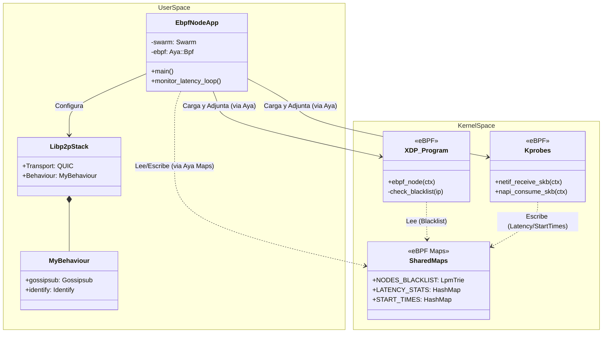
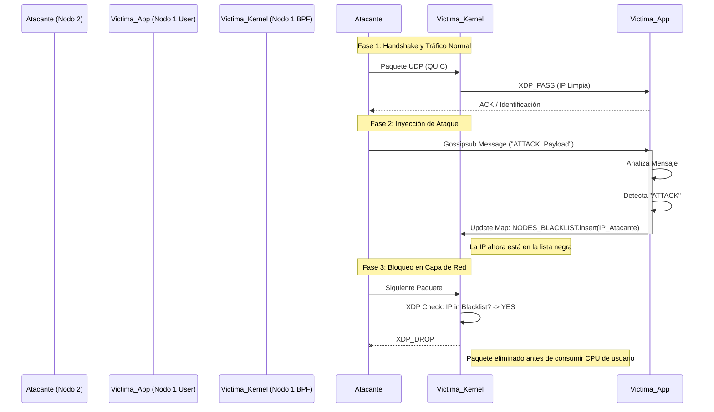

# eBPF Blockchain Lab: Arquitectura, Internals y Manual de Operación

Este documento detalla la implementación técnica del nodo de blockchain experimental definido en [RFC 001](./rfc.md). El sistema combina programación de sistemas (Rust), redes P2P (libp2p) y filtrado de paquetes de alto rendimiento en el kernel (eBPF/XDP).

## 1. Visión General de la Arquitectura

El nodo opera en un modelo híbrido donde la lógica de negocio reside en el espacio de usuario y las políticas de seguridad/observabilidad se aplican en el espacio del kernel.

### Diagrama de Clases y Componentes (Internals)

El siguiente diagrama muestra la relación entre las estructuras de Rust en el espacio de usuario y los programas/mapas en el kernel.



---

## 2. Descripción de Funcionalidades Internas

### 2.1. Espacio de Kernel (eBPF - `ebpf-node-ebpf`)

Este componente se compila a bytecode BPF y se inyecta en el kernel de Linux.

*   **`ebpf_node` (Programa XDP):**
    *   **Función:** Se ejecuta por cada paquete recibido en la interfaz de red (`eth0`), antes de que el kernel asigne memoria para el `sk_buff`.
    *   **Lógica:** Parsea la cabecera Ethernet e IPv4. Extrae la IP de origen. Consulta el mapa `NODES_BLACKLIST`.
    *   **Acción:** Si la IP existe en el mapa, retorna `XDP_DROP` (descarte inmediato). Si no, retorna `XDP_PASS` (pasa al stack TCP/IP).

*   **`netif_receive_skb` (Kprobe):**
    *   **Función:** Sonda dinámica adjunta a la función del kernel que recibe paquetes del driver.
    *   **Lógica:** Obtiene el puntero del `sk_buff` y el tiempo actual (`bpf_ktime_get_ns`). Guarda esta tupla en el mapa `START_TIMES`.

*   **`napi_consume_skb` (Kprobe):**
    *   **Función:** Sonda adjunta a la función de finalización de procesamiento o descarte.
    *   **Lógica:** Busca el tiempo de inicio en `START_TIMES` usando el puntero `sk_buff`. Calcula `delta = ahora - inicio`. Determina el bucket logarítmico (potencia de 2) e incrementa el contador en `LATENCY_STATS`.

*   **Mapas (Almacenamiento):**
    *   **`NODES_BLACKLIST` (LpmTrie):** Árbol de prefijos (Longest Prefix Match) optimizado para búsquedas de IPs/Subredes rápidas. Clave: IPv4 (u32), Valor: u32 (dummy/flags).
    *   **`LATENCY_STATS` (HashMap):** Histograma de latencia. Clave: Bucket (u64), Valor: Cantidad de paquetes (u64).

### 2.2. Espacio de Usuario (Nodo - `ebpf-node`)

Aplicación Rust asíncrona (Tokio) que orquesta el sistema.

*   **Inicialización (`main`):**
    *   Configura límites de memoria (`RLIMIT_MEMLOCK`) para permitir la carga de mapas BPF.
    *   Utiliza `aya` para cargar el bytecode compilado desde `OUT_DIR`.
    *   Adjunta el programa XDP a la interfaz de red.
    *   Adjunta los Kprobes a las funciones del kernel correspondientes.

*   **Networking P2P (`libp2p`):**
    *   **Transporte:** QUIC (sobre UDP) para baja latencia.
    *   **Gossipsub:** Protocolo de difusión para propagar transacciones/bloques. Configurado con validación estricta y firma de mensajes.
    *   **Identify:** Protocolo para identificación de pares en la red.

*   **Lógica de Seguridad Activa:**
    *   Escucha eventos del `Swarm`.
    *   Al recibir un mensaje por Gossipsub, inspecciona el contenido.
    *   Si detecta un patrón de ataque (ej: payload que empieza con "ATTACK"), extrae (simuladamente) la IP del emisor.
    *   **Intervención:** Escribe directamente en el mapa `NODES_BLACKLIST` del kernel, bloqueando al atacante instantáneamente a nivel de red.

*   **Loop de Observabilidad:**
    *   Tarea en segundo plano que lee periódicamente el mapa `LATENCY_STATS`.
    *   Imprime en consola un histograma de la latencia de red observada en tiempo real.

---

## 3. Preparación del Entorno y Ejecución

### Requisitos Previos
*   Linux Kernel 5.10+ (con soporte BTF).
*   LXD instalado.

### Configuración del Contenedor (Setup)
El siguiente bloque de comandos configura un contenedor privilegiado con acceso a BPF y dependencias de Rust Nightly.

```bash
# 1. Crear contenedor con perfil adecuado
lxc launch ubuntu:22.04 ebpf-blockchain --profile ebpf-blockchain
lxc config device add ebpf-blockchain project disk source=$(pwd) path=/root/ebpf-blockchain

# 2. Acceder y preparar dependencias
lxc exec ebpf-blockchain -- bash
# (Dentro del contenedor)
apt update && apt install -y build-essential clang llvm libelf-dev libbpf-dev curl git
curl --proto '=https' --tlsv1.2 -sSf https://sh.rustup.rs | sh -s -- -y
source $HOME/.cargo/env
rustup toolchain install nightly
rustup component add rust-src --toolchain nightly
cargo install bpf-linker
```

### Compilación y Ejecución
```bash
# Compilar todo el workspace
cd /root/ebpf-blockchain/ebpf-node
cargo build

# Ejecutar el nodo (requiere privilegios de root/CAP_BPF)
RUST_LOG=info ./target/debug/ebpf-node --iface eth0
```

---

## 4. Escenario de Pruebas y Validación

Para validar la arquitectura, ejecutamos un escenario donde un nodo "Atacante" intenta saturar al nodo "Víctima".

### Secuencia de Prueba (UML)



### Instrucciones para Replicar:

1.  **Levantar Nodo 1 (Víctima):** Seguir instrucciones de ejecución. Anotar su dirección IP y PeerID.
2.  **Levantar Nodo 2 (Atacante):**
    *   `lxc copy ebpf-blockchain node-2`
    *   `lxc start node-2`
    *   Ejecutar nodo apuntando al Nodo 1.
3.  **Simular Ataque:**
    *   Modificar código en Nodo 2 para enviar mensaje `b"ATTACK..."`.
    *   O esperar que el Nodo 1 detecte tráfico (según lógica implementada).
4.  **Verificar:**
    *   Log del Nodo 1: `IP X.X.X.X blocked successfully`.
    *   Verificación en kernel: `bpftool map dump name NODES_BLACKLIST`.

---

## 5. Mantenimiento y Debugging

Herramientas útiles para inspeccionar el estado del sistema eBPF en tiempo real:

| Comando | Descripción |
| :--- | :--- |
| `bpftool prog show` | Lista programas BPF cargados (XDP, Kprobes). |
| `bpftool map show` | Lista mapas BPF activos. |
| `bpftool map dump name NODES_BLACKLIST` | Muestra las IPs actualmente bloqueadas. |
| `bpftool map dump name LATENCY_STATS` | Muestra el histograma de latencia crudo. |
| `ip link show eth0` | Muestra si hay un programa XDP adjunto (`xdp` o `xdp generic`). |

---

**Autor:** Maximiliano Paredes
**Estado:** PoC Funcional (Research)
