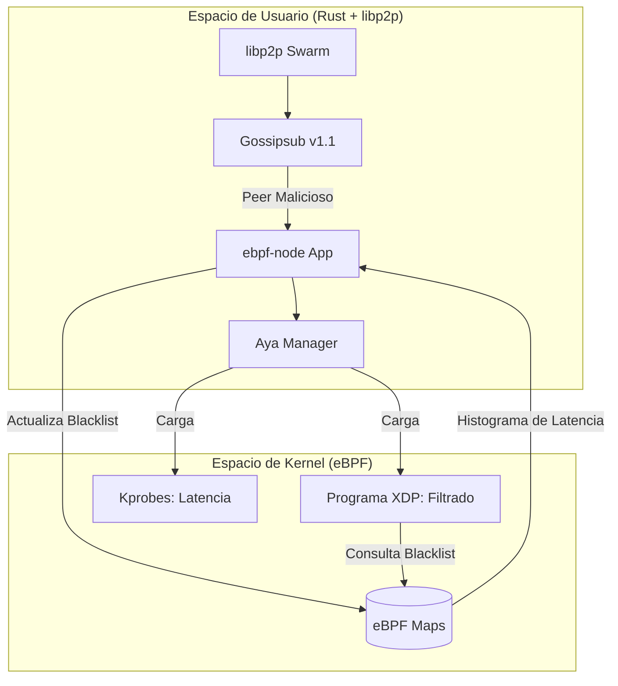
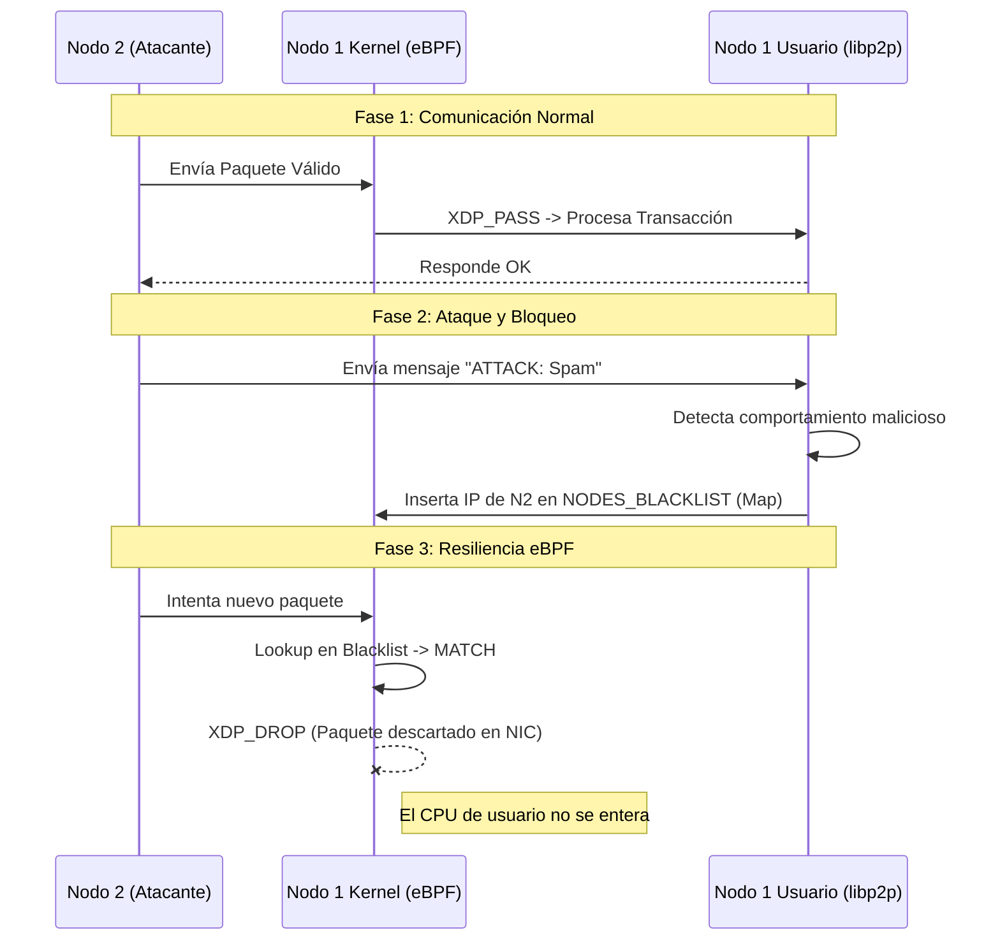

# eBPF Blockchain Lab: Observabilidad y Seguridad Activa (RFC 001)

Este proyecto implementa un nodo de blockchain experimental que integra **eBPF (Extended Berkeley Packet Filter)** para la gestión de red en el kernel y **libp2p** para la comunicación P2P en el espacio de usuario. Basado en el [RFC 001](./rfc.md).

## 1. Arquitectura del Sistema

El sistema se divide en dos dominios principales que colaboran mediante mapas compartidos:

### Estructura de Componentes (UML)



### Descripción de las Partes:
*   **ebpf-node (User Space):** Orquestador principal. Gestiona el ciclo de vida de los programas eBPF y la lógica de red descentralizada.
*   **ebpf-node-ebpf (Kernel Space):** Código Rust compilado a bytecode BPF.
    *   **XDP (eXpress Data Path):** Intercepta paquetes en la NIC. Si una IP está en la `NODES_BLACKLIST`, el paquete se descarta (`XDP_DROP`) antes de llegar al stack TCP/IP.
    *   **Kprobes:** Sondas en funciones del kernel (`netif_receive_skb`) para medir latencia con precisión de nanosegundos.
*   **ebpf-node-common:** Tipos de datos compartidos (estructuras de mapas y claves) para garantizar la coherencia entre kernel y usuario.

---

## 2. Requisitos y Dependencias

### Requisitos del Host:
*   Linux Kernel 5.10+ con BTF habilitado.
*   LXD/LXC instalado y configurado.

### Dependencias del Contenedor:
*   **Toolchain:** Rust (Nightly para eBPF), `bpf-linker`, `cargo-generate`.
*   **Librerías:** `clang`, `llvm`, `libelf-dev`, `libbpf-dev`.
*   **Crates clave:** `aya` (BPF manager), `libp2p` (Networking), `network-types` (Parsing de paquetes).

---

## 3. Preparación del Entorno (LXC)

Para estabilizar el ambiente de desarrollo, ejecute:

```bash
# Crear y configurar contenedor
lxc launch ubuntu:22.04 ebpf-blockchain --profile ebpf-blockchain
lxc config device add ebpf-blockchain project disk source=$(pwd) path=/root/ebpf-blockchain

# Instalar herramientas (dentro del contenedor)
lxc exec ebpf-blockchain -- bash -c "apt update && apt install -y build-essential clang llvm libelf-dev libbpf-dev"
lxc exec ebpf-blockchain -- bash -c "curl --proto '=https' --tlsv1.2 -sSf https://sh.rustup.rs | sh -s -- -y"
lxc exec ebpf-blockchain -- bash -c "source \$HOME/.cargo/env && rustup toolchain install nightly && rustup component add rust-src --toolchain nightly"
lxc exec ebpf-blockchain -- bash -c "source \$HOME/.cargo/env && cargo install bpf-linker"
```

---

## 4. Ejecución de Nodos

### Compilación:
```bash
lxc exec ebpf-blockchain -- bash -c "source \$HOME/.cargo/env && cd /root/ebpf-blockchain/ebpf-node && cargo build"
```

### Nodo 1 (Bootstrap):
```bash
lxc exec ebpf-blockchain -- bash -c "source \$HOME/.cargo/env && cd /root/ebpf-blockchain/ebpf-node && RUST_LOG=info ./target/debug/ebpf-node --iface eth0"
```

### Nodo 2 (Conexión):
Clone el contenedor y ejecute apuntando a la dirección del Nodo 1:
```bash
lxc copy ebpf-blockchain node-2
lxc start node-2
lxc exec node-2 -- bash -c "... ./target/debug/ebpf-node --iface eth0 --peer /ip4/[IP_NODO_1]/udp/4001/quic-v1/p2p/[PEER_ID]"
```

---

## 5. Pruebas de Funcionalidad

### Flujo de Secuencia de Pruebas:



### Pasos para validar:
1.  **Validar Observabilidad:** Observe los logs cada 10 segundos. Verá el histograma de latencia:
    *   `Bucket 2^15: X packets` (indica tiempo de procesamiento en el stack).
2.  **Simular Ataque:** Envíe un mensaje de Gossipsub que inicie con la palabra `ATTACK`.
3.  **Verificar Bloqueo:**
    *   El Nodo 1 imprimirá: `IP 1.2.3.4 blocked successfully`.
    *   Use `bpftool map dump name NODES_BLACKLIST` para ver la IP bloqueada en el kernel.
    *   Cualquier paquete subsiguiente de esa IP será descartado por la tarjeta de red sin impactar el rendimiento de la aplicación.

---

## 6. Mantenimiento
Para inspeccionar el estado de los mapas de eBPF en tiempo real desde el host:
```bash
lxc exec ebpf-blockchain -- bpftool map show
lxc exec ebpf-blockchain -- bpftool prog show
```
