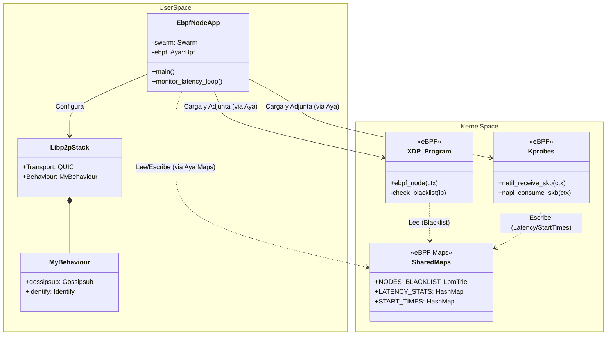
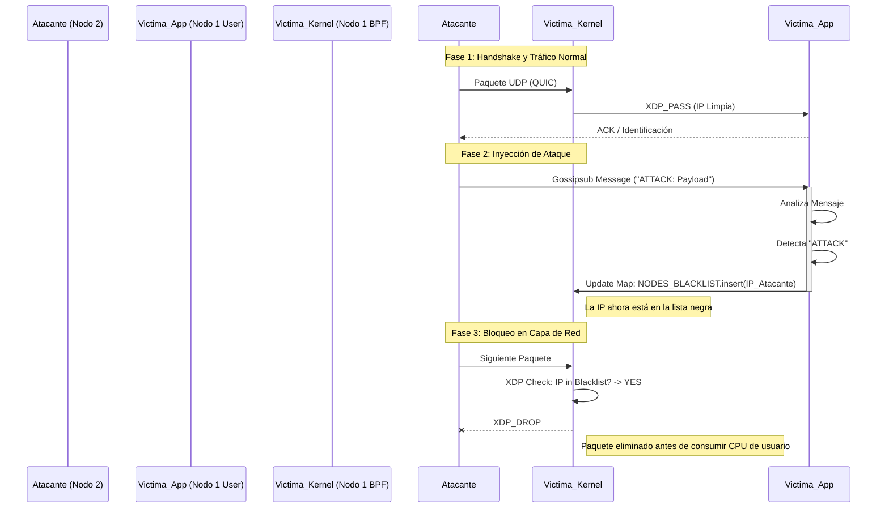

# eBPF Blockchain Lab: Arquitectura, Internals y Manual de Operación

Este documento detalla la implementación técnica del nodo de blockchain experimental definido en [RFC 001](./rfc.md). El sistema combina programación de sistemas (Rust), redes P2P (libp2p) y filtrado de paquetes de alto rendimiento en el kernel (eBPF/XDP).

## 1. Visión General de la Arquitectura

El nodo opera en un modelo híbrido donde la lógica de negocio reside en el espacio de usuario y las políticas de seguridad/observabilidad se aplican en el espacio del kernel.

### Diagrama de Clases y Componentes (Internals)

El siguiente diagrama muestra la relación entre las estructuras de Rust en el espacio de usuario y los programas/mapas en el kernel.


```mermaid
classDiagram
    namespace UserSpace {
        class EbpfNodeApp {
            -swarm: Swarm
            -ebpf: Aya::Bpf
            +main()
            +monitor_latency_loop()
        }

        class Libp2pStack {
            +Transport: QUIC
            +Behaviour: MyBehaviour
        }

        class MyBehaviour {
            +gossipsub: Gossipsub
            +identify: Identify
        }
    }

    namespace KernelSpace {
        class XDP_Program {
            <<eBPF>>
            +ebpf_node(ctx)
            -check_blacklist(ip)
        }

        class Kprobes {
            <<eBPF>>
            +netif_receive_skb(ctx)
            +napi_consume_skb(ctx)
        }

        class SharedMaps {
            <<eBPF Maps>>
            +NODES_BLACKLIST: LpmTrie<u32, u32>
            +LATENCY_STATS: HashMap<u64, u64>
            +START_TIMES: HashMap<u64, u64>
        }
    }

    EbpfNodeApp --> Libp2pStack : Configura
    Libp2pStack *-- MyBehaviour
    EbpfNodeApp --> XDP_Program : Carga y Adjunta (via Aya)
    EbpfNodeApp --> Kprobes : Carga y Adjunta (via Aya)
    EbpfNodeApp ..> SharedMaps : Lee/Escribe (via Aya Maps)
    
    XDP_Program ..> SharedMaps : Lee (Blacklist)
    Kprobes ..> SharedMaps : Escribe (Latency/StartTimes)
```

---

## 2. Descripción de Funcionalidades Internas

### 2.1. Espacio de Kernel (eBPF - `ebpf-node-ebpf`)

Este componente se compila a bytecode BPF y se inyecta en el kernel de Linux.

*   **`ebpf_node` (Programa XDP):**
    *   **Función:** Se ejecuta por cada paquete recibido en la interfaz de red (`eth0`), antes de que el kernel asigne memoria para el `sk_buff`.
    *   **Lógica:** Parsea la cabecera Ethernet e IPv4. Extrae la IP de origen. Consulta el mapa `NODES_BLACKLIST`.
    *   **Acción:** Si la IP existe en el mapa, retorna `XDP_DROP` (descarte inmediato). Si no, retorna `XDP_PASS` (pasa al stack TCP/IP).

*   **`netif_receive_skb` (Kprobe):**
    *   **Función:** Sonda dinámica adjunta a la función del kernel que recibe paquetes del driver.
    *   **Lógica:** Obtiene el puntero del `sk_buff` y el tiempo actual (`bpf_ktime_get_ns`). Guarda esta tupla en el mapa `START_TIMES`.

*   **`napi_consume_skb` (Kprobe):**
    *   **Función:** Sonda adjunta a la función de finalización de procesamiento o descarte.
    *   **Lógica:** Busca el tiempo de inicio en `START_TIMES` usando el puntero `sk_buff`. Calcula `delta = ahora - inicio`. Determina el bucket logarítmico (potencia de 2) e incrementa el contador en `LATENCY_STATS`.

*   **Mapas (Almacenamiento):**
    *   **`NODES_BLACKLIST` (LpmTrie):** Árbol de prefijos (Longest Prefix Match) optimizado para búsquedas de IPs/Subredes rápidas. Clave: IPv4 (u32), Valor: u32 (dummy/flags).
    *   **`LATENCY_STATS` (HashMap):** Histograma de latencia. Clave: Bucket (u64), Valor: Cantidad de paquetes (u64).

### 2.2. Espacio de Usuario (Nodo - `ebpf-node`)

Aplicación Rust asíncrona (Tokio) que orquesta el sistema.

*   **Inicialización (`main`):**
    *   Configura límites de memoria (`RLIMIT_MEMLOCK`) para permitir la carga de mapas BPF.
    *   Utiliza `aya` para cargar el bytecode compilado desde `OUT_DIR`.
    *   Adjunta el programa XDP a la interfaz de red.
    *   Adjunta los Kprobes a las funciones del kernel correspondientes.

*   **Networking P2P (`libp2p`):**
    *   **Transporte:** QUIC (sobre UDP) para baja latencia.
    *   **Gossipsub:** Protocolo de difusión para propagar transacciones/bloques. Configurado con validación estricta y firma de mensajes.
    *   **Identify:** Protocolo para identificación de pares en la red.

*   **Lógica de Seguridad Activa:**
    *   Escucha eventos del `Swarm`.
    *   Al recibir un mensaje por Gossipsub, inspecciona el contenido.
    *   Si detecta un patrón de ataque (ej: payload que empieza con "ATTACK"), extrae (simuladamente) la IP del emisor.
    *   **Intervención:** Escribe directamente en el mapa `NODES_BLACKLIST` del kernel, bloqueando al atacante instantáneamente a nivel de red.

*   **Loop de Observabilidad:**
    *   Tarea en segundo plano que lee periódicamente el mapa `LATENCY_STATS`.
    *   Expone métricas (latencia, mensajes recibidos, peers conectados) a través de un servidor HTTP (`0.0.0.0:9090/metrics`) para ser consumidas por Prometheus.
    *   Imprime en consola un histograma de la latencia de red observada en tiempo real.

---

## 3. Preparación del Entorno y Ejecución

### Requisitos Previos
*   Linux Kernel 5.10+ (con soporte BTF).
*   LXD instalado.

### Configuración Automatizada de la Instancia LXD (Setup)

El proyecto incluye un archivo `ebpf-blockchain.yaml` en la raíz del repositorio que define toda la infraestructura como código usando Cloud-Init. Este manifiesto configura recursos (RAM, CPU), privilegios BPF en el kernel, instala de forma desatendida Rust Nightly, `bpf-linker`, `cargo-watch` y mapea automáticamente el directorio de tu proyecto.

Para aprovisionar el entorno completo en un solo paso:

```bash
# 1. Crear e iniciar la instancia LXD inyectando el manifiesto YAML
# (Asegúrate de estar en el directorio raíz donde reside ebpf-blockchain.yaml)
lxc launch ubuntu:22.04 ebpf-blockchain < ebpf-blockchain.yaml

# 2. Esperar a que cloud-init finalice la descarga e instalación de Rust y herramientas eBPF.
# Puedes monitorear el progreso de la instalación interactiva con:
lxc exec ebpf-blockchain -- tail -f /var/log/cloud-init-output.log

# 3. Acceder al nodo (el usuario root ya tiene listo el PATH de Cargo)
lxc exec ebpf-blockchain -- bash
```

### Live Coding y Ejecución Reactiva (Hot-Reload)

Gracias a la declaración `workspace` dentro de la sección de `devices` en el archivo YAML, tu directorio local del Host se ha montado nativamente en `/root/ebpf-blockchain` dentro de la máquina. **Esto significa "cero copias":** no necesitas regenerar la imagen de LXC, ni copiar archivos manuales. Cualquier cambio que guardes en tu IDE (VSCode, etc.) se refleja al instante.

Para hacer que el nodo se recompile y reinicie automáticamente ante cualquier modificación del código fuente (tanto en el espacio de usuario como en los programas eBPF del kernel), utiliza `cargo-watch`:

```bash
# Acceder a la ruta montada dentro del contenedor
cd /root/ebpf-blockchain/ebpf-node

# Ejecutar el nodo en modo reactivo
RUST_LOG=info cargo watch -c -w ebpf-node/src/ -w ebpf-node-ebpf/src/ -x 'run --bin ebpf-node -- --iface eth0'
```
* **Nota:** Al estar como usuario `root` en el contenedor, `cargo run` tiene automáticamente los permisos (CAP_BPF) necesarios para inyectar eBPF en el kernel.

---

## 4. Escenario de Pruebas y Validación

Para validar la arquitectura, ejecutamos un escenario donde un nodo "Atacante" intenta saturar al nodo "Víctima".

### Secuencia de Prueba (UML)


```mermaid
sequenceDiagram
    participant Atacante (Nodo 2)
    participant Victima_App (Nodo 1 User)
    participant Victima_Kernel (Nodo 1 BPF)
    
    Note over Atacante, Victima_Kernel: Fase 1: Handshake y Tráfico Normal
    Atacante->>Victima_Kernel: Paquete UDP (QUIC)
    Victima_Kernel->>Victima_App: XDP_PASS (IP Limpia)
    Victima_App-->>Atacante: ACK / Identificación
    
    Note over Atacante, Victima_Kernel: Fase 2: Inyección de Ataque
    Atacante->>Victima_App: Gossipsub Message ("ATTACK: Payload")
    activate Victima_App
    Victima_App->>Victima_App: Analiza Mensaje
    Victima_App->>Victima_App: Detecta "ATTACK"
    Victima_App->>Victima_Kernel: Update Map: NODES_BLACKLIST.insert(IP_Atacante)
    deactivate Victima_App
    Note right of Victima_Kernel: La IP ahora está en la lista negra
    
    Note over Atacante, Victima_Kernel: Fase 3: Bloqueo en Capa de Red
    Atacante->>Victima_Kernel: Siguiente Paquete
    Victima_Kernel->>Victima_Kernel: XDP Check: IP in Blacklist? -> YES
    Victima_Kernel--XAtacante: XDP_DROP
    Note right of Victima_Kernel: Paquete eliminado antes de consumir CPU de usuario
```

### Instrucciones para Replicar:

1.  **Levantar Nodo 1 (Víctima):** Seguir instrucciones de ejecución. Anotar su dirección IP y PeerID.
2.  **Levantar Nodo 2 (Atacante):**
    *   `lxc copy ebpf-blockchain node-2`
    *   `lxc start node-2`
    *   Ejecutar nodo apuntando al Nodo 1.
3.  **Simular Ataque:**
    *   Modificar código en Nodo 2 para enviar mensaje `b"ATTACK..."`.
    *   O esperar que el Nodo 1 detecte tráfico (según lógica implementada).
4.  **Verificar:**
    *   Log del Nodo 1: `IP X.X.X.X blocked successfully`.
    *   Verificación en kernel: `bpftool map dump name NODES_BLACKLIST`.

---

## 5. Mantenimiento y Debugging

Herramientas útiles para inspeccionar el estado del sistema eBPF en tiempo real:

| Comando | Descripción |
| :--- | :--- |
| `bpftool prog show` | Lista programas BPF cargados (XDP, Kprobes). |
| `bpftool map show` | Lista mapas BPF activos. |
| `bpftool map dump name NODES_BLACKLIST` | Muestra las IPs actualmente bloqueadas. |
| `bpftool map dump name LATENCY_STATS` | Muestra el histograma de latencia crudo. |
| `ip link show eth0` | Muestra si hay un programa XDP adjunto (`xdp` o `xdp generic`). |

---

## 6. Observabilidad: Integración con Prometheus y Grafana

El nodo expone métricas en formato Prometheus en el puerto `9090` bajo la ruta `/metrics` usando un servidor HTTP embebido (Axum). 

### Métricas Expuestas
- `ebpf_node_latency_buckets`: Histograma de latencias de red recolectado desde el Kernel vía eBPF (Kprobes).
- `ebpf_node_messages_received_total`: Contador de mensajes Gossipsub recibidos.
- `ebpf_node_peers_connected`: Número de pares P2P actualmente conectados.

### Despliegue de Observabilidad con Docker Compose

En la raíz del proyecto encontrarás los archivos `docker-compose.yml` y `prometheus.yml` preconfigurados. La instancia LXD está configurada para usar una NIC física (`enp5s0`), por lo que recibirá una IP directamente de tu router local (ej. `192.168.1.x`).

1. Averigua la IP de tu instancia LXD con `lxc list` y edita el archivo `prometheus.yml` para que apunte a ella:

```yaml
scrape_configs:
  - job_name: "ebpf_node_1"
    static_configs:
      - targets: ["192.168.1.123:9090"] # Reemplazar por la IP que `lxc list` te muestre
```

2. Levanta los servicios:
```bash
docker-compose up -d
```

### Configuración en Grafana

1. Acceder a Grafana en `http://localhost:3000` en tu Host (usuario/contraseña por defecto: `admin`/`admin`).
2. Ir a **Connections > Data Sources** y agregar **Prometheus**.
3. En la URL del servidor, ingresar `http://localhost:9090` (ya que ambos corren en `network_mode: host` en tu máquina).
4. Guardar y probar (Save & Test).
5. Crear un nuevo Dashboard (Dashboards > New Dashboard) y agregar paneles específicos usando PromQL:

   *   **Histograma de Latencia (Bar chart):**
       *   **Consulta:** `ebpf_node_latency_buckets`
       *   **Explicación:** Dado que eBPF guarda los datos en buckets de base 2, el label `bucket` contiene el exponente (ej. `bucket="10"` significa 2^10 nanosegundos).
       *   **Configuración Grafana:** Usa un gráfico de **Bar chart**. En la pestaña *Transform Data* de Grafana, puedes ordenar las series por nombre para que el eje X respete la progresión logarítmica de la latencia medida en el Kernel.

   *   **Peers Conectados (Stat / Gauge):**
       *   **Consulta:** `ebpf_node_peers_connected{status="connected"}`
       *   **Configuración Grafana:** Panel tipo **Stat**. Mostrará el número actual de conexiones activas en el enjambre P2P.

   *   **Tasa de Mensajes P2P (Time series):**
       *   **Consulta:** `rate(ebpf_node_messages_received_total[1m])`
       *   **Configuración Grafana:** Panel tipo **Time series**. Mostrará la cantidad de mensajes Gossipsub procesados por segundo, ideal para identificar picos de actividad o ataques de inundación en la red.

---

**Autor:** Maximiliano Paredes
**Estado:** PoC Funcional (Research)
