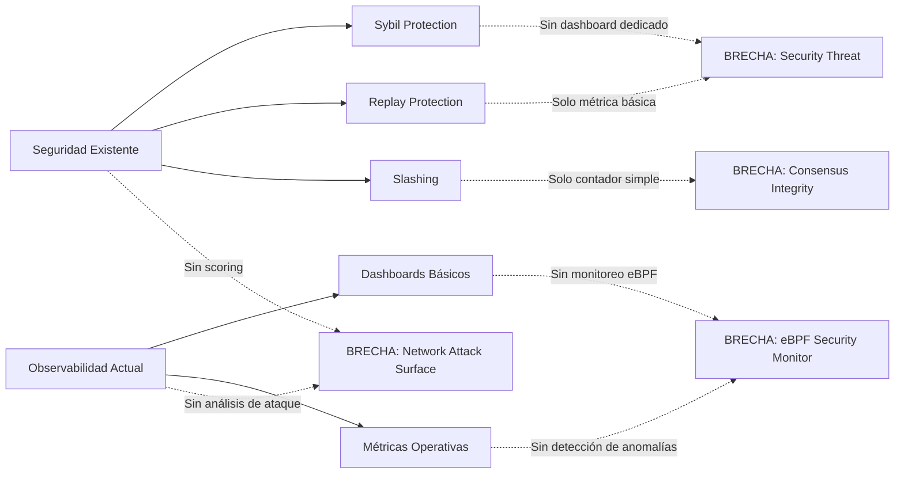
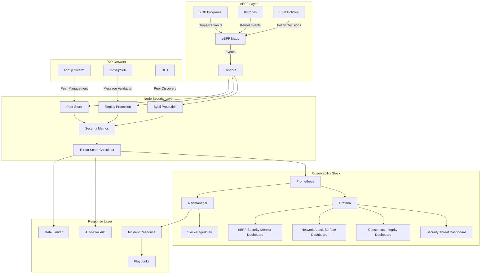
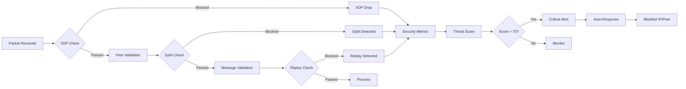

# Plan Estratégico: Expansión de Observabilidad de Seguridad

## eBPF Blockchain Network - Security Monitoring Enhancement

**Versión:** 1.0  
**Fecha:** 2026-04-23  
**Estado:** Propuesta Estratégica  

---

## Tabla de Contenidos

1. [Resumen Ejecutivo](#resumen-ejecutivo)
2. [Análisis del Estado Actual](#análisis-del-estado-actual)
3. [Tablas de Dashboards: Existentes vs Necesarios](#tablas-de-dashboards-existentes-vs-necesarios)
4. [Especificación de Nuevas Métricas](#especificación-de-nuevas-métricas)
5. [Nuevos Dashboards de Grafana](#nuevos-dashboards-de-grafana)
6. [Sistema de Alertas de Seguridad](#sistema-de-alertas-de-seguridad)
7. [Roadmap Estratégico con Fases](#roadmap-estratégico-con-fases)
8. [Arquitectura de Seguridad](#arquitectura-de-seguridad)
9. [Implementación de Dashboards JSON](#implementación-de-dashboards-json)
10. [Archivos de Alertas YAML Completos](#archivos-de-alertas-yaml-completos)

---

## Resumen Ejecutivo

Este plan estratégico define la expansión del sistema de observabilidad de seguridad del proyecto eBPF Blockchain. El objetivo es implementar un sistema completo de detección y respuesta ante amenazas que incluya:

- **4 nuevos dashboards** de Grafana para análisis profundo de seguridad
- **12 nuevas métricas** Prometheus específicas de seguridad y consenso
- **15 nuevas alertas** de seguridad en formato Prometheus
- **Roadmap de 3 fases** con entregables claros

El proyecto actualmente cuenta con una base sólida de seguridad (Sybil protection, slashing, replay protection) pero carece de visibilidad operativa completa para detectar y responder a ataques en tiempo real.

---

## Análisis del Estado Actual

### Infraestructura Existente

| Componente | Estado | Descripción |
|------------|--------|-------------|
| Nodos LXD | 3 nodos PoS | Consensus Proof of Stake |
| eBPF | Implementado | XDP programs, KProbes, hot-reload |
| P2P Networking | Implementado | libp2p con gossipsub, Kademlia DHT |
| Observabilidad | Parcial | Prometheus + Grafana + Loki + Tempo |
| Seguridad Básica | Implementado | Replay protection, sybil protection, slashing |

### Dashboards Existentes (7)

| Dashboard | UID | Propósito | Cobertura |
|-----------|-----|-----------|-----------|
| ebpf-cluster.json | ebpf-cluster | Vista general del cluster | Media |
| consensus.json | ebpf-consensus | Métricas de consenso | Alta |
| health-overview.json | ebpf-health | Health general | Media |
| log-pipeline-health.json | ebpf-log-pipeline | Pipeline de logs | Alta |
| network-activity-debug.json | ebpf-network-activity | Actividad de red | Media |
| network-p2p.json | ebpf-network-p2p | Networking P2P | Alta |
| transactions.json | ebpf-transactions | Transacciones | Media |
| block-generator-debug.json | ebpf-block-generator | Block generator | Baja |

### Métricas Existentes (25+)

| Categoría | Métricas | Cobertura |
|-----------|----------|-----------|
| eBPF | XDP packets, blacklist/whitelist size, errors | Media |
| Consenso | Blocks proposed, rounds, duration, validators, slashing | Alta |
| P2P | Peers connected, messages sent/received, connections | Alta |
| Security | Sybil attempts, slashing events, replay rejected | Baja |
| Network | Bandwidth, latency, swarm errors | Media |
| Transaction | Processed, by type, queue size, failures, confirmed, rejected | Alta |
| Database | Operations, write rate, size | Media |
| API | Request duration, requests total | Media |
| System | Memory, uptime, threads | Media |

### Brechas Identificadas

| Brecha | Impacto | Prioridad |
|--------|---------|-----------|
| Sin threat scoring | No se puede priorizar incidentes | Crítica |
| Sin doble-vote detection | Vulnerabilidad no monitoreada | Crítica |
| Sin eclipse attack detection | Ataque de red no detectable | Alta |
| Sin fork detection | Consenso ciego a bifurcaciones | Alta |
| Sin peer scoring | No se puede evaluar confianza de peers | Alta |
| Sin validator uptime | No se mide disponibilidad de validadores | Media |
| Sin consensus latency histogram | Solo gauge, no distribución | Media |
| Sin message validation failures | Fallos de validación no rastreados | Media |

---

## Tablas de Dashboards: Existentes vs Necesarios

### Dashboard Comparison Matrix

| # | Dashboard | Estado | Tipo | Propósito Principal | Métricas Clave |
|---|-----------|--------|------|---------------------|----------------|
| 1 | Cluster Overview | EXISTENTE | General | Vista general del cluster | Nodes, resources, health |
| 2 | Consensus | EXISTENTE | Consenso | Métricas de consenso | Blocks, rounds, duration |
| 3 | Health Overview | EXISTENTE | Salud | Health general | CPU, memory, disk |
| 4 | Log Pipeline | EXISTENTE | Logs | Pipeline de logs | Ingest, drops, errors |
| 5 | Network Activity | EXISTENTE | Red | Actividad de red | Traffic, connections |
| 6 | Network P2P | EXISTENTE | P2P | Networking P2P | Peers, messages, bandwidth |
| 7 | Transactions | EXISTENTE | TX | Transacciones | Processed, failures, queue |
| 8 | Block Generator | EXISTENTE | Debug | Block generator | Generated blocks |
| 9 | **Security Threat** | NUEVO | Seguridad | Ataques y amenazas | Threat score, slashing, sybil |
| 10 | **Consensus Integrity** | NUEVO | Consenso | Integridad del consenso | Double-vote, forks, finality |
| 11 | **Network Attack Surface** | NUEVO | Red | Superficie de ataque | DDoS, eclipse, peer score |
| 12 | **eBPF Security Monitor** | NUEVO | eBPF | Monitoreo de seguridad eBPF | XDP drops, kprobe anomalies |

### Coverage Gap Analysis



---

## Especificación de Nuevas Métricas

### 1. Security Metrics (4 métricas)

#### 1.1 Threat Score Gauge

```rust
pub static ref SECURITY_THREAT_SCORE: Gauge = register_gauge!(
    "ebpf_node_security_threat_score",
    "Security threat score from 0-100, calculated from multiple security indicators. \
     0-25: Low risk, 26-50: Medium risk, 51-75: High risk, 76-100: Critical risk"
)
.unwrap();
```

| Propiedad | Valor |
|-----------|-------|
| Nombre | `ebpf_node_security_threat_score` |
| Tipo | Gauge |
| Labels | Ninguno (global por nodo) |
| Rango | 0.0 - 100.0 |
| Help Text | Security threat score from 0-100 |
| Escala de Riesgo | 0-25: Low, 26-50: Medium, 51-75: High, 76-100: Critical |

**Fórmula de Cálculo Sugerida:**
```
threat_score = min(100, 
    (sybil_attempts * 15) + 
    (slashing_events * 25) + 
    (replay_rejections * 10) + 
    (blacklist_size / 10) + 
    (vote_validation_failures * 5)
)
```

#### 1.2 Blacklist Size Gauge

```rust
pub static ref BLACKLIST_SIZE: IntGauge = register_int_gauge!(
    "ebpf_node_blacklist_size",
    "Current size of the security blacklist (IPs and peer IDs blocked)"
)
.unwrap();
```

| Propiedad | Valor |
|-----------|-------|
| Nombre | `ebpf_node_blacklist_size` |
| Tipo | IntGauge |
| Labels | Ninguno |
| Help Text | Current size of the security blacklist |

#### 1.3 Vote Validation Failures Counter

```rust
pub static ref VOTE_VALIDATION_FAILURES: IntCounter = register_int_counter!(
    "ebpf_node_vote_validation_failures_total",
    "Total number of vote validation failures (invalid signature, wrong proposer, etc.)"
)
.unwrap();
```

| Propiedad | Valor |
|-----------|-------|
| Nombre | `ebpf_node_vote_validation_failures_total` |
| Tipo | IntCounter |
| Labels | Ninguno |
| Help Text | Total vote validation failures |

#### 1.4 Double Vote Attempts Counter

```rust
pub static ref DOUBLE_VOTE_ATTEMPTS: IntCounter = register_int_counter!(
    "ebpf_node_double_vote_attempts_total",
    "Total number of double-vote attempts detected (same validator signing two different blocks in same round)"
)
.unwrap();
```

| Propiedad | Valor |
|-----------|-------|
| Nombre | `ebpf_node_double_vote_attempts_total` |
| Tipo | IntCounter |
| Labels | Ninguno |
| Help Text | Double-vote attempts detected |

### 2. Consensus Metrics (4 métricas)

#### 2.1 Fork Events Counter

```rust
pub static ref FORK_EVENTS: IntCounter = register_int_counter!(
    "ebpf_node_fork_events_total",
    "Total number of fork events detected (multiple blocks proposed in same round)"
)
.unwrap();
```

| Propiedad | Valor |
|-----------|-------|
| Nombre | `ebpf_node_fork_events_total` |
| Tipo | IntCounter |
| Labels | `type` (value: "temporary", "permanent") |
| Help Text | Fork events detected |

#### 2.2 Finality Checkpoints Counter

```rust
pub static ref FINALITY_CHECKPOINTS: IntCounter = register_int_counter!(
    "ebpf_node_finality_checkpoints_total",
    "Total number of finality checkpoints achieved"
)
unwrap();
```

| Propiedad | Valor |
|-----------|-------|
| Nombre | `ebpf_node_finality_checkpoints_total` |
| Tipo | IntCounter |
| Labels | Ninguno |
| Help Text | Finality checkpoints achieved |

#### 2.3 Validator Uptime Gauge

```rust
pub static ref VALIDATOR_UPTIME: Gauge = register_gauge!(
    "ebpf_node_validator_uptime_ratio",
    "Validator uptime ratio (0.0-1.0) based on blocks proposed vs expected",
    &["validator_id"]
)
.unwrap();
```

| Propiedad | Valor |
|-----------|-------|
| Nombre | `ebpf_node_validator_uptime_ratio` |
| Tipo | Gauge |
| Labels | `validator_id` |
| Rango | 0.0 - 1.0 |
| Help Text | Validator uptime ratio |

#### 2.4 Consensus Latency Histogram

```rust
pub static ref CONSENSUS_LATENCY: Histogram = register_histogram!(
    "ebpf_node_consensus_latency_ms",
    "Consensus round latency distribution in milliseconds",
    vec![100.0, 250.0, 500.0, 1000.0, 2500.0, 5000.0, 10000.0]
)
.unwrap();
```

| Propiedad | Valor |
|-----------|-------|
| Nombre | `ebpf_node_consensus_latency_ms` |
| Tipo | Histogram |
| Buckets | 100, 250, 500, 1000, 2500, 5000, 10000 ms |
| Help Text | Consensus latency distribution |

### 3. Network Attack Metrics (4 métricas)

#### 3.1 Suspicious Connections Counter

```rust
pub static ref SUSPICIOUS_CONNECTIONS: IntCounterVec = register_int_counter_vec!(
    "ebpf_node_suspicious_connections_total",
    "Total number of suspicious connections blocked by reason",
    &["reason"]  // values: "sybil", "blacklisted", "rate_limited", "invalid_signature"
)
.unwrap();
```

| Propiedad | Valor |
|-----------|-------|
| Nombre | `ebpf_node_suspicious_connections_total` |
| Tipo | IntCounterVec |
| Labels | `reason` (sybil, blacklisted, rate_limited, invalid_signature) |
| Help Text | Suspicious connections by reason |

#### 3.2 Peer Score Gauge

```rust
pub static ref PEER_SCORE: GaugeVec = register_gauge_vec!(
    "ebpf_node_peer_score",
    "Peer trust score (0.0-100.0). Higher is more trusted. Based on: uptime, block proposals, misbehavior",
    &["peer_id"]
)
.unwrap();
```

| Propiedad | Valor |
|-----------|-------|
| Nombre | `ebpf_node_peer_score` |
| Tipo | GaugeVec |
| Labels | `peer_id` |
| Rango | 0.0 - 100.0 |
| Help Text | Peer trust score |

#### 3.3 Bandwidth Abuse Counter

```rust
pub static ref BANDWIDTH_ABUSE: IntCounterVec = register_int_counter_vec!(
    "ebpf_node_bandwidth_abuse_total",
    "Total bytes of bandwidth abuse detected (excessive sends/receives)",
    &["direction"]  // values: "sent", "received"
)
.unwrap();
```

| Propiedad | Valor |
|-----------|-------|
| Nombre | `ebpf_node_bandwidth_abuse_total` |
| Tipo | IntCounterVec |
| Labels | `direction` (sent, received) |
| Help Text | Bandwidth abuse by direction |

#### 3.4 Message Validation Failures Counter

```rust
pub static ref MESSAGE_VALIDATION_FAILURES: IntCounter = register_int_counter!(
    "ebpf_node_message_validation_failures_total",
    "Total number of P2P message validation failures (invalid format, signature, etc.)"
)
.unwrap();
```

| Propiedad | Valor |
|-----------|-------|
| Nombre | `ebpf_node_message_validation_failures_total` |
| Tipo | IntCounter |
| Labels | Ninguno |
| Help Text | P2P message validation failures |

---

## Nuevos Dashboards de Grafana

### Dashboard 1: Security Threat Dashboard

**Archivo:** `monitoring/grafana/dashboards/security-threat.json`  
**UID:** `ebpf-security-threat`  
**Tags:** `security`, `threats`, `ebpf-blockchain`  

#### Secciones del Dashboard

| Panel | Tipo | Métrica | Descripción |
|-------|------|---------|-------------|
| Threat Score | Stat | `ebpf_node_security_threat_score` | Score global con thresholds |
| Slashing Events | TimeSeries | `ebpf_node_slashing_events_total` | Eventos de slashing acumulados |
| Sybil Attempts | TimeSeries | `ebpf_node_sybil_attempts_total` | Intentos Sybil por minuto |
| Replay Attacks | Stat + TimeSeries | `ebpf_node_transactions_replay_rejected_total` | Ataques de replay |
| Blacklist Size | Stat | `ebpf_node_blacklist_size` | Tamaño actual de blacklist |
| XDP Blacklist | Stat | `ebpf_node_xdp_blacklist_size` | Blacklist a nivel de kernel |
| Vote Failures | TimeSeries | `ebpf_node_vote_validation_failures_total` | Fallos de validación de votos |
| Double Votes | Stat | `ebpf_node_double_vote_attempts_total` | Intentos de doble voto |
| Suspicious Connections | TimeSeries | `ebpf_node_suspicious_connections_total` | Conexiones sospechosas por razón |
| Threat Timeline | TimeSeries | Combinado | Timeline de todos los eventos de seguridad |

#### Thresholds Sugeridos

```
Threat Score:
  - 0-25:   Green (Low Risk)
  - 26-50:  Yellow (Medium Risk)
  - 51-75:  Orange (High Risk)
  - 76-100: Red (Critical Risk)
```

### Dashboard 2: Consensus Integrity Dashboard

**Archivo:** `monitoring/grafana/dashboards/consensus-integrity.json`  
**UID:** `ebpf-consensus-integrity`  
**Tags:** `consensus`, `integrity`, `ebpf-blockchain`  

#### Secciones del Dashboard

| Panel | Tipo | Métrica | Descripción |
|-------|------|---------|-------------|
| Fork Events | Stat | `ebpf_node_fork_events_total` | Total de forks |
| Finality Checkpoints | Stat | `ebpf_node_finality_checkpoints_total` | Checkpoints de finality |
| Double Vote Attempts | Stat | `ebpf_node_double_vote_attempts_total` | Intentos de doble voto |
| Consensus Latency | Histogram | `ebpf_node_consensus_latency_ms` | Distribución de latencia |
| Validator Uptime | TimeSeries | `ebpf_node_validator_uptime_ratio` | Uptime por validador |
| Block Proposer Rotation | TimeSeries | `ebpf_node_blocks_proposed_total` | Rotación de proposers |
| Quorum Success Rate | Stat | Calculado | Tasa de éxito de quorum |
| Round Duration | TimeSeries | `ebpf_node_consensus_duration_ms` | Duración de rondas |

### Dashboard 3: Network Attack Surface Dashboard

**Archivo:** `monitoring/grafana/dashboards/network-attack-surface.json`  
**UID:** `ebpf-network-attack-surface`  
**Tags:** `network`, `attack`, `ebpf-blockchain`  

#### Secciones del Dashboard

| Panel | Tipo | Métrica | Descripción |
|-------|------|---------|-------------|
| Suspicious Connections | Stat | `ebpf_node_suspicious_connections_total` | Total sospechosas |
| Peer Score Distribution | Stat + TimeSeries | `ebpf_node_peer_score` | Scores de peers |
| DDoS Indicators | TimeSeries | `ebpf_node_suspicious_connections_total{reason="rate_limited"}` | Indicadores DDoS |
| Eclipse Attack Risk | Stat | Calculado | Riesgo de eclipse attack |
| Bandwidth Abuse | TimeSeries | `ebpf_node_bandwidth_abuse_total` | Abuso de bandwidth |
| Message Validation | TimeSeries | `ebpf_node_message_validation_failures_total` | Fallos de validación |
| Connection Flood | TimeSeries | `rate(ebpf_node_p2p_connections_total[5m])` | Tasa de conexiones |
| Sybil Distribution | Table | Calculado | Distribución Sybil por IP |

### Dashboard 4: eBPF Security Monitoring Dashboard

**Archivo:** `monitoring/grafana/dashboards/ebpf-security-monitor.json`  
**UID:** `ebpf-ebpf-security`  
**Tags:** `ebpf`, `security`, `kernel`, `ebpf-blockchain`  

#### Secciones del Dashboard

| Panel | Tipo | Métrica | Descripción |
|-------|------|---------|-------------|
| XDP Drops | TimeSeries | `ebpf_node_xdp_packets_dropped_total` | Paquetes descartados |
| XDP Redirects | TimeSeries | `ebpf_node_xdp_packets_processed_total` | Paquetes procesados |
| XDP Drop Rate | Stat | `rate(ebpf_node_xdp_packets_dropped_total[5m])` | Tasa de drops |
| Kprobe Anomalies | TimeSeries | `rate(ebpf_kprobe_hit_count[5m])` | Hits por kprobe |
| Hot Reload Status | Stat | `ebpf_hot_reload_success_total`, `ebpf_hot_reload_failure_total` | Estado de hot reload |
| Map Access Violations | TimeSeries | `ebpf_node_errors_total` | Errores de eBPF |
| Ringbuf Utilization | Gauge | `ebpf_ringbuf_buffer_utilization` | Utilización del buffer |
| Resource Exhaustion | TimeSeries | `ebpf_node_memory_usage_bytes` | Uso de recursos |

---

## Sistema de Alertas de Seguridad

### Archivo: `monitoring/prometheus/alerts/security-alerts.yml`

```yaml
groups:
  # =====================
  # ALERTAS DE AMENAZAS DE SEGURIDAD
  # =====================
  - name: security_threats
    rules:
      # CRITICAL: Threat score alto
      - alert: HighSecurityThreatScore
        expr: ebpf_node_security_threat_score > 70
        for: 5m
        labels:
          severity: critical
          component: security
          team: security
        annotations:
          summary: "Puntuación de amenaza de seguridad crítica"
          description: "El score de amenaza es {{ $value }}/100. Se requiere investigación inmediata. Posible ataque activo."
          runbook: "https://github.com/ebpf-blockchain/docs/security/incident-response.md"

      # HIGH: Score de amenaza medio-alto
      - alert: ElevatedSecurityThreatScore
        expr: ebpf_node_security_threat_score > 50 and ebpf_node_security_threat_score <= 70
        for: 10m
        labels:
          severity: warning
          component: security
          team: security
        annotations:
          summary: "Puntuación de amenaza de seguridad elevada"
          description: "El score de amenaza es {{ $value }}/100. Monitorear de cerca y preparar respuesta."

      # CRITICAL: Evento de slashing detectado
      - alert: SlashingEventDetected
        expr: increase(ebpf_node_slashing_events_total[1m]) > 0
        for: 0m
        labels:
          severity: critical
          component: consensus
          team: security
        annotations:
          summary: "Evento de slashing detectado"
          description: "{{ $value }} evento(s) de slashing en el último minuto. Posible comportamiento malicioso de validador."
          runbook: "https://github.com/ebpf-blockchain/docs/security/slashing-response.md"

      # CRITICAL: Doble voto detectado
      - alert: DoubleVoteDetected
        expr: increase(ebpf_node_double_vote_attempts_total[1m]) > 0
        for: 0m
        labels:
          severity: critical
          component: consensus
          team: security
        annotations:
          summary: "Intento de doble voto detectado"
          description: "{{ $value }} intento(s) de doble voto detectado(s). Ataque grave al consenso."

      # CRITICAL: Ataque Sybil activo
      - alert: ActiveSybilAttack
        expr: increase(ebpf_node_sybil_attempts_total[5m]) > 5
        for: 5m
        labels:
          severity: critical
          component: security
          team: security
        annotations:
          summary: "Posible ataque Sybil activo"
          description: "{{ $value }} intentos Sybil en 5 minutos. Posible ataque de identidad falsa masivo."

      # HIGH: Blacklist creciendo rápidamente
      - alert: BlacklistRapidGrowth
        expr: increase(ebpf_node_blacklist_size[10m]) > 50
        for: 10m
        labels:
          severity: warning
          component: security
          team: security
        annotations:
          summary: "Blacklist creciendo rápidamente"
          description: "La blacklist creció {{ $value }} entradas en 10 minutos. Posible ataque masivo."

      # HIGH: Fallos de validación de votos
      - alert: HighVoteValidationFailures
        expr: rate(ebpf_node_vote_validation_failures_total[5m]) > 5
        for: 5m
        labels:
          severity: warning
          component: consensus
          team: security
        annotations:
          summary: "Alta tasa de fallos de validación de votos"
          description: "{{ $value }} fallos/segundo de validación de votos. Posible intento de corruptir consenso."

      # MEDIUM: Conexiones sospechosas
      - alert: SuspiciousConnectionFlood
        expr: increase(ebpf_node_suspicious_connections_total[5m]) > 20
        for: 5m
        labels:
          severity: warning
          component: network
          team: security
        annotations:
          summary: "Inundación de conexiones sospechosas"
          description: "{{ $value }} conexiones sospechosas en 5 minutos. Posible escaneo o ataque de saturación."

  # =====================
  # ALERTAS DE INTEGRIDAD DEL CONSENSO
  # =====================
  - name: consensus_integrity
    rules:
      # CRITICAL: Fork detectado
      - alert: BlockchainForkDetected
        expr: increase(ebpf_node_fork_events_total[1m]) > 0
        for: 0m
        labels:
          severity: critical
          component: consensus
          team: consensus
        annotations:
          summary: "Bifurcación de blockchain detectada"
          description: "{{ $value }} fork(s) detectado(s). Posible ataque de doble gasto o inestabilidad del consenso."

      # HIGH: Finality delay
      - alert: FinalityDelay
        expr: increase(ebpf_node_finality_checkpoints_total[10m]) < 1
        for: 10m
        labels:
          severity: warning
          component: consensus
          team: consensus
        annotations:
          summary: "Retraso en finalidad"
          description: "No se alcanzó finalidad en 10 minutos. Posible problema de consenso."

      # HIGH: Validator downtime
      - alert: ValidatorDown
        expr: ebpf_node_validator_uptime_ratio < 0.5
        for: 15m
        labels:
          severity: warning
          component: consensus
          team: validators
        annotations:
          summary: "Validador con bajo uptime"
          description: "El validador {{ $labels.validator_id }} tiene uptime de {{ $value }}. Posible problema o compromiso."

      # MEDIUM: Consensus latency alta
      - alert: HighConsensusLatency
        expr: histogram_quantile(0.99, rate(ebpf_node_consensus_latency_ms[5m])) > 5000
        for: 5m
        labels:
          severity: warning
          component: consensus
          team: consensus
        annotations:
          summary: "Alta latencia de consenso (p99)"
          description: "Latencia p99: {{ $value }}ms. El consenso está experimentando delays significativos."

  # =====================
  # ALERTAS DE ATAQUE DE RED
  # =====================
  - name: network_attacks
    rules:
      # CRITICAL: Posible ataque Eclipse
      - alert: PossibleEclipseAttack
        expr: ebpf_node_peers_connected > 40 and ebpf_node_suspicious_connections_total > 30
        for: 5m
        labels:
          severity: critical
          component: network
          team: security
        annotations:
          summary: "Posible ataque Eclipse detectado"
          description: "Peers conectados: {{ $value }}, conexiones sospechosas altas. Posible aislamiento de nodo."

      # HIGH: DDoS detectado
      - alert: DDoSAttackDetected
        expr: increase(ebpf_node_suspicious_connections_total{reason="rate_limited"}[5m]) > 50
        for: 5m
        labels:
          severity: critical
          component: network
          team: security
        annotations:
          summary: "Posible ataque DDoS detectado"
          description: "{{ $value }} conexiones rate-limited en 5 minutos. Posible ataque de denegación de servicio."

      # HIGH: Bandwidth abuse
      - alert: BandwidthAbuseDetected
        expr: increase(ebpf_node_bandwidth_abuse_total[5m]) > 104857600  # 100MB
        for: 5m
        labels:
          severity: warning
          component: network
          team: security
        annotations:
          summary: "Abuso de bandwidth detectado"
          description: "{{ $value }} bytes de abuso de bandwidth en 5 minutos."

      # MEDIUM: Message validation failures
      - alert: HighMessageValidationFailures
        expr: rate(ebpf_node_message_validation_failures_total[5m]) > 10
        for: 5m
        labels:
          severity: warning
          component: network
          team: security
        annotations:
          summary: "Alta tasa de fallos de validación de mensajes"
          description: "{{ $value }} fallos/segundo de validación de mensajes P2P."

      # MEDIUM: Peer score bajo
      - alert: LowPeerScores
        expr: count(ebpf_node_peer_score < 20) > 5
        for: 10m
        labels:
          severity: warning
          component: network
          team: security
        annotations:
          summary: "Múltiples peers con score bajo"
          description: "{{ $value }} peers con score de confianza < 20. Posible compromiso de red."

  # =====================
  # ALERTAS DE SEGURIDAD eBPF
  # =====================
  - name: ebpf_security
    rules:
      # CRITICAL: XDP drop rate alto
      - alert: CriticalXDPPacketDropRate
        expr: rate(ebpf_node_xdp_packets_dropped_total[1m]) > 500
        for: 2m
        labels:
          severity: critical
          component: ebpf
          team: security
        annotations:
          summary: "Tasa crítica de drops XDP"
          description: "{{ $value }} drops/segundo por XDP. Posible ataque DDoS masivo o problema de kernel."

      # HIGH: XDP drop rate medio
      - alert: ElevatedXDPPacketDropRate
        expr: rate(ebpf_node_xdp_packets_dropped_total[5m]) > 100
        for: 5m
        labels:
          severity: warning
          component: ebpf
          team: security
        annotations:
          summary: "Tasa elevada de drops XDP"
          description: "{{ $value }} drops/segundo por XDP. Monitorear y preparar respuesta."

      # HIGH: Kprobe anomaly
      - alert: KprobeHitAnomaly
        expr: rate(ebpf_kprobe_hit_count[5m]) > 1000
        for: 5m
        labels:
          severity: warning
          component: ebpf
          team: security
        annotations:
          summary: "Anomalía en hits de kprobe"
          description: "{{ $value }} hits/segundo de kprobe. Posible comportamiento anómalo en kernel."

      # MEDIUM: Hot reload failures
      - alert: HotReloadFailureRate
        expr: increase(ebpf_hot_reload_failure_total[5m]) > increase(ebpf_hot_reload_success_total[5m])
        for: 5m
        labels:
          severity: warning
          component: ebpf
          team: security
        annotations:
          summary: "Tasa de fallos de hot reload alta"
          description: "Más fallos que éxitos en hot reload. Posible intento de manipulación de eBPF."

      # HIGH: Ringbuf near exhaustion
      - alert: RingbufNearExhaustion
        expr: ebpf_ringbuf_buffer_utilization > 90
        for: 5m
        labels:
          severity: warning
          component: ebpf
          team: security
        annotations:
          summary: "Ringbuf cerca de saturación"
          description: "Utilización del ringbuf: {{ $value }}%. Posible pérdida de datos de seguridad."

      # CRITICAL: Resource exhaustion
      - alert: eBPFResourceExhaustion
        expr: ebpf_node_memory_usage_bytes > 2147483648  # 2GB
        for: 5m
        labels:
          severity: critical
          component: ebpf
          team: security
        annotations:
          summary: "Exhaustión de recursos eBPF"
          description: "Uso de memoria: {{ $value }} bytes ({{ $value / 1073741824 }}GB). Posible fuga o ataque."

  # =====================
  # ALERTAS DE RESPUESTA AUTOMATIZADA
  # =====================
  - name: automated_response
    rules:
      # CRITICAL: Auto-blacklist trigger
      - alert: AutoBlacklistTrigger
        expr: ebpf_node_security_threat_score > 85 and ebpf_node_blacklist_size < 5000
        for: 2m
        labels:
          severity: critical
          component: security
          team: security
          auto_response: "true"
        annotations:
          summary: "Trigger de auto-blacklist activado"
          description: "Score de amenaza > 85. Activando blacklist automático."

      # HIGH: Emergency consensus halt
      - alert: EmergencyConsensusHalt
        expr: ebpf_node_fork_events_total > 10 and ebpf_node_double_vote_attempts_total > 5
        for: 5m
        labels:
          severity: critical
          component: consensus
          team: security
          auto_response: "true"
        annotations:
          summary: "Halto de consenso de emergencia"
          description: "Múltiples forks + double votes. Considerar halto de consenso."
```

---

## Roadmap Estratégico con Fases

### Fase A: Observabilidad Inmediata (Semanas 1-2)

**Objetivo:** Implementar métricas críticas y dashboards de seguridad básicos.

#### Entregables

| # | Entregable | Archivo | Responsable | Duración |
|---|------------|---------|-------------|----------|
| A.1 | Nuevas métricas de seguridad | `ebpf-node/ebpf-node/src/metrics/prometheus.rs` | Backend | 2 días |
| A.2 | Dashboard Security Threat | `monitoring/grafana/dashboards/security-threat.json` | DevOps | 1 día |
| A.3 | Dashboard Consensus Integrity | `monitoring/grafana/dashboards/consensus-integrity.json` | DevOps | 1 día |
| A.4 | Alertas de seguridad críticas | `monitoring/prometheus/alerts/security-alerts.yml` | DevOps | 1 día |
| A.5 | Integración con peer_store | `ebpf-node/ebpf-node/src/security/peer_store.rs` | Backend | 1 día |

#### Checklist de Implementación

```
[ ] Implementar SECURITY_THREAT_SCORE gauge
[ ] Implementar BLACKLIST_SIZE gauge
[ ] Implementar VOTE_VALIDATION_FAILURES counter
[ ] Implementar DOUBLE_VOTE_ATTEMPTS counter
[ ] Implementar FORK_EVENTS counter
[ ] Implementar FINALITY_CHECKPOINTS counter
[ ] Implementar VALIDATOR_UPTIME gauge
[ ] Implementar CONSENSUS_LATENCY histogram
[ ] Implementar SUSPICIOUS_CONNECTIONS counter
[ ] Implementar PEER_SCORE gauge
[ ] Implementar BANDWIDTH_ABUSE counter
[ ] Implementar MESSAGE_VALIDATION_FAILURES counter
[ ] Crear dashboard Security Threat
[ ] Crear dashboard Consensus Integrity
[ ] Configurar alertas críticas
[ ] Deploy y validar en cluster
```

### Fase B: Análisis Avanzado (Semanas 2-4)

**Objetivo:** Integrar análisis de red, eBPF monitoring y correlación de logs.

#### Entregables

| # | Entregable | Archivo | Responsable | Duración |
|---|------------|---------|-------------|----------|
| B.1 | Dashboard Network Attack Surface | `monitoring/grafana/dashboards/network-attack-surface.json` | DevOps | 2 días |
| B.2 | Dashboard eBPF Security Monitor | `monitoring/grafana/dashboards/ebpf-security-monitor.json` | DevOps | 1 día |
| B.3 | Integración con Loki | `monitoring/promtail/promtail-config.yml` | DevOps | 1 día |
| B.4 | Correlación security events | Custom query | Analyst | 2 días |
| B.5 | Alertas avanzadas | `monitoring/prometheus/alerts/security-alerts.yml` | DevOps | 1 día |

#### Checklist de Implementación

```
[ ] Crear dashboard Network Attack Surface
[ ] Crear dashboard eBPF Security Monitor
[ ] Configurar Loki para security logs
[ ] Implementar queries de correlación
[ ] Agregar alertas de Fase B
[ ] Configurar Tempo para P2P tracing
[ ] Crear playbooks de respuesta
[ ] Validar integración completa
```

### Fase C: Respuesta Automatizada (Semanas 4-8)

**Objetivo:** Implementar respuestas automáticas y machine learning para detección de anomalías.

#### Entregables

| # | Entregable | Archivo/Componente | Responsable | Duración |
|---|------------|-------------------|-------------|----------|
| C.1 | Auto-blacklisting | `ebpf-node/ebpf-node/src/security/` | Backend | 3 días |
| C.2 | Rate limiting dinámico | `ebpf-node/ebpf-node/src/p2p/` | Backend | 2 días |
| C.3 | Emergency consensus halt | `ebpf-node/ebpf-node/src/consensus/` | Backend | 3 días |
| C.4 | Anomaly detection ML | `tools/anomaly-detector/` | Data Science | 5 días |
| C.5 | Incident response playbooks | `docs/security/` | Security | 2 días |

#### Checklist de Implementación

```
[ ] Implementar auto-blacklisting basado en threat score
[ ] Implementar rate limiting dinámico por peer
[ ] Implementar emergency consensus halt
[ ] Entrenar modelo de anomaly detection
[ ] Crear playbooks de respuesta a incidentes
[ ] Documentar procedimientos
[ ] Testing de estrés y validación
[ ] Go-live y monitoreo
```

---

## Arquitectura de Seguridad

### Diagrama de Arquitectura



### Flujo de Detección de Amenazas



---

## Implementación de Dashboards JSON

### Dashboard JSON: Security Threat

```json
{
  "overwrite": true,
  "title": "eBPF Security Threats",
  "annotations": {
    "list": [
      {
        "builtIn": 1,
        "datasource": "-- Grafana --",
        "enable": true,
        "hide": true,
        "iconColor": "rgba(255, 96, 96, 1)",
        "name": "Annotations & Logs",
        "type": "dashboard"
      }
    ]
  },
  "editable": true,
  "gnetId": null,
  "graphTooltip": 0,
  "id": null,
  "links": [
    {
      "asDropdown": true,
      "includeTime": true,
      "prompt": null,
      "tag": "security",
      "title": "Security Dashboards",
      "type": "tags"
    }
  ],
  "panels": [
    {
      "collapsed": false,
      "gridPos": {"h": 1, "w": 24, "x": 0, "y": 0},
      "id": 1,
      "title": "Threat Assessment",
      "type": "row"
    },
    {
      "datasource": {"type": "prometheus", "uid": "prometheus"},
      "fieldConfig": {
        "defaults": {
          "color": {"mode": "thresholds"},
          "mappings": [],
          "thresholds": {
            "mode": "absolute",
            "steps": [
              {"color": "green", "value": null},
              {"color": "yellow", "value": 25},
              {"color": "orange", "value": 50},
              {"color": "red", "value": 75}
            ]
          },
          "unit": "percent"
        },
        "overrides": []
      },
      "gridPos": {"h": 8, "w": 8, "x": 0, "y": 1},
      "id": 2,
      "options": {
        "colorMode": "background",
        "graphMode": "area",
        "justifyMode": "auto",
        "orientation": "auto",
        "reduceOptions": {"calcs": ["lastNotNull"], "fields": "", "values": false},
        "textMode": "auto"
      },
      "pluginVersion": "8.0.0",
      "targets": [
        {
          "expr": "ebpf_node_security_threat_score",
          "legendFormat": "Threat Score",
          "refId": "A",
          "datasource": {"type": "prometheus", "uid": "prometheus"}
        }
      ],
      "title": "Security Threat Score",
      "type": "stat",
      "description": "Overall security threat score (0-100)"
    },
    {
      "datasource": {"type": "prometheus", "uid": "prometheus"},
      "fieldConfig": {
        "defaults": {
          "color": {"mode": "thresholds"},
          "mappings": [],
          "thresholds": {"mode": "absolute", "steps": [{"color": "green", "value": null}, {"color": "red", "value": 0}]}
        },
        "overrides": []
      },
      "gridPos": {"h": 4, "w": 4, "x": 8, "y": 1},
      "id": 3,
      "options": {"colorMode": "value", "graphMode": "area", "justifyMode": "auto", "orientation": "auto", "reduceOptions": {"calcs": ["lastNotNull"], "fields": "", "values": false}, "textMode": "auto"},
      "pluginVersion": "8.0.0",
      "targets": [
        {"expr": "ebpf_node_slashing_events_total", "legendFormat": "Slashing", "refId": "A"}
      ],
      "title": "Slashing Events",
      "type": "stat"
    },
    {
      "datasource": {"type": "prometheus", "uid": "prometheus"},
      "fieldConfig": {
        "defaults": {
          "color": {"mode": "thresholds"},
          "mappings": [],
          "thresholds": {"mode": "absolute", "steps": [{"color": "green", "value": null}, {"color": "red", "value": 0}]}
        },
        "overrides": []
      },
      "gridPos": {"h": 4, "w": 4, "x": 12, "y": 1},
      "id": 4,
      "options": {"colorMode": "value", "graphMode": "area", "justifyMode": "auto", "orientation": "auto", "reduceOptions": {"calcs": ["lastNotNull"], "fields": "", "values": false}, "textMode": "auto"},
      "pluginVersion": "8.0.0",
      "targets": [
        {"expr": "ebpf_node_double_vote_attempts_total", "legendFormat": "Double Votes", "refId": "A"}
      ],
      "title": "Double Vote Attempts",
      "type": "stat"
    },
    {
      "datasource": {"type": "prometheus", "uid": "prometheus"},
      "fieldConfig": {
        "defaults": {
          "color": {"mode": "thresholds"},
          "mappings": [],
          "thresholds": {"mode": "absolute", "steps": [{"color": "green", "value": null}, {"color": "yellow", "value": 10}, {"color": "red", "value": 100}]}
        },
        "overrides": []
      },
      "gridPos": {"h": 4, "w": 4, "x": 8, "y": 5},
      "id": 5,
      "options": {"colorMode": "value", "graphMode": "area", "justifyMode": "auto", "orientation": "auto", "reduceOptions": {"calcs": ["lastNotNull"], "fields": "", "values": false}, "textMode": "auto"},
      "pluginVersion": "8.0.0",
      "targets": [
        {"expr": "ebpf_node_blacklist_size", "legendFormat": "Blacklist", "refId": "A"}
      ],
      "title": "Blacklist Size",
      "type": "stat"
    },
    {
      "datasource": {"type": "prometheus", "uid": "prometheus"},
      "fieldConfig": {
        "defaults": {
          "color": {"mode": "thresholds"},
          "mappings": [],
          "thresholds": {"mode": "absolute", "steps": [{"color": "green", "value": null}, {"color": "yellow", "value": 100}, {"color": "red", "value": 1000}]}
        },
        "overrides": []
      },
      "gridPos": {"h": 4, "w": 4, "x": 12, "y": 5},
      "id": 6,
      "options": {"colorMode": "value", "graphMode": "area", "justifyMode": "auto", "orientation": "auto", "reduceOptions": {"calcs": ["lastNotNull"], "fields": "", "values": false}, "textMode": "auto"},
      "pluginVersion": "8.0.0",
      "targets": [
        {"expr": "ebpf_node_xdp_blacklist_size", "legendFormat": "XDP Blacklist", "refId": "A"}
      ],
      "title": "XDP Blacklist Size",
      "type": "stat"
    },
    {
      "datasource": {"type": "prometheus", "uid": "prometheus"},
      "fieldConfig": {
        "defaults": {
          "color": {"mode": "thresholds"},
          "mappings": [],
          "thresholds": {"mode": "absolute", "steps": [{"color": "green", "value": null}, {"color": "red", "value": 0}]}
        },
        "overrides": []
      },
      "gridPos": {"h": 4, "w": 4, "x": 16, "y": 1},
      "id": 7,
      "options": {"colorMode": "value", "graphMode": "area", "justifyMode": "auto", "orientation": "auto", "reduceOptions": {"calcs": ["lastNotNull"], "fields": "", "values": false}, "textMode": "auto"},
      "pluginVersion": "8.0.0",
      "targets": [
        {"expr": "ebpf_node_sybil_attempts_total", "legendFormat": "Sybil", "refId": "A"}
      ],
      "title": "Sybil Attempts",
      "type": "stat"
    },
    {
      "datasource": {"type": "prometheus", "uid": "prometheus"},
      "fieldConfig": {
        "defaults": {
          "color": {"mode": "thresholds"},
          "mappings": [],
          "thresholds": {"mode": "absolute", "steps": [{"color": "green", "value": null}, {"color": "red", "value": 0}]}
        },
        "overrides": []
      },
      "gridPos": {"h": 4, "w": 4, "x": 16, "y": 5},
      "id": 8,
      "options": {"colorMode": "value", "graphMode": "area", "justifyMode": "auto", "orientation": "auto", "reduceOptions": {"calcs": ["lastNotNull"], "fields": "", "values": false}, "textMode": "auto"},
      "pluginVersion": "8.0.0",
      "targets": [
        {"expr": "ebpf_node_vote_validation_failures_total", "legendFormat": "Vote Failures", "refId": "A"}
      ],
      "title": "Vote Validation Failures",
      "type": "stat"
    },
    {
      "datasource": {"type": "prometheus", "uid": "prometheus"},
      "fieldConfig": {
        "defaults": {
          "color": {"mode": "thresholds"},
          "mappings": [],
          "thresholds": {"mode": "absolute", "steps": [{"color": "green", "value": null}, {"color": "red", "value": 0}]}
        },
        "overrides": []
      },
      "gridPos": {"h": 4, "w": 4, "x": 20, "y": 1},
      "id": 9,
      "options": {"colorMode": "value", "graphMode": "area", "justifyMode": "auto", "orientation": "auto", "reduceOptions": {"calcs": ["lastNotNull"], "fields": "", "values": false}, "textMode": "auto"},
      "pluginVersion": "8.0.0",
      "targets": [
        {"expr": "ebpf_node_transactions_replay_rejected_total", "legendFormat": "Replay", "refId": "A"}
      ],
      "title": "Replay Rejections",
      "type": "stat"
    },
    {
      "datasource": {"type": "prometheus", "uid": "prometheus"},
      "fieldConfig": {
        "defaults": {
          "color": {"mode": "thresholds"},
          "mappings": [],
          "thresholds": {"mode": "absolute", "steps": [{"color": "green", "value": null}, {"color": "red", "value": 0}]}
        },
        "overrides": []
      },
      "gridPos": {"h": 4, "w": 4, "x": 20, "y": 5},
      "id": 10,
      "options": {"colorMode": "value", "graphMode": "area", "justifyMode": "auto", "orientation": "auto", "reduceOptions": {"calcs": ["lastNotNull"], "fields": "", "values": false}, "textMode": "auto"},
      "pluginVersion": "8.0.0",
      "targets": [
        {"expr": "ebpf_node_message_validation_failures_total", "legendFormat": "Msg Failures", "refId": "A"}
      ],
      "title": "Message Validation Failures",
      "type": "stat"
    },
    {
      "collapsed": false,
      "gridPos": {"h": 1, "w": 24, "x": 0, "y": 9},
      "id": 11,
      "title": "Security Events Timeline",
      "type": "row"
    },
    {
      "aliasColors": {},
      "bars": false,
      "dashLength": 10,
      "dashes": false,
      "datasource": {"type": "prometheus", "uid": "prometheus"},
      "fieldConfig": {"defaults": {"unit": "short"}, "overrides": []},
      "fill": 1,
      "fillGradient": 0,
      "gridPos": {"h": 8, "w": 12, "x": 0, "y": 10},
      "hiddenSeries": false,
      "id": 12,
      "legend": {"avg": false, "current": false, "max": false, "min": false, "show": true, "total": false, "values": false},
      "lines": true,
      "linewidth": 2,
      "nullPointMode": "null",
      "options": {"alertThreshold": true},
      "percentage": false,
      "pluginVersion": "8.0.0",
      "points": false,
      "renderer": "flot",
      "seriesOverrides": [],
      "spaceLength": 10,
      "stack": false,
      "steppedLine": false,
      "targets": [
        {"expr": "increase(ebpf_node_slashing_events_total[5m])", "legendFormat": "Slashing", "refId": "A"},
        {"expr": "increase(ebpf_node_double_vote_attempts_total[5m])", "legendFormat": "Double Votes", "refId": "B"},
        {"expr": "increase(ebpf_node_sybil_attempts_total[5m])", "legendFormat": "Sybil", "refId": "C"}
      ],
      "thresholds": [],
      "timeFrom": null,
      "timeRegions": [],
      "timeShift": null,
      "title": "Security Events (5m rate)",
      "tooltip": {"shared": true, "sort": 0, "value_type": "individual"},
      "type": "timeseries",
      "xaxis": {"buckets": null, "mode": "time", "name": null, "show": true, "values": []},
      "yaxes": [
        {"format": "short", "label": null, "logBase": 1, "max": null, "min": null, "show": true},
        {"format": "short", "label": null, "logBase": 1, "max": null, "min": null, "show": true}
      ],
      "yaxis": {"align": false, "alignLevel": null}
    },
    {
      "aliasColors": {},
      "bars": true,
      "dashLength": 10,
      "dashes": false,
      "datasource": {"type": "prometheus", "uid": "prometheus"},
      "fieldConfig": {"defaults": {"unit": "short"}, "overrides": []},
      "fill": 1,
      "fillGradient": 0,
      "gridPos": {"h": 8, "w": 12, "x": 12, "y": 10},
      "hiddenSeries": false,
      "id": 13,
      "legend": {"avg": false, "current": false, "max": false, "min": false, "show": true, "total": false, "values": false},
      "lines": true,
      "linewidth": 2,
      "nullPointMode": "null",
      "options": {"alertThreshold": true},
      "percentage": false,
      "pluginVersion": "8.0.0",
      "points": false,
      "renderer": "flot",
      "seriesOverrides": [],
      "spaceLength": 10,
      "stack": true,
      "steppedLine": false,
      "targets": [
        {"expr": "increase(ebpf_node_suspicious_connections_total[5m])", "legendFormat": "{{reason}}", "refId": "A"}
      ],
      "thresholds": [],
      "timeFrom": null,
      "timeRegions": [],
      "timeShift": null,
      "title": "Suspicious Connections by Reason",
      "tooltip": {"shared": true, "sort": 0, "value_type": "individual"},
      "type": "timeseries",
      "xaxis": {"buckets": null, "mode": "time", "name": null, "show": true, "values": []},
      "yaxes": [
        {"format": "short", "label": null, "logBase": 1, "max": null, "min": null, "show": true},
        {"format": "short", "label": null, "logBase": 1, "max": null, "min": null, "show": true}
      ],
      "yaxis": {"align": false, "alignLevel": null}
    },
    {
      "collapsed": false,
      "gridPos": {"h": 1, "w": 24, "x": 0, "y": 18},
      "id": 14,
      "title": "Threat Score History",
      "type": "row"
    },
    {
      "aliasColors": {},
      "bars": false,
      "dashLength": 10,
      "dashes": false,
      "datasource": {"type": "prometheus", "uid": "prometheus"},
      "fieldConfig": {"defaults": {"unit": "percent", "max": 100, "min": 0}, "overrides": []},
      "fill": 1,
      "fillGradient": 0,
      "gridPos": {"h": 8, "w": 24, "x": 0, "y": 19},
      "hiddenSeries": false,
      "id": 15,
      "legend": {"avg": false, "current": false, "max": false, "min": false, "show": true, "total": false, "values": false},
      "lines": true,
      "linewidth": 3,
      "nullPointMode": "null",
      "options": {"alertThreshold": true},
      "percentage": false,
      "pluginVersion": "8.0.0",
      "points": false,
      "renderer": "flot",
      "seriesOverrides": [
        {"alias": "/Threshold/", "color": "#E02F44", "dashes": true, "fill": 0, "linewidth": 2}
      ],
      "spaceLength": 10,
      "stack": false,
      "steppedLine": false,
      "targets": [
        {
          "expr": "ebpf_node_security_threat_score",
          "legendFormat": "Threat Score",
          "refId": "A"
        },
        {
          "expr": "50",
          "legendFormat": "Warning Threshold",
          "refId": "B",
          "datasource": "prometheus",
          "hide": false
        },
        {
          "expr": "75",
          "legendFormat": "Critical Threshold",
          "refId": "C",
          "datasource": "prometheus",
          "hide": false
        }
      ],
      "thresholds": [
        {"color": "green", "value": null},
        {"color": "yellow", "value": 25},
        {"color": "orange", "value": 50},
        {"color": "red", "value": 75}
      ],
      "timeFrom": null,
      "timeRegions": [],
      "timeShift": null,
      "title": "Security Threat Score History",
      "tooltip": {"shared": true, "sort": 0, "value_type": "individual"},
      "type": "timeseries",
      "xaxis": {"buckets": null, "mode": "time", "name": null, "show": true, "values": []},
      "yaxes": [
        {"format": "percent", "label": null, "logBase": 1, "max": 100, "min": 0, "show": true},
        {"format": "short", "label": null, "logBase": 1, "max": null, "min": null, "show": true}
      ],
      "yaxis": {"align": false, "alignLevel": null}
    }
  ],
  "refresh": "10s",
  "schemaVersion": 30,
  "style": "dark",
  "tags": ["security", "threats", "ebpf-blockchain"],
  "templating": {"list": []},
  "time": {"from": "now-6h", "to": "now"},
  "timepicker": {},
  "timezone": "",
  "uid": "ebpf-security-threat",
  "version": 1
}
```

### Dashboard JSON: Consensus Integrity

```json
{
  "overwrite": true,
  "title": "eBPF Consensus Integrity",
  "annotations": {
    "list": [
      {
        "builtIn": 1,
        "datasource": "-- Grafana --",
        "enable": true,
        "hide": true,
        "iconColor": "rgba(255, 255, 0, 1)",
        "name": "Annotations & Logs",
        "type": "dashboard"
      }
    ]
  },
  "editable": true,
  "gnetId": null,
  "graphTooltip": 0,
  "id": null,
  "links": [
    {"asDropdown": true, "includeTime": true, "prompt": null, "tag": "consensus", "title": "Consensus Dashboards", "type": "tags"}
  ],
  "panels": [
    {
      "collapsed": false,
      "gridPos": {"h": 1, "w": 24, "x": 0, "y": 0},
      "id": 1,
      "title": "Integrity Indicators",
      "type": "row"
    },
    {
      "datasource": {"type": "prometheus", "uid": "prometheus"},
      "fieldConfig": {
        "defaults": {
          "color": {"mode": "thresholds"},
          "mappings": [],
          "thresholds": {"mode": "absolute", "steps": [{"color": "green", "value": null}, {"color": "red", "value": 0}]}
        },
        "overrides": []
      },
      "gridPos": {"h": 4, "w": 4, "x": 0, "y": 1},
      "id": 2,
      "options": {"colorMode": "value", "graphMode": "area", "justifyMode": "auto", "orientation": "auto", "reduceOptions": {"calcs": ["lastNotNull"], "fields": "", "values": false}, "textMode": "auto"},
      "pluginVersion": "8.0.0",
      "targets": [
        {"expr": "ebpf_node_fork_events_total", "legendFormat": "Forks", "refId": "A"}
      ],
      "title": "Fork Events",
      "type": "stat"
    },
    {
      "datasource": {"type": "prometheus", "uid": "prometheus"},
      "fieldConfig": {
        "defaults": {
          "color": {"mode": "thresholds"},
          "mappings": [],
          "thresholds": {"mode": "absolute", "steps": [{"color": "green", "value": null}, {"color": "red", "value": 0}]}
        },
        "overrides": []
      },
      "gridPos": {"h": 4, "w": 4, "x": 4, "y": 1},
      "id": 3,
      "options": {"colorMode": "value", "graphMode": "area", "justifyMode": "auto", "orientation": "auto", "reduceOptions": {"calcs": ["lastNotNull"], "fields": "", "values": false}, "textMode": "auto"},
      "pluginVersion": "8.0.0",
      "targets": [
        {"expr": "ebpf_node_finality_checkpoints_total", "legendFormat": "Finality", "refId": "A"}
      ],
      "title": "Finality Checkpoints",
      "type": "stat"
    },
    {
      "datasource": {"type": "prometheus", "uid": "prometheus"},
      "fieldConfig": {
        "defaults": {
          "color": {"mode": "thresholds"},
          "mappings": [],
          "thresholds": {"mode": "absolute", "steps": [{"color": "green", "value": null}, {"color": "red", "value": 0}]}
        },
        "overrides": []
      },
      "gridPos": {"h": 4, "w": 4, "x": 8, "y": 1},
      "id": 4,
      "options": {"colorMode": "value", "graphMode": "area", "justifyMode": "auto", "orientation": "auto", "reduceOptions": {"calcs": ["lastNotNull"], "fields": "", "values": false}, "textMode": "auto"},
      "pluginVersion": "8.0.0",
      "targets": [
        {"expr": "ebpf_node_double_vote_attempts_total", "legendFormat": "Double Votes", "refId": "A"}
      ],
      "title": "Double Vote Attempts",
      "type": "stat"
    },
    {
      "datasource": {"type": "prometheus", "uid": "prometheus"},
      "fieldConfig": {
        "defaults": {
          "color": {"mode": "thresholds"},
          "mappings": [],
          "thresholds": {"mode": "absolute", "steps": [{"color": "green", "value": null}, {"color": "yellow", "value": 0.5}, {"color": "red", "value": 0.25}]}
        },
        "overrides": []
      },
      "gridPos": {"h": 4, "w": 4, "x": 12, "y": 1},
      "id": 5,
      "options": {"colorMode": "value", "graphMode": "area", "justifyMode": "auto", "orientation": "auto", "reduceOptions": {"calcs": ["lastNotNull"], "fields": "", "values": false}, "textMode": "auto", "unit": "percentunit"},
      "pluginVersion": "8.0.0",
      "targets": [
        {"expr": "ebpf_node_validator_uptime_ratio", "legendFormat": "{{validator_id}}", "refId": "A"}
      ],
      "title": "Validator Uptime (avg)",
      "type": "stat"
    },
    {
      "datasource": {"type": "prometheus", "uid": "prometheus"},
      "fieldConfig": {
        "defaults": {
          "color": {"mode": "thresholds"},
          "mappings": [],
          "thresholds": {"mode": "absolute", "steps": [{"color": "green", "value": null}, {"color": "yellow", "value": 100}, {"color": "red", "value": 500}]}
        },
        "overrides": []
      },
      "gridPos": {"h": 4, "w": 4, "x": 16, "y": 1},
      "id": 6,
      "options": {"colorMode": "value", "graphMode": "area", "justifyMode": "auto", "orientation": "auto", "reduceOptions": {"calcs": ["lastNotNull"], "fields": "", "values": false}, "textMode": "auto", "unit": "ms"},
      "pluginVersion": "8.0.0",
      "targets": [
        {"expr": "histogram_quantile(0.99, rate(ebpf_node_consensus_latency_ms[5m]))", "legendFormat": "P99", "refId": "A"}
      ],
      "title": "Consensus Latency P99",
      "type": "stat"
    },
    {
      "datasource": {"type": "prometheus", "uid": "prometheus"},
      "fieldConfig": {
        "defaults": {
          "color": {"mode": "thresholds"},
          "mappings": [],
          "thresholds": {"mode": "absolute", "steps": [{"color": "green", "value": null}, {"color": "yellow", "value": 10}, {"color": "red", "value": 50}]}
        },
        "overrides": []
      },
      "gridPos": {"h": 4, "w": 4, "x": 20, "y": 1},
      "id": 7,
      "options": {"colorMode": "value", "graphMode": "area", "justifyMode": "auto", "orientation": "auto", "reduceOptions": {"calcs": ["lastNotNull"], "fields": "", "values": false}, "textMode": "auto"},
      "pluginVersion": "8.0.0",
      "targets": [
        {"expr": "ebpf_node_validator_count", "legendFormat": "Validators", "refId": "A"}
      ],
      "title": "Active Validators",
      "type": "stat"
    },
    {
      "collapsed": false,
      "gridPos": {"h": 1, "w": 24, "x": 0, "y": 5},
      "id": 8,
      "title": "Consensus Latency Distribution",
      "type": "row"
    },
    {
      "aliasColors": {},
      "bars": false,
      "dashLength": 10,
      "dashes": false,
      "datasource": {"type": "prometheus", "uid": "prometheus"},
      "fieldConfig": {"defaults": {"unit": "ms"}, "overrides": []},
      "fill": 1,
      "fillGradient": 0,
      "gridPos": {"h": 8, "w": 12, "x": 0, "y": 6},
      "hiddenSeries": false,
      "id": 9,
      "legend": {"avg": false, "current": false, "max": false, "min": false, "show": true, "total": false, "values": false},
      "lines": true,
      "linewidth": 2,
      "nullPointMode": "null",
      "options": {"alertThreshold": true},
      "percentage": false,
      "pluginVersion": "8.0.0",
      "points": false,
      "renderer": "flot",
      "seriesOverrides": [],
      "spaceLength": 10,
      "stack": false,
      "steppedLine": false,
      "targets": [
        {"expr": "histogram_quantile(0.50, rate(ebpf_node_consensus_latency_ms[5m]))", "legendFormat": "P50", "refId": "A"},
        {"expr": "histogram_quantile(0.90, rate(ebpf_node_consensus_latency_ms[5m]))", "legendFormat": "P90", "refId": "B"},
        {"expr": "histogram_quantile(0.99, rate(ebpf_node_consensus_latency_ms[5m]))", "legendFormat": "P99", "refId": "C"}
      ],
      "thresholds": [
        {"color": "green", "value": null},
        {"color": "yellow", "value": 1000},
        {"color": "red", "value": 5000}
      ],
      "timeFrom": null,
      "timeRegions": [],
      "timeShift": null,
      "title": "Consensus Latency Percentiles",
      "tooltip": {"shared": true, "sort": 0, "value_type": "individual"},
      "type": "timeseries",
      "xaxis": {"buckets": null, "mode": "time", "name": null, "show": true, "values": []},
      "yaxes": [
        {"format": "ms", "label": null, "logBase": 1, "max": null, "min": null, "show": true},
        {"format": "short", "label": null, "logBase": 1, "max": null, "min": null, "show": true}
      ],
      "yaxis": {"align": false, "alignLevel": null}
    },
    {
      "aliasColors": {},
      "bars": false,
      "dashLength": 10,
      "dashes": false,
      "datasource": {"type": "prometheus", "uid": "prometheus"},
      "fieldConfig": {"defaults": {"unit": "short"}, "overrides": []},
      "fill": 1,
      "fillGradient": 0,
      "gridPos": {"h": 8, "w": 12, "x": 12, "y": 6},
      "hiddenSeries": false,
      "id": 10,
      "legend": {"avg": false, "current": false, "max": false, "min": false, "show": true, "total": false, "values": false},
      "lines": true,
      "linewidth": 2,
      "nullPointMode": "null",
      "options": {"alertThreshold": true},
      "percentage": false,
      "pluginVersion": "8.0.0",
      "points": false,
      "renderer": "flot",
      "seriesOverrides": [],
      "spaceLength": 10,
      "stack": false,
      "steppedLine": false,
      "targets": [
        {"expr": "increase(ebpf_node_fork_events_total[5m])", "legendFormat": "Forks", "refId": "A"},
        {"expr": "increase(ebpf_node_double_vote_attempts_total[5m])", "legendFormat": "Double Votes", "refId": "B"}
      ],
      "thresholds": [],
      "timeFrom": null,
      "timeRegions": [],
      "timeShift": null,
      "title": "Integrity Events (5m rate)",
      "tooltip": {"shared": true, "sort": 0, "value_type": "individual"},
      "type": "timeseries",
      "xaxis": {"buckets": null, "mode": "time", "name": null, "show": true, "values": []},
      "yaxes": [
        {"format": "short", "label": null, "logBase": 1, "max": null, "min": null, "show": true},
        {"format": "short", "label": null, "logBase": 1, "max": null, "min": null, "show": true}
      ],
      "yaxis": {"align": false, "alignLevel": null}
    },
    {
      "collapsed": false,
      "gridPos": {"h": 1, "w": 24, "x": 0, "y": 14},
      "id": 11,
      "title": "Validator Performance",
      "type": "row"
    },
    {
      "aliasColors": {},
      "bars": false,
      "dashLength": 10,
      "dashes": false,
      "datasource": {"type": "prometheus", "uid": "prometheus"},
      "fieldConfig": {"defaults": {"max": 1.0, "min": 0.0, "unit": "percentunit"}, "overrides": []},
      "fill": 1,
      "fillGradient": 0,
      "gridPos": {"h": 8, "w": 12, "x": 0, "y": 15},
      "hiddenSeries": false,
      "id": 12,
      "legend": {"avg": false, "current": false, "max": false, "min": false, "show": true, "total": false, "values": false},
      "lines": true,
      "linewidth": 2,
      "nullPointMode": "null",
      "options": {"alertThreshold": true},
      "percentage": false,
      "pluginVersion": "8.0.0",
      "points": false,
      "renderer": "flot",
      "seriesOverrides": [
        {"alias": "/Threshold/", "color": "#E02F44", "dashes": true, "fill": 0, "linewidth": 2}
      ],
      "spaceLength": 10,
      "stack": false,
      "steppedLine": false,
      "targets": [
        {"expr": "ebpf_node_validator_uptime_ratio", "legendFormat": "{{validator_id}}", "refId": "A"},
        {"expr": "0.5", "legendFormat": "Minimum Threshold", "refId": "B", "datasource": "prometheus", "hide": false}
      ],
      "thresholds": [
        {"color": "green", "value": null},
        {"color": "yellow", "value": 0.5},
        {"color": "red", "value": 0.25}
      ],
      "timeFrom": null,
      "timeRegions": [],
      "timeShift": null,
      "title": "Validator Uptime Ratio",
      "tooltip": {"shared": true, "sort": 0, "value_type": "individual"},
      "type": "timeseries",
      "xaxis": {"buckets": null, "mode": "time", "name": null, "show": true, "values": []},
      "yaxes": [
        {"format": "percentunit", "label": null, "logBase": 1, "max": 1, "min": 0, "show": true},
        {"format": "short", "label": null, "logBase": 1, "max": null, "min": null, "show": true}
      ],
      "yaxis": {"align": false, "alignLevel": null}
    },
    {
      "aliasColors": {},
      "bars": true,
      "dashLength": 10,
      "dashes": false,
      "datasource": {"type": "prometheus", "uid": "prometheus"},
      "fieldConfig": {"defaults": {"unit": "short"}, "overrides": []},
      "fill": 1,
      "fillGradient": 0,
      "gridPos": {"h": 8, "w": 12, "x": 12, "y": 15},
      "hiddenSeries": false,
      "id": 13,
      "legend": {"avg": false, "current": false, "max": false, "min": false, "show": true, "total": false, "values": false},
      "lines": true,
      "linewidth": 2,
      "nullPointMode": "null",
      "options": {"alertThreshold": true},
      "percentage": false,
      "pluginVersion": "8.0.0",
      "points": false,
      "renderer": "flot",
      "seriesOverrides": [],
      "spaceLength": 10,
      "stack": true,
      "steppedLine": false,
      "targets": [
        {"expr": "rate(ebpf_node_blocks_proposed_total[5m])", "legendFormat": "{{validator_id}}", "refId": "A"}
      ],
      "thresholds": [],
      "timeFrom": null,
      "timeRegions": [],
      "timeShift": null,
      "title": "Block Proposals by Validator",
      "tooltip": {"shared": true, "sort": 0, "value_type": "individual"},
      "type": "timeseries",
      "xaxis": {"buckets": null, "mode": "time", "name": null, "show": true, "values": []},
      "yaxes": [
        {"format": "short", "label": null, "logBase": 1, "max": null, "min": null, "show": true},
        {"format": "short", "label": null, "logBase": 1, "max": null, "min": null, "show": true}
      ],
      "yaxis": {"align": false, "alignLevel": null}
    }
  ],
  "refresh": "10s",
  "schemaVersion": 30,
  "style": "dark",
  "tags": ["consensus", "integrity", "ebpf-blockchain"],
  "templating": {"list": []},
  "time": {"from": "now-6h", "to": "now"},
  "timepicker": {},
  "timezone": "",
  "uid": "ebpf-consensus-integrity",
  "version": 1
}
```

### Dashboard JSON: Network Attack Surface

```json
{
  "overwrite": true,
  "title": "eBPF Network Attack Surface",
  "annotations": {
    "list": [
      {
        "builtIn": 1,
        "datasource": "-- Grafana --",
        "enable": true,
        "hide": true,
        "iconColor": "rgba(255, 165, 0, 1)",
        "name": "Annotations & Logs",
        "type": "dashboard"
      }
    ]
  },
  "editable": true,
  "gnetId": null,
  "graphTooltip": 0,
  "id": null,
  "links": [
    {"asDropdown": true, "includeTime": true, "prompt": null, "tag": "network", "title": "Network Dashboards", "type": "tags"}
  ],
  "panels": [
    {
      "collapsed": false,
      "gridPos": {"h": 1, "w": 24, "x": 0, "y": 0},
      "id": 1,
      "title": "Attack Indicators",
      "type": "row"
    },
    {
      "datasource": {"type": "prometheus", "uid": "prometheus"},
      "fieldConfig": {
        "defaults": {
          "color": {"mode": "thresholds"},
          "mappings": [],
          "thresholds": {"mode": "absolute", "steps": [{"color": "green", "value": null}, {"color": "yellow", "value": 10}, {"color": "red", "value": 50}]}
        },
        "overrides": []
      },
      "gridPos": {"h": 4, "w": 4, "x": 0, "y": 1},
      "id": 2,
      "options": {"colorMode": "value", "graphMode": "area", "justifyMode": "auto", "orientation": "auto", "reduceOptions": {"calcs": ["lastNotNull"], "fields": "", "values": false}, "textMode": "auto"},
      "pluginVersion": "8.0.0",
      "targets": [
        {"expr": "ebpf_node_suspicious_connections_total", "legendFormat": "Suspicious", "refId": "A"}
      ],
      "title": "Suspicious Connections",
      "type": "stat"
    },
    {
      "datasource": {"type": "prometheus", "uid": "prometheus"},
      "fieldConfig": {
        "defaults": {
          "color": {"mode": "thresholds"},
          "mappings": [],
          "thresholds": {"mode": "absolute", "steps": [{"color": "green", "value": null}, {"color": "yellow", "value": 30}, {"color": "red", "value": 40}]}
        },
        "overrides": []
      },
      "gridPos": {"h": 4, "w": 4, "x": 4, "y": 1},
      "id": 3,
      "options": {"colorMode": "value", "graphMode": "area", "justifyMode": "auto", "orientation": "auto", "reduceOptions": {"calcs": ["lastNotNull"], "fields": "", "values": false}, "textMode": "auto"},
      "pluginVersion": "8.0.0",
      "targets": [
        {"expr": "ebpf_node_peers_connected", "legendFormat": "Peers", "refId": "A"}
      ],
      "title": "Peers Connected",
      "type": "stat"
    },
    {
      "datasource": {"type": "prometheus", "uid": "prometheus"},
      "fieldConfig": {
        "defaults": {
          "color": {"mode": "thresholds"},
          "mappings": [],
          "thresholds": {"mode": "absolute", "steps": [{"color": "green", "value": null}, {"color": "red", "value": 0}]}
        },
        "overrides": []
      },
      "gridPos": {"h": 4, "w": 4, "x": 8, "y": 1},
      "id": 4,
      "options": {"colorMode": "value", "graphMode": "area", "justifyMode": "auto", "orientation": "auto", "reduceOptions": {"calcs": ["lastNotNull"], "fields": "", "values": false}, "textMode": "auto"},
      "pluginVersion": "8.0.0",
      "targets": [
        {"expr": "count(ebpf_node_peer_score < 20)", "legendFormat": "Low Score", "refId": "A"}
      ],
      "title": "Low Score Peers",
      "type": "stat"
    },
    {
      "datasource": {"type": "prometheus", "uid": "prometheus"},
      "fieldConfig": {
        "defaults": {
          "color": {"mode": "thresholds"},
          "mappings": [],
          "thresholds": {"mode": "absolute", "steps": [{"color": "green", "value": null}, {"color": "yellow", "value": 10485760}, {"color": "red", "value": 104857600}]}
        },
        "overrides": []
      },
      "gridPos": {"h": 4, "w": 4, "x": 12, "y": 1},
      "id": 5,
      "options": {"colorMode": "value", "graphMode": "area", "justifyMode": "auto", "orientation": "auto", "reduceOptions": {"calcs": ["lastNotNull"], "fields": "", "values": false}, "textMode": "auto", "unit": "bytes"},
      "pluginVersion": "8.0.0",
      "targets": [
        {"expr": "ebpf_node_bandwidth_abuse_total", "legendFormat": "Abuse", "refId": "A"}
      ],
      "title": "Bandwidth Abuse",
      "type": "stat"
    },
    {
      "datasource": {"type": "prometheus", "uid": "prometheus"},
      "fieldConfig": {
        "defaults": {
          "color": {"mode": "thresholds"},
          "mappings": [],
          "thresholds": {"mode": "absolute", "steps": [{"color": "green", "value": null}, {"color": "red", "value": 0}]}
        },
        "overrides": []
      },
      "gridPos": {"h": 4, "w": 4, "x": 16, "y": 1},
      "id": 6,
      "options": {"colorMode": "value", "graphMode": "area", "justifyMode": "auto", "orientation": "auto", "reduceOptions": {"calcs": ["lastNotNull"], "fields": "", "values": false}, "textMode": "auto"},
      "pluginVersion": "8.0.0",
      "targets": [
        {"expr": "ebpf_node_message_validation_failures_total", "legendFormat": "Failures", "refId": "A"}
      ],
      "title": "Message Validation Failures",
      "type": "stat"
    },
    {
      "datasource": {"type": "prometheus", "uid": "prometheus"},
      "fieldConfig": {
        "defaults": {
          "color": {"mode": "thresholds"},
          "mappings": [],
          "thresholds": {"mode": "absolute", "steps": [{"color": "green", "value": null}, {"color": "yellow", "value": 100000}, {"color": "red", "value": 1000000}]}
        },
        "overrides": []
      },
      "gridPos": {"h": 4, "w": 4, "x": 20, "y": 1},
      "id": 7,
      "options": {"colorMode": "value", "graphMode": "area", "justifyMode": "auto", "orientation": "auto", "reduceOptions": {"calcs": ["lastNotNull"], "fields": "", "values": false}, "textMode": "auto", "unit": "Bps"},
      "pluginVersion": "8.0.0",
      "targets": [
        {"expr": "rate(ebpf_node_bandwidth_sent_bytes_total[5m])", "legendFormat": "Sent Rate", "refId": "A"}
      ],
      "title": "Sent Bandwidth Rate",
      "type": "stat"
    },
    {
      "collapsed": false,
      "gridPos": {"h": 1, "w": 24, "x": 0, "y": 5},
      "id": 8,
      "title": "Attack Patterns",
      "type": "row"
    },
    {
      "aliasColors": {},
      "bars": true,
      "dashLength": 10,
      "dashes": false,
      "datasource": {"type": "prometheus", "uid": "prometheus"},
      "fieldConfig": {"defaults": {"unit": "short"}, "overrides": []},
      "fill": 1,
      "fillGradient": 0,
      "gridPos": {"h": 8, "w": 12, "x": 0, "y": 6},
      "hiddenSeries": false,
      "id": 9,
      "legend": {"avg": false, "current": false, "max": false, "min": false, "show": true, "total": false, "values": false},
      "lines": true,
      "linewidth": 2,
      "nullPointMode": "null",
      "options": {"alertThreshold": true},
      "percentage": false,
      "pluginVersion": "8.0.0",
      "points": false,
      "renderer": "flot",
      "seriesOverrides": [],
      "spaceLength": 10,
      "stack": true,
      "steppedLine": false,
      "targets": [
        {"expr": "increase(ebpf_node_suspicious_connections_total[5m])", "legendFormat": "{{reason}}", "refId": "A"}
      ],
      "thresholds": [],
      "timeFrom": null,
      "timeRegions": [],
      "timeShift": null,
      "title": "Suspicious Connections by Reason",
      "tooltip": {"shared": true, "sort": 0, "value_type": "individual"},
      "type": "timeseries",
      "xaxis": {"buckets": null, "mode": "time", "name": null, "show": true, "values": []},
      "yaxes": [
        {"format": "short", "label": null, "logBase": 1, "max": null, "min": null, "show": true},
        {"format": "short", "label": null, "logBase": 1, "max": null, "min": null, "show": true}
      ],
      "yaxis": {"align": false, "alignLevel": null}
    },
    {
      "aliasColors": {},
      "bars": false,
      "dashLength": 10,
      "dashes": false,
      "datasource": {"type": "prometheus", "uid": "prometheus"},
      "fieldConfig": {"defaults": {"unit": "short"}, "overrides": []},
      "fill": 1,
      "fillGradient": 0,
      "gridPos": {"h": 8, "w": 12, "x": 12, "y": 6},
      "hiddenSeries": false,
      "id": 10,
      "legend": {"avg": false, "current": false, "max": false, "min": false, "show": true, "total": false, "values": false},
      "lines": true,
      "linewidth": 2,
      "nullPointMode": "null",
      "options": {"alertThreshold": true},
      "percentage": false,
      "pluginVersion": "8.0.0",
      "points": false,
      "renderer": "flot",
      "seriesOverrides": [],
      "spaceLength": 10,
      "stack": false,
      "steppedLine": false,
      "targets": [
        {"expr": "rate(ebpf_node_p2p_connections_total[5m])", "legendFormat": "Connection Rate", "refId": "A"},
        {"expr": "rate(ebpf_node_p2p_connections_closed_total[5m])", "legendFormat": "Close Rate", "refId": "B"}
      ],
      "thresholds": [],
      "timeFrom": null,
      "timeRegions": [],
      "timeShift": null,
      "title": "Connection Rate Analysis",
      "tooltip": {"shared": true, "sort": 0, "value_type": "individual"},
      "type": "timeseries",
      "xaxis": {"buckets": null, "mode": "time", "name": null, "show": true, "values": []},
      "yaxes": [
        {"format": "short", "label": null, "logBase": 1, "max": null, "min": null, "show": true},
        {"format": "short", "label": null, "logBase": 1, "max": null, "min": null, "show": true}
      ],
      "yaxis": {"align": false, "alignLevel": null}
    },
    {
      "collapsed": false,
      "gridPos": {"h": 1, "w": 24, "x": 0, "y": 14},
      "id": 11,
      "title": "Peer Trust Scores",
      "type": "row"
    },
    {
      "aliasColors": {},
      "bars": false,
      "dashLength": 10,
      "dashes": false,
      "datasource": {"type": "prometheus", "uid": "prometheus"},
      "fieldConfig": {"defaults": {"max": 100, "min": 0, "unit": "short"}, "overrides": []},
      "fill": 1,
      "fillGradient": 0,
      "gridPos": {"h": 8, "w": 12, "x": 0, "y": 15},
      "hiddenSeries": false,
      "id": 12,
      "legend": {"avg": false, "current": false, "max": false, "min": false, "show": true, "total": false, "values": false},
      "lines": true,
      "linewidth": 2,
      "nullPointMode": "null",
      "options": {"alertThreshold": true},
      "percentage": false,
      "pluginVersion": "8.0.0",
      "points": false,
      "renderer": "flot",
      "seriesOverrides": [
        {"alias": "/Threshold/", "color": "#E02F44", "dashes": true, "fill": 0, "linewidth": 2}
      ],
      "spaceLength": 10,
      "stack": false,
      "steppedLine": false,
      "targets": [
        {"expr": "ebpf_node_peer_score", "legendFormat": "{{peer_id}}", "refId": "A"},
        {"expr": "20", "legendFormat": "Minimum Trust Threshold", "refId": "B", "datasource": "prometheus", "hide": false}
      ],
      "thresholds": [
        {"color": "green", "value": null},
        {"color": "yellow", "value": 20},
        {"color": "red", "value": 50}
      ],
      "timeFrom": null,
      "timeRegions": [],
      "timeShift": null,
      "title": "Peer Trust Scores",
      "tooltip": {"shared": true, "sort": 0, "value_type": "individual"},
      "type": "timeseries",
      "xaxis": {"buckets": null, "mode": "time", "name": null, "show": true, "values": []},
      "yaxes": [
        {"format": "short", "label": null, "logBase": 1, "max": 100, "min": 0, "show": true},
        {"format": "short", "label": null, "logBase": 1, "max": null, "min": null, "show": true}
      ],
      "yaxis": {"align": false, "alignLevel": null}
    },
    {
      "aliasColors": {},
      "bars": false,
      "dashLength": 10,
      "dashes": false,
      "datasource": {"type": "prometheus", "uid": "prometheus"},
      "fieldConfig": {"defaults": {"unit": "bytes"}, "overrides": []},
      "fill": 1,
      "fillGradient": 0,
      "gridPos": {"h": 8, "w": 12, "x": 12, "y": 15},
      "hiddenSeries": false,
      "id": 13,
      "legend": {"avg": false, "current": false, "max": false, "min": false, "show": true, "total": false, "values": false},
      "lines": true,
      "linewidth": 2,
      "nullPointMode": "null",
      "options": {"alertThreshold": true},
      "percentage": false,
      "pluginVersion": "8.0.0",
      "points": false,
      "renderer": "flot",
      "seriesOverrides": [],
      "spaceLength": 10,
      "stack": false,
      "steppedLine": false,
      "targets": [
        {"expr": "increase(ebpf_node_bandwidth_abuse_total[5m])", "legendFormat": "{{direction}}", "refId": "A"}
      ],
      "thresholds": [],
      "timeFrom": null,
      "timeRegions": [],
      "timeShift": null,
      "title": "Bandwidth Abuse",
      "tooltip": {"shared": true, "sort": 0, "value_type": "individual"},
      "type": "timeseries",
      "xaxis": {"buckets": null, "mode": "time", "name": null, "show": true, "values": []},
      "yaxes": [
        {"format": "bytes", "label": null, "logBase": 1, "max": null, "min": null, "show": true},
        {"format": "short", "label": null, "logBase": 1, "max": null, "min": null, "show": true}
      ],
      "yaxis": {"align": false, "alignLevel": null}
    }
  ],
  "refresh": "10s",
  "schemaVersion": 30,
  "style": "dark",
  "tags": ["network", "attack", "ebpf-blockchain"],
  "templating": {"list": []},
  "time": {"from": "now-6h", "to": "now"},
  "timepicker": {},
  "timezone": "",
  "uid": "ebpf-network-attack-surface",
  "version": 1
}
```

### Dashboard JSON: eBPF Security Monitor

```json
{
  "overwrite": true,
  "title": "eBPF Security Monitor",
  "annotations": {
    "list": [
      {
        "builtIn": 1,
        "datasource": "-- Grafana --",
        "enable": true,
        "hide": true,
        "iconColor": "rgba(255, 105, 180, 1)",
        "name": "Annotations & Logs",
        "type": "dashboard"
      }
    ]
  },
  "editable": true,
  "gnetId": null,
  "graphTooltip": 0,
  "id": null,
  "links": [
    {"asDropdown": true, "includeTime": true, "prompt": null, "tag": "ebpf", "title": "eBPF Dashboards", "type": "tags"}
  ],
  "panels": [
    {
      "collapsed": false,
      "gridPos": {"h": 1, "w": 24, "x": 0, "y": 0},
      "id": 1,
      "title": "XDP Security",
      "type": "row"
    },
    {
      "datasource": {"type": "prometheus", "uid": "prometheus"},
      "fieldConfig": {
        "defaults": {
          "color": {"mode": "thresholds"},
          "mappings": [],
          "thresholds": {"mode": "absolute", "steps": [{"color": "green", "value": null}, {"color": "yellow", "value": 100}, {"color": "red", "value": 500}]}
        },
        "overrides": []
      },
      "gridPos": {"h": 4, "w": 4, "x": 0, "y": 1},
      "id": 2,
      "options": {"colorMode": "value", "graphMode": "area", "justifyMode": "auto", "orientation": "auto", "reduceOptions": {"calcs": ["lastNotNull"], "fields": "", "values": false}, "textMode": "auto", "unit": "ops"},
      "pluginVersion": "8.0.0",
      "targets": [
        {"expr": "rate(ebpf_node_xdp_packets_dropped_total[5m])", "legendFormat": "Drop Rate", "refId": "A"}
      ],
      "title": "XDP Drop Rate",
      "type": "stat"
    },
    {
      "datasource": {"type": "prometheus", "uid": "prometheus"},
      "fieldConfig": {
        "defaults": {
          "color": {"mode": "thresholds"},
          "mappings": [],
          "thresholds": {"mode": "absolute", "steps": [{"color": "green", "value": null}, {"color": "yellow", "value": 1000}, {"color": "red", "value": 5000}]}
        },
        "overrides": []
      },
      "gridPos": {"h": 4, "w": 4, "x": 4, "y": 1},
      "id": 3,
      "options": {"colorMode": "value", "graphMode": "area", "justifyMode": "auto", "orientation": "auto", "reduceOptions": {"calcs": ["lastNotNull"], "fields": "", "values": false}, "textMode": "auto"},
      "pluginVersion": "8.0.0",
      "targets": [
        {"expr": "ebpf_node_xdp_packets_dropped_total", "legendFormat": "Drops", "refId": "A"}
      ],
      "title": "XDP Total Drops",
      "type": "stat"
    },
    {
      "datasource": {"type": "prometheus", "uid": "prometheus"},
      "fieldConfig": {
        "defaults": {
          "color": {"mode": "thresholds"},
          "mappings": [],
          "thresholds": {"mode": "absolute", "steps": [{"color": "green", "value": null}]}
        },
        "overrides": []
      },
      "gridPos": {"h": 4, "w": 4, "x": 8, "y": 1},
      "id": 4,
      "options": {"colorMode": "value", "graphMode": "area", "justifyMode": "auto", "orientation": "auto", "reduceOptions": {"calcs": ["lastNotNull"], "fields": "", "values": false}, "textMode": "auto"},
      "pluginVersion": "8.0.0",
      "targets": [
        {"expr": "ebpf_node_xdp_packets_processed_total", "legendFormat": "Processed", "refId": "A"}
      ],
      "title": "XDP Processed",
      "type": "stat"
    },
    {
      "datasource": {"type": "prometheus", "uid": "prometheus"},
      "fieldConfig": {
        "defaults": {
          "color": {"mode": "thresholds"},
          "mappings": [],
          "thresholds": {"mode": "absolute", "steps": [{"color": "green", "value": null}, {"color": "yellow", "value": 1000}, {"color": "red", "value": 90}]}
        },
        "overrides": []
      },
      "gridPos": {"h": 4, "w": 4, "x": 12, "y": 1},
      "id": 5,
      "options": {"colorMode": "value", "graphMode": "area", "justifyMode": "auto", "orientation": "auto", "reduceOptions": {"calcs": ["lastNotNull"], "fields": "", "values": false}, "textMode": "auto", "unit": "percent"},
      "pluginVersion": "8.0.0",
      "targets": [
        {"expr": "ebpf_ringbuf_buffer_utilization", "legendFormat": "Utilization", "refId": "A"}
      ],
      "title": "Ringbuf Utilization",
      "type": "stat"
    },
    {
      "datasource": {"type": "prometheus", "uid": "prometheus"},
      "fieldConfig": {
        "defaults": {
          "color": {"mode": "thresholds"},
          "mappings": [],
          "thresholds": {"mode": "absolute", "steps": [{"color": "green", "value": null}, {"color": "red", "value": 0}]}
        },
        "overrides": []
      },
      "gridPos": {"h": 4, "w": 4, "x": 16, "y": 1},
      "id": 6,
      "options": {"colorMode": "value", "graphMode": "area", "justifyMode": "auto", "orientation": "auto", "reduceOptions": {"calcs": ["lastNotNull"], "fields": "", "values": false}, "textMode": "auto"},
      "pluginVersion": "8.0.0",
      "targets": [
        {"expr": "ebpf_hot_reload_success_total", "legendFormat": "Success", "refId": "A"}
      ],
      "title": "Hot Reload Success",
      "type": "stat"
    },
    {
      "datasource": {"type": "prometheus", "uid": "prometheus"},
      "fieldConfig": {
        "defaults": {
          "color": {"mode": "thresholds"},
          "mappings": [],
          "thresholds": {"mode": "absolute", "steps": [{"color": "green", "value": null}, {"color": "red", "value": 0}]}
        },
        "overrides": []
      },
      "gridPos": {"h": 4, "w": 4, "x": 20, "y": 1},
      "id": 7,
      "options": {"colorMode": "value", "graphMode": "area", "justifyMode": "auto", "orientation": "auto", "reduceOptions": {"calcs": ["lastNotNull"], "fields": "", "values": false}, "textMode": "auto"},
      "pluginVersion": "8.0.0",
      "targets": [
        {"expr": "ebpf_hot_reload_failure_total", "legendFormat": "Failures", "refId": "A"}
      ],
      "title": "Hot Reload Failures",
      "type": "stat"
    },
    {
      "collapsed": false,
      "gridPos": {"h": 1, "w": 24, "x": 0, "y": 5},
      "id": 8,
      "title": "XDP Activity",
      "type": "row"
    },
    {
      "aliasColors": {},
      "bars": false,
      "dashLength": 10,
      "dashes": false,
      "datasource": {"type": "prometheus", "uid": "prometheus"},
      "fieldConfig": {"defaults": {"unit": "short"}, "overrides": []},
      "fill": 1,
      "fillGradient": 0,
      "gridPos": {"h": 8, "w": 12, "x": 0, "y": 6},
      "hiddenSeries": false,
      "id": 9,
      "legend": {"avg": false, "current": false, "max": false, "min": false, "show": true, "total": false, "values": false},
      "lines": true,
      "linewidth": 2,
      "nullPointMode": "null",
      "options": {"alertThreshold": true},
      "percentage": false,
      "pluginVersion": "8.0.0",
      "points": false,
      "renderer": "flot",
      "seriesOverrides": [],
      "spaceLength": 10,
      "stack": false,
      "steppedLine": false,
      "targets": [
        {"expr": "rate(ebpf_node_xdp_packets_processed_total[5m])", "legendFormat": "Processed Rate", "refId": "A"},
        {"expr": "rate(ebpf_node_xdp_packets_dropped_total[5m])", "legendFormat": "Drop Rate", "refId": "B"}
      ],
      "thresholds": [
        {"color": "green", "value": null},
        {"color": "yellow", "value": 100},
        {"color": "red", "value": 500}
      ],
      "timeFrom": null,
      "timeRegions": [],
      "timeShift": null,
      "title": "XDP Packet Rates",
      "tooltip": {"shared": true, "sort": 0, "value_type": "individual"},
      "type": "timeseries",
      "xaxis": {"buckets": null, "mode": "time", "name": null, "show": true, "values": []},
      "yaxes": [
        {"format": "short", "label": null, "logBase": 1, "max": null, "min": null, "show": true},
        {"format": "short", "label": null, "logBase": 1, "max": null, "min": null, "show": true}
      ],
      "yaxis": {"align": false, "alignLevel": null}
    },
    {
      "aliasColors": {},
      "bars": false,
      "dashLength": 10,
      "dashes": false,
      "datasource": {"type": "prometheus", "uid": "prometheus"},
      "fieldConfig": {"defaults": {"unit": "short"}, "overrides": []},
      "fill": 1,
      "fillGradient": 0,
      "gridPos": {"h": 8, "w": 12, "x": 12, "y": 6},
      "hiddenSeries": false,
      "id": 10,
      "legend": {"avg": false, "current": false, "max": false, "min": false, "show": true, "total": false, "values": false},
      "lines": true,
      "linewidth": 2,
      "nullPointMode": "null",
      "options": {"alertThreshold": true},
      "percentage": false,
      "pluginVersion": "8.0.0",
      "points": false,
      "renderer": "flot",
      "seriesOverrides": [],
      "spaceLength": 10,
      "stack": false,
      "steppedLine": false,
      "targets": [
        {"expr": "rate(ebpf_kprobe_hit_count[5m])", "legendFormat": "{{probe_name}}", "refId": "A"}
      ],
      "thresholds": [],
      "timeFrom": null,
      "timeRegions": [],
      "timeShift": null,
      "title": "KProbe Hit Rates",
      "tooltip": {"shared": true, "sort": 0, "value_type": "individual"},
      "type": "timeseries",
      "xaxis": {"buckets": null, "mode": "time", "name": null, "show": true, "values": []},
      "yaxes": [
        {"format": "short", "label": null, "logBase": 1, "max": null, "min": null, "show": true},
        {"format": "short", "label": null, "logBase": 1, "max": null, "min": null, "show": true}
      ],
      "yaxis": {"align": false, "alignLevel": null}
    },
    {
      "collapsed": false,
      "gridPos": {"h": 1, "w": 24, "x": 0, "y": 14},
      "id": 11,
      "title": "Resource Monitoring",
      "type": "row"
    },
    {
      "aliasColors": {},
      "bars": false,
      "dashLength": 10,
      "dashes": false,
      "datasource": {"type": "prometheus", "uid": "prometheus"},
      "fieldConfig": {"defaults": {"unit": "bytes"}, "overrides": []},
      "fill": 1,
      "fillGradient": 0,
      "gridPos": {"h": 8, "w": 12, "x": 0, "y": 15},
      "hiddenSeries": false,
      "id": 12,
      "legend": {"avg": false, "current": false, "max": false, "min": false, "show": true, "total": false, "values": false},
      "lines": true,
      "linewidth": 2,
      "nullPointMode": "null",
      "options": {"alertThreshold": true},
      "percentage": false,
      "pluginVersion": "8.0.0",
      "points": false,
      "renderer": "flot",
      "seriesOverrides": [
        {"alias": "/Threshold/", "color": "#E02F44", "dashes": true, "fill": 0, "linewidth": 2}
      ],
      "spaceLength": 10,
      "stack": false,
      "steppedLine": false,
      "targets": [
        {"expr": "ebpf_node_memory_usage_bytes", "legendFormat": "Memory Usage", "refId": "A"},
        {"expr": "2147483648", "legendFormat": "2GB Threshold", "refId": "B", "datasource": "prometheus", "hide": false}
      ],
      "thresholds": [
        {"color": "green", "value": null},
        {"color": "yellow", "value": 1073741824},
        {"color": "red", "value": 2147483648}
      ],
      "timeFrom": null,
      "timeRegions": [],
      "timeShift": null,
      "title": "Memory Usage",
      "tooltip": {"shared": true, "sort": 0, "value_type": "individual"},
      "type": "timeseries",
      "xaxis": {"buckets": null, "mode": "time", "name": null, "show": true, "values": []},
      "yaxes": [
        {"format": "bytes", "label": null, "logBase": 1, "max": null, "min": null, "show": true},
        {"format": "short", "label": null, "logBase": 1, "max": null, "min": null, "show": true}
      ],
      "yaxis": {"align": false, "alignLevel": null}
    },
    {
      "aliasColors": {},
      "bars": false,
      "dashLength": 10,
      "dashes": false,
      "datasource": {"type": "prometheus", "uid": "prometheus"},
      "fieldConfig": {"defaults": {"unit": "percent"}, "overrides": []},
      "fill": 1,
      "fillGradient": 0,
      "gridPos": {"h": 8, "w": 12, "x": 12, "y": 15},
      "hiddenSeries": false,
      "id": 13,
      "legend": {"avg": false, "current": false, "max": false, "min": false, "show": true, "total": false, "values": false},
      "lines": true,
      "linewidth": 2,
      "nullPointMode": "null",
      "options": {"alertThreshold": true},
      "percentage": false,
      "pluginVersion": "8.0.0",
      "points": false,
      "renderer": "flot",
      "seriesOverrides": [],
      "spaceLength": 10,
      "stack": false,
      "steppedLine": false,
      "targets": [
        {"expr": "ebpf_ringbuf_buffer_utilization", "legendFormat": "Ringbuf Utilization", "refId": "A"}
      ],
      "thresholds": [
        {"color": "green", "value": null},
        {"color": "yellow", "value": 70},
        {"color": "red", "value": 90}
      ],
      "timeFrom": null,
      "timeRegions": [],
      "timeShift": null,
      "title": "Ringbuf Buffer Utilization",
      "tooltip": {"shared": true, "sort": 0, "value_type": "individual"},
      "type": "timeseries",
      "xaxis": {"buckets": null, "mode": "time", "name": null, "show": true, "values": []},
      "yaxes": [
        {"format": "percent", "label": null, "logBase": 1, "max": 100, "min": 0, "show": true},
        {"format": "short", "label": null, "logBase": 1, "max": null, "min": null, "show": true}
      ],
      "yaxis": {"align": false, "alignLevel": null}
    },
    {
      "collapsed": false,
      "gridPos": {"h": 1, "w": 24, "x": 0, "y": 23},
      "id": 14,
      "title": "eBPF Errors & Hot Reload",
      "type": "row"
    },
    {
      "aliasColors": {},
      "bars": true,
      "dashLength": 10,
      "dashes": false,
      "datasource": {"type": "prometheus", "uid": "prometheus"},
      "fieldConfig": {"defaults": {"unit": "short"}, "overrides": []},
      "fill": 1,
      "fillGradient": 0,
      "gridPos": {"h": 8, "w": 12, "x": 0, "y": 24},
      "hiddenSeries": false,
      "id": 15,
      "legend": {"avg": false, "current": false, "max": false, "min": false, "show": true, "total": false, "values": false},
      "lines": true,
      "linewidth": 2,
      "nullPointMode": "null",
      "options": {"alertThreshold": true},
      "percentage": false,
      "pluginVersion": "8.0.0",
      "points": false,
      "renderer": "flot",
      "seriesOverrides": [],
      "spaceLength": 10,
      "stack": true,
      "steppedLine": false,
      "targets": [
        {"expr": "increase(ebpf_node_errors_total[5m])", "legendFormat": "eBPF Errors", "refId": "A"},
        {"expr": "increase(ebpf_hot_reload_failure_total[5m])", "legendFormat": "Hot Reload Failures", "refId": "B"}
      ],
      "thresholds": [],
      "timeFrom": null,
      "timeRegions": [],
      "timeShift": null,
      "title": "eBPF Errors (5m rate)",
      "tooltip": {"shared": true, "sort": 0, "value_type": "individual"},
      "type": "timeseries",
      "xaxis": {"buckets": null, "mode": "time", "name": null, "show": true, "values": []},
      "yaxes": [
        {"format": "short", "label": null, "logBase": 1, "max": null, "min": null, "show": true},
        {"format": "short", "label": null, "logBase": 1, "max": null, "min": null, "show": true}
      ],
      "yaxis": {"align": false, "alignLevel": null}
    },
    {
      "aliasColors": {},
      "bars": true,
      "dashLength": 10,
      "dashes": false,
      "datasource": {"type": "prometheus", "uid": "prometheus"},
      "fieldConfig": {"defaults": {"unit": "short"}, "overrides": []},
      "fill": 1,
      "fillGradient": 0,
      "gridPos": {"h": 8, "w": 12, "x": 12, "y": 24},
      "hiddenSeries": false,
      "id": 16,
      "legend": {"avg": false, "current": false, "max": false, "min": false, "show": true, "total": false, "values": false},
      "lines": true,
      "linewidth": 2,
      "nullPointMode": "null",
      "options": {"alertThreshold": true},
      "percentage": false,
      "pluginVersion": "8.0.0",
      "points": false,
      "renderer": "flot",
      "seriesOverrides": [],
      "spaceLength": 10,
      "stack": false,
      "steppedLine": false,
      "targets": [
        {"expr": "increase(ebpf_hot_reload_success_total[5m])", "legendFormat": "Success", "refId": "A"},
        {"expr": "increase(ebpf_hot_reload_failure_total[5m])", "legendFormat": "Failure", "refId": "B"}
      ],
      "thresholds": [],
      "timeFrom": null,
      "timeRegions": [],
      "timeShift": null,
      "title": "Hot Reload Success vs Failure",
      "tooltip": {"shared": true, "sort": 0, "value_type": "individual"},
      "type": "timeseries",
      "xaxis": {"buckets": null, "mode": "time", "name": null, "show": true, "values": []},
      "yaxes": [
        {"format": "short", "label": null, "logBase": 1, "max": null, "min": null, "show": true},
        {"format": "short", "label": null, "logBase": 1, "max": null, "min": null, "show": true}
      ],
      "yaxis": {"align": false, "alignLevel": null}
    }
  ],
  "refresh": "10s",
  "schemaVersion": 30,
  "style": "dark",
  "tags": ["ebpf", "security", "kernel", "ebpf-blockchain"],
  "templating": {"list": []},
  "time": {"from": "now-6h", "to": "now"},
  "timepicker": {},
  "timezone": "",
  "uid": "ebpf-ebpf-security",
  "version": 1
}
```

---

## Archivos de Alertas YAML Completos

### Archivo: `monitoring/prometheus/alerts/security-alerts.yml`

```yaml
groups:
  # =====================
  # ALERTAS DE AMENAZAS DE SEGURIDAD
  # =====================
  - name: security_threats
    rules:
      # CRITICAL: Threat score alto
      - alert: HighSecurityThreatScore
        expr: ebpf_node_security_threat_score > 70
        for: 5m
        labels:
          severity: critical
          component: security
          team: security
        annotations:
          summary: "Puntuación de amenaza de seguridad crítica"
          description: "El score de amenaza es {{ $value }}/100. Se requiere investigación inmediata. Posible ataque activo."
          runbook: "https://github.com/ebpf-blockchain/docs/security/incident-response.md"

      # HIGH: Score de amenaza medio-alto
      - alert: ElevatedSecurityThreatScore
        expr: ebpf_node_security_threat_score > 50 and ebpf_node_security_threat_score <= 70
        for: 10m
        labels:
          severity: warning
          component: security
          team: security
        annotations:
          summary: "Puntuación de amenaza de seguridad elevada"
          description: "El score de amenaza es {{ $value }}/100. Monitorear de cerca y preparar respuesta."

      # CRITICAL: Evento de slashing detectado
      - alert: SlashingEventDetected
        expr: increase(ebpf_node_slashing_events_total[1m]) > 0
        for: 0m
        labels:
          severity: critical
          component: consensus
          team: security
        annotations:
          summary: "Evento de slashing detectado"
          description: "{{ $value }} evento(s) de slashing en el último minuto. Posible comportamiento malicioso de validador."
          runbook: "https://github.com/ebpf-blockchain/docs/security/slashing-response.md"

      # CRITICAL: Doble voto detectado
      - alert: DoubleVoteDetected
        expr: increase(ebpf_node_double_vote_attempts_total[1m]) > 0
        for: 0m
        labels:
          severity: critical
          component: consensus
          team: security
        annotations:
          summary: "Intento de doble voto detectado"
          description: "{{ $value }} intento(s) de doble voto detectado(s). Ataque grave al consenso."

      # CRITICAL: Ataque Sybil activo
      - alert: ActiveSybilAttack
        expr: increase(ebpf_node_sybil_attempts_total[5m]) > 5
        for: 5m
        labels:
          severity: critical
          component: security
          team: security
        annotations:
          summary: "Posible ataque Sybil activo"
          description: "{{ $value }} intentos Sybil en 5 minutos. Posible ataque de identidad falsa masivo."

      # HIGH: Blacklist creciendo rápidamente
      - alert: BlacklistRapidGrowth
        expr: increase(ebpf_node_blacklist_size[10m]) > 50
        for: 10m
        labels:
          severity: warning
          component: security
          team: security
        annotations:
          summary: "Blacklist creciendo rápidamente"
          description: "La blacklist creció {{ $value }} entradas en 10 minutos. Posible ataque masivo."

      # HIGH: Fallos de validación de votos
      - alert: HighVoteValidationFailures
        expr: rate(ebpf_node_vote_validation_failures_total[5m]) > 5
        for: 5m
        labels:
          severity: warning
          component: consensus
          team: security
        annotations:
          summary: "Alta tasa de fallos de validación de votos"
          description: "{{ $value }} fallos/segundo de validación de votos. Posible intento de corruptir consenso."

      # MEDIUM: Conexiones sospechosas
      - alert: SuspiciousConnectionFlood
        expr: increase(ebpf_node_suspicious_connections_total[5m]) > 20
        for: 5m
        labels:
          severity: warning
          component: network
          team: security
        annotations:
          summary: "Inundación de conexiones sospechosas"
          description: "{{ $value }} conexiones sospechosas en 5 minutos. Posible escaneo o ataque de saturación."

  # =====================
  # ALERTAS DE INTEGRIDAD DEL CONSENSO
  # =====================
  - name: consensus_integrity
    rules:
      # CRITICAL: Fork detectado
      - alert: BlockchainForkDetected
        expr: increase(ebpf_node_fork_events_total[1m]) > 0
        for: 0m
        labels:
          severity: critical
          component: consensus
          team: consensus
        annotations:
          summary: "Bifurcación de blockchain detectada"
          description: "{{ $value }} fork(s) detectado(s). Posible ataque de doble gasto o inestabilidad del consenso."

      # HIGH: Finality delay
      - alert: FinalityDelay
        expr: increase(ebpf_node_finality_checkpoints_total[10m]) < 1
        for: 10m
        labels:
          severity: warning
          component: consensus
          team: consensus
        annotations:
          summary: "Retraso en finalidad"
          description: "No se alcanzó finalidad en 10 minutos. Posible problema de consenso."

      # HIGH: Validator downtime
      - alert: ValidatorDown
        expr: ebpf_node_validator_uptime_ratio < 0.5
        for: 15m
        labels:
          severity: warning
          component: consensus
          team: validators
        annotations:
          summary: "Validador con bajo uptime"
          description: "El validador {{ $labels.validator_id }} tiene uptime de {{ $value }}. Posible problema o compromiso."

      # MEDIUM: Consensus latency alta
      - alert: HighConsensusLatency
        expr: histogram_quantile(0.99, rate(ebpf_node_consensus_latency_ms[5m])) > 5000
        for: 5m
        labels:
          severity: warning
          component: consensus
          team: consensus
        annotations:
          summary: "Alta latencia de consenso (p99)"
          description: "Latencia p99: {{ $value }}ms. El consenso está experimentando delays significativos."

  # =====================
  # ALERTAS DE ATAQUE DE RED
  # =====================
  - name: network_attacks
    rules:
      # CRITICAL: Posible ataque Eclipse
      - alert: PossibleEclipseAttack
        expr: ebpf_node_peers_connected > 40 and ebpf_node_suspicious_connections_total > 30
        for: 5m
        labels:
          severity: critical
          component: network
          team: security
        annotations:
          summary: "Posible ataque Eclipse detectado"
          description: "Peers conectados: {{ $value }}, conexiones sospechosas altas. Posible aislamiento de nodo."

      # HIGH: DDoS detectado
      - alert: DDoSAttackDetected
        expr: increase(ebpf_node_suspicious_connections_total{reason="rate_limited"}[5m]) > 50
        for: 5m
        labels:
          severity: critical
          component: network
          team: security
        annotations:
          summary: "Posible ataque DDoS detectado"
          description: "{{ $value }} conexiones rate-limited en 5 minutos. Posible ataque de denegación de servicio."

      # HIGH: Bandwidth abuse
      - alert: BandwidthAbuseDetected
        expr: increase(ebpf_node_bandwidth_abuse_total[5m]) > 104857600
        for: 5m
        labels:
          severity: warning
          component: network
          team: security
        annotations:
          summary: "Abuso de bandwidth detectado"
          description: "{{ $value }} bytes de abuso de bandwidth en 5 minutos."

      # MEDIUM: Message validation failures
      - alert: HighMessageValidationFailures
        expr: rate(ebpf_node_message_validation_failures_total[5m]) > 10
        for: 5m
        labels:
          severity: warning
          component: network
          team: security
        annotations:
          summary: "Alta tasa de fallos de validación de mensajes"
          description: "{{ $value }} fallos/segundo de validación de mensajes P2P."

      # MEDIUM: Peer score bajo
      - alert: LowPeerScores
        expr: count(ebpf_node_peer_score < 20) > 5
        for: 10m
        labels:
          severity: warning
          component: network
          team: security
        annotations:
          summary: "Múltiples peers con score bajo"
          description: "{{ $value }} peers con score de confianza < 20. Posible compromiso de red."

  # =====================
  # ALERTAS DE SEGURIDAD eBPF
  # =====================
  - name: ebpf_security
    rules:
      # CRITICAL: XDP drop rate alto
      - alert: CriticalXDPPacketDropRate
        expr: rate(ebpf_node_xdp_packets_dropped_total[1m]) > 500
        for: 2m
        labels:
          severity: critical
          component: ebpf
          team: security
        annotations:
          summary: "Tasa crítica de drops XDP"
          description: "{{ $value }} drops/segundo por XDP. Posible ataque DDoS masivo o problema de kernel."

      # HIGH: XDP drop rate medio
      - alert: ElevatedXDPPacketDropRate
        expr: rate(ebpf_node_xdp_packets_dropped_total[5m]) > 100
        for: 5m
        labels:
          severity: warning
          component: ebpf
          team: security
        annotations:
          summary: "Tasa elevada de drops XDP"
          description: "{{ $value }} drops/segundo por XDP. Monitorear y preparar respuesta."

      # HIGH: Kprobe anomaly
      - alert: KprobeHitAnomaly
        expr: rate(ebpf_kprobe_hit_count[5m]) > 1000
        for: 5m
        labels:
          severity: warning
          component: ebpf
          team: security
        annotations:
          summary: "Anomalía en hits de kprobe"
          description: "{{ $value }} hits/segundo de kprobe. Posible comportamiento anómalo en kernel."

      # MEDIUM: Hot reload failures
      - alert: HotReloadFailureRate
        expr: increase(ebpf_hot_reload_failure_total[5m]) > increase(ebpf_hot_reload_success_total[5m])
        for: 5m
        labels:
          severity: warning
          component: ebpf
          team: security
        annotations:
          summary: "Tasa de fallos de hot reload alta"
          description: "Más fallos que éxitos en hot reload. Posible intento de manipulación de eBPF."

      # HIGH: Ringbuf near exhaustion
      - alert: RingbufNearExhaustion
        expr: ebpf_ringbuf_buffer_utilization > 90
        for: 5m
        labels:
          severity: warning
          component: ebpf
          team: security
        annotations:
          summary: "Ringbuf cerca de saturación"
          description: "Utilización del ringbuf: {{ $value }}%. Posible pérdida de datos de seguridad."

      # CRITICAL: Resource exhaustion
      - alert: eBPFResourceExhaustion
        expr: ebpf_node_memory_usage_bytes > 2147483648
        for: 5m
        labels:
          severity: critical
          component: ebpf
          team: security
        annotations:
          summary: "Exhaustión de recursos eBPF"
          description: "Uso de memoria: {{ $value }} bytes ({{ $value / 1073741824 }}GB). Posible fuga o ataque."

  # =====================
  # ALERTAS DE RESPUESTA AUTOMATIZADA
  # =====================
  - name: automated_response
    rules:
      # CRITICAL: Auto-blacklist trigger
      - alert: AutoBlacklistTrigger
        expr: ebpf_node_security_threat_score > 85 and ebpf_node_blacklist_size < 5000
        for: 2m
        labels:
          severity: critical
          component: security
          team: security
          auto_response: "true"
        annotations:
          summary: "Trigger de auto-blacklist activado"
          description: "Score de amenaza > 85. Activando blacklist automático."

      # HIGH: Emergency consensus halt
      - alert: EmergencyConsensusHalt
        expr: ebpf_node_fork_events_total > 10 and ebpf_node_double_vote_attempts_total > 5
        for: 5m
        labels:
          severity: critical
          component: consensus
          team: security
          auto_response: "true"
        annotations:
          summary: "Halto de consenso de emergencia"
          description: "Múltiples forks + double votes. Considerar halto de consenso."
```

### Actualización de Prometheus Configuration

El archivo `monitoring/prometheus/prometheus.yml` debe incluir la nueva regla de alertas:

```yaml
# Agregar a la sección rule_files:
rule_files:
  - "alerts.yml"
  - "security-alerts.yml"
```

---

## Resumen de Entregables

### Archivos a Crear/Modificar

| # | Archivo | Acción | Descripción |
|---|---------|--------|-------------|
| 1 | `ebpf-node/ebpf-node/src/metrics/prometheus.rs` | Modificar | Agregar 12 nuevas métricas |
| 2 | `ebpf-node/ebpf-node/src/security/peer_store.rs` | Modificar | Integrar blacklist metrics |
| 3 | `ebpf-node/ebpf-node/src/security/sybil.rs` | Modificar | Agregar suspicious connection tracking |
| 4 | `monitoring/grafana/dashboards/security-threat.json` | Crear | Dashboard de amenazas |
| 5 | `monitoring/grafana/dashboards/consensus-integrity.json` | Crear | Dashboard de integridad |
| 6 | `monitoring/grafana/dashboards/network-attack-surface.json` | Crear | Dashboard de ataque de red |
| 7 | `monitoring/grafana/dashboards/ebpf-security-monitor.json` | Crear | Dashboard de seguridad eBPF |
| 8 | `monitoring/prometheus/alerts/security-alerts.yml` | Crear | Alertas de seguridad |
| 9 | `monitoring/prometheus/prometheus.yml` | Modificar | Incluir nueva regla |
| 10 | `docs/security/incident-response.md` | Crear | Playbook de respuesta |
| 11 | `docs/security/slashing-response.md` | Crear | Playbook de slashing |

### Métricas Nuevas (12)

| # | Nombre | Tipo | Categoría |
|---|--------|------|-----------|
| 1 | `ebpf_node_security_threat_score` | Gauge | Security |
| 2 | `ebpf_node_blacklist_size` | IntGauge | Security |
| 3 | `ebpf_node_vote_validation_failures_total` | IntCounter | Security |
| 4 | `ebpf_node_double_vote_attempts_total` | IntCounter | Security |
| 5 | `ebpf_node_fork_events_total` | IntCounter | Consensus |
| 6 | `ebpf_node_finality_checkpoints_total` | IntCounter | Consensus |
| 7 | `ebpf_node_validator_uptime_ratio` | Gauge | Consensus |
| 8 | `ebpf_node_consensus_latency_ms` | Histogram | Consensus |
| 9 | `ebpf_node_suspicious_connections_total` | IntCounterVec | Network |
| 10 | `ebpf_node_peer_score` | GaugeVec | Network |
| 11 | `ebpf_node_bandwidth_abuse_total` | IntCounterVec | Network |
| 12 | `ebpf_node_message_validation_failures_total` | IntCounter | Network |

### Alertas Nuevas (15)

| # | Alerta | Severidad | Categoría |
|---|--------|-----------|-----------|
| 1 | HighSecurityThreatScore | Critical | Security |
| 2 | ElevatedSecurityThreatScore | Warning | Security |
| 3 | SlashingEventDetected | Critical | Consensus |
| 4 | DoubleVoteDetected | Critical | Consensus |
| 5 | ActiveSybilAttack | Critical | Security |
| 6 | BlacklistRapidGrowth | Warning | Security |
| 7 | HighVoteValidationFailures | Warning | Consensus |
| 8 | SuspiciousConnectionFlood | Warning | Network |
| 9 | BlockchainForkDetected | Critical | Consensus |
| 10 | FinalityDelay | Warning | Consensus |
| 11 | ValidatorDown | Warning | Consensus |
| 12 | HighConsensusLatency | Warning | Consensus |
| 13 | PossibleEclipseAttack | Critical | Network |
| 14 | DDoSAttackDetected | Critical | Network |
| 15 | BandwidthAbuseDetected | Warning | Network |

---

## Conclusión

Este plan estratégico proporciona una hoja de ruta completa para expandir la observabilidad de seguridad del proyecto eBPF Blockchain. La implementación progresiva en 3 fases permite:

1. **Fase A:** Establecer visibilidad básica inmediata
2. **Fase B:** Añadir análisis avanzado y correlación
3. **Fase C:** Implementar respuesta automatizada y machine learning

La inversión en observabilidad de seguridad es crítica para mantener la integridad de la red blockchain y detectar amenazas en tiempo real.
