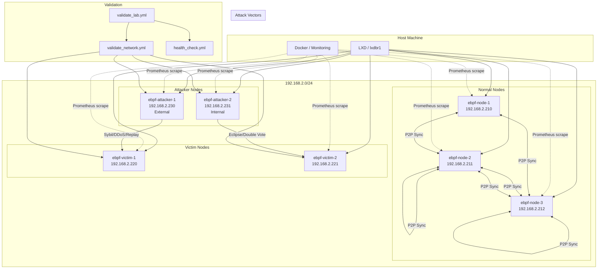

# Plan: Laboratorio Local con LXD Bridge y Validación de Red

## 1. Análisis Profundo del Proyecto

### 1.1 Estructura Actual del Proyecto

```
ebpf-blockchain/
├── ansible/
│   ├── inventory/
│   │   ├── hosts.yml              ← Inventario con todos los nodos
│   │   └── group_vars/all.yml     ← Variables globales
│   ├── playbooks/
│   │   ├── deploy_cluster.yml     ← Despliegue cluster LXC
│   │   ├── deploy.yml             ← Despliegue individual
│   │   ├── deploy_attacker.yml    ← Despliegue nodos atacante
│   │   ├── deploy_victim.yml      ← Despliegue nodos víctima
│   │   ├── health_check.yml       ← Health check básico
│   │   ├── setup_ebpf_nodes.yml   ← Configuración nodos
│   │   └── setup_dev_environment.yml ← Dev environment
│   └── roles/
│       ├── lxc_node/              ← Roles LXC
│       ├── dev_environment/       ← Dev env
│       ├── monitoring/            ← Monitoring stack
│       └── ...
├── services/
│   ├── start-local-nodes.sh       ← Nodos locales (127.0.0.1)
│   ├── stop-local-nodes.sh        ← Stop nodos
│   └── ebpf-blockchain-node*.service ← Systemd services
├── scripts/
│   ├── deploy.sh                  ← Deploy script bash
│   ├── configure-lxd-ports.sh     ← Config puertos LXD
│   └── ...
├── monitoring/                    ← Stack observabilidad
└── ebpf-node/                     ← Código Rust
```

### 1.2 Inconsistencias Detectadas

| # | Inconsistencia | Ubicación | Impacto |
|---|---------------|-----------|---------|
| 1 | **Red mixta IPv4/IPv6** | `hosts.yml`: nodos normales usan IPv4 (192.168.2.x), attacker/victim usan IPv6 (fd42:cb45:3f5b:661::/64) | Attacker y victim NO están en el mismo rango que los nodos normales |
| 2 | **Gateway inconsistente** | `deploy_cluster.yml` usa `192.168.2.1`, `all.yml` usa `192.168.2.200`, `hosts.yml` usa `fd42:cb45:3f5b:661::1` | Routing inconsistente entre nodos |
| 3 | **start-local-nodes.sh usa localhost** | `services/start-local-nodes.sh` usa `127.0.0.1` para P2P | Nodos locales no son accesibles desde LAN |
| 4 | **Puertos P2P diferentes** | `start-local-nodes.sh` usa puertos 5001/5002/5003, `all.yml` define `node_p2p_port: 50000` | Configuración desincronizada |
| 5 | **Attacker-1 no se despliega** | `deploy_cluster.yml` despliega solo Attacker-2, Attacker-1 falta | Faltan nodos de ataque en el laboratorio |
| 6 | **Subred attacker/victim no definida** | No hay bridge dedicado para attacker/victim | No hay garantía de conectividad entre attacker y victim |
| 7 | **Health check limitado** | `health_check.yml` solo verifica `lxc_nodes`, no attacker/victim | No hay validación de red entre attacker↔victim |
| 8 | **LXC profile hardcodea lxdbr1** | `profile.yaml.j2` usa `network: lxdbr1` | Correcto, pero attacker/victim podrían estar en otra red |

---

## 2. Arquitectura del Laboratorio Local

### 2.1 Diseño de Red Propuesto

```
┌─────────────────────────────────────────────────────────────────────┐
│                        HOST MACHINE                                  │
│                                                                      │
│  lxdbr1: 192.168.2.1/24 (Bridge Principal)                          │
│  ┌───────────────────────────────────────────────────────────────┐  │
│  │                    RED PRINCIPAL (192.168.2.0/24)              │  │
│  │                                                               │  │
│  │  ┌──────────┐  ┌──────────┐  ┌──────────┐                    │  │
│  │  │ Node-1   │  │ Node-2   │  │ Node-3   │                    │  │
│  │  │ .210     │  │ .211     │  │ .212     │                    │  │
│  │  └──────────┘  └──────────┘  └──────────┘                    │  │
│  │                                                               │  │
│  │  ┌──────────┐  ┌──────────┐  ┌──────────┐  ┌──────────┐     │  │
│  │  │ Victim-1 │  │ Victim-2 │  │ Attacker-1│  │Attacker-2│     │  │
│  │  │ .220     │  │ .221     │  │ .230     │  │ .231     │     │  │
│  │  └──────────┘  └──────────┘  └──────────┘  └──────────┘     │  │
│  │                                                               │  │
│  │  ┌──────────┐                                                │  │
│  │  │ Monitoring│ (localhost/Docker)                             │  │
│  │  │ .1       │                                                │  │
│  │  └──────────┘                                                │  │
│  └───────────────────────────────────────────────────────────────┘  │
│                                                                      │
│  Todos los nodos en el MISMO subnet 192.168.2.0/24                   │
│  Todos accesibles desde LAN via 192.168.2.x                          │
└─────────────────────────────────────────────────────────────────────┘
```

### 2.2 Asignación de IPs Unificada

| Nodo | Tipo | IP (192.168.2.0/24) | Puertos |
|------|------|---------------------|---------|
| ebpf-node-1 | Normal | 192.168.2.210 | RPC:8080, P2P:50000, Metrics:9090 |
| ebpf-node-2 | Normal | 192.168.2.211 | RPC:8080, P2P:50001, Metrics:9090 |
| ebpf-node-3 | Normal | 192.168.2.212 | RPC:8080, P2P:50002, Metrics:9090 |
| ebpf-victim-1 | Victim | 192.168.2.220 | RPC:8080, P2P:50003, Metrics:9090 |
| ebpf-victim-2 | Victim | 192.168.2.221 | RPC:8080, P2P:50004, Metrics:9090 |
| ebpf-attacker-1 | Attacker (Ext) | 192.168.2.230 | RPC:8080, P2P:50005, Metrics:9090 |
| ebpf-attacker-2 | Attacker (Int) | 192.168.2.231 | RPC:8080, P2P:50006, Metrics:9090 |
| lxdbr1 | Gateway | 192.168.2.1 | - |

---

## 3. Plan de Implementación

### Fase 1: Unificación de Red

#### 3.1 Actualizar `ansible/inventory/hosts.yml`

```yaml
---
all:
  vars:
    ansible_user: root
    ansible_connection: ssh
    ansible_ssh_common_args: '-o StrictHostKeyChecking=no -o UserKnownHostsFile=/dev/null'
    ansible_ssh_private_key_file: ~/.ssh/id_ed25519
    project_dir: /home/maxi/Documentos/source/ebpf-blockchain
    lxc_network: 192.168.2.0/24
    lxc_gateway: 192.168.2.1
    lxc_profile: ebpf-blockchain
    lxc_bridge: lxdbr1

  children:
    lxc_nodes:
      vars:
        node_type: ebpf
        ansible_port: 22
      hosts:
        ebpf-node-1:
          ansible_host: 192.168.2.210
          node_ip: 192.168.2.210
          node_name: ebpf-node-1
        ebpf-node-2:
          ansible_host: 192.168.2.211
          node_ip: 192.168.2.211
          node_name: ebpf-node-2
        ebpf-node-3:
          ansible_host: 192.168.2.212
          node_ip: 192.168.2.212
          node_name: ebpf-node-3

    victim_nodes:
      vars:
        node_type: victim
      hosts:
        ebpf-victim-1:
          ansible_host: 192.168.2.220
          node_ip: 192.168.2.220
          node_name: ebpf-victim-1
          targeted_by: ebpf-attacker-1
        ebpf-victim-2:
          ansible_host: 192.168.2.221
          node_ip: 192.168.2.221
          node_name: ebpf-victim-2
          targeted_by: ebpf-attacker-2

    attacker_nodes:
      vars:
        node_type: attacker
      hosts:
        ebpf-attacker-1:
          ansible_host: 192.168.2.230
          node_ip: 192.168.2.230
          node_name: ebpf-attacker-1
          attack_position: external
          attack_types:
            - sybil
            - ddos
            - replay
        ebpf-attacker-2:
          ansible_host: 192.168.2.231
          node_ip: 192.168.2.231
          node_name: ebpf-attacker-2
          attack_position: internal
          attack_types:
            - eclipse
            - double_vote
            - consensus_manipulation

    monitoring:
      vars:
        node_type: monitoring
        ansible_connection: local
      hosts:
        localhost:
          ansible_host: localhost
          prometheus_port: 9090
          grafana_port: 3000
          grafana_admin: admin
          grafana_password: admin

    dev_environment:
      vars:
        node_type: development
        ansible_connection: local
        dev_mode: true
        debug_enabled: true
      hosts:
        localhost:
          ansible_host: localhost
          dev_port_prometheus: 9090
          dev_port_grafana: 3000
          dev_port_loki: 3100
          dev_port_tempo: 3200
```

#### 3.2 Actualizar `ansible/inventory/group_vars/all.yml`

```yaml
---
# Network configuration - UNIFIED
network:
  subnet: 192.168.2.0/24
  gateway: 192.168.2.1
  nameservers:
    - 8.8.8.8
    - 8.8.4.4

# IP Assignment ranges
ip_ranges:
  nodes_start: 210
  nodes_end: 212
  victims_start: 220
  victims_end: 221
  attackers_start: 230
  attackers_end: 231

# Node defaults
node_defaults:
  user: root
  home: /root
  rust_version: nightly
  p2p_port_start: 50000
  rpc_port: 8080
  metrics_port: 9090
```

### Fase 2: Actualizar Playbooks de Despliegue

#### 3.1 Actualizar `ansible/playbooks/deploy_cluster.yml`

Cambios principales:
- Unificar todos los nodos en IPv4 (192.168.2.0/24)
- Agregar despliegue de Attacker-1
- Usar IPs dinámicas basadas en rangos
- Configurar netplan unificado para todos los nodos

#### 3.2 Actualizar `ansible/playbooks/deploy_attacker.yml`

Cambios principales:
- Cambiar de IPv6 a IPv4
- Agregar soporte para Attacker-1
- Unificar configuración de red

#### 3.3 Actualizar `ansible/playbooks/deploy_victim.yml`

Cambios principales:
- Cambiar de IPv6 a IPv4
- Unificar configuración de red

### Fase 3: Actualizar `start-local-nodes.sh` para Bridge

Crear nueva versión de `services/start-local-nodes.sh`:

```bash
#!/bin/bash
# =============================================================================
# Start Local eBPF Blockchain Nodes via LXD Bridge
# =============================================================================
# Usage: ./services/start-local-nodes.sh
# =============================================================================

set -e

PROJECT_DIR="/home/maxi/Documentos/source/ebpf-blockchain"
LXC_BRIDGE="lxdbr1"
SUBNET="192.168.2"
LOG_DIR="$PROJECT_DIR/logs"

# Node configuration
declare -A NODES
NODES=(
  ["ebpf-node-1"]="192.168.2.210:50000:8080:9090"
  ["ebpf-node-2"]="192.168.2.211:50001:8080:9090"
  ["ebpf-node-3"]="192.168.2.212:50002:8080:9090"
  ["ebpf-victim-1"]="192.168.2.220:50003:8080:9090"
  ["ebpf-victim-2"]="192.168.2.221:50004:8080:9090"
  ["ebpf-attacker-1"]="192.168.2.230:50005:8080:9090"
  ["ebpf-attacker-2"]="192.168.2.231:50006:8080:9090"
)

# Colors
RED='\033[0;31m'
GREEN='\033[0;32m'
YELLOW='\033[1;33m'
NC='\033[0m'

echo -e "${GREEN}============================================${NC}"
echo -e "${GREEN}  eBPF Blockchain - LXD Bridge Lab${NC}"
echo -e "${GREEN}============================================${NC}"

# Verify LXD bridge exists
if ! lxc network show "$LXC_BRIDGE" >/dev/null 2>&1; then
    echo -e "${RED}ERROR: LXD bridge $LXC_BRIDGE not found${NC}"
    echo "Run: ansible-playbook ansible/playbooks/deploy_cluster.yml"
    exit 1
fi

# Verify binary exists
BINARY="$PROJECT_DIR/ebpf-node/target/release/ebpf-node"
if [ ! -f "$BINARY" ]; then
    echo -e "${RED}ERROR: Binary not found at $BINARY${NC}"
    echo "Run: cd ebpf-node && cargo build --release"
    exit 1
fi

echo -e "${YELLOW}Starting nodes on $LXC_BRIDGE ($SUBNET.0/24)...${NC}"
echo ""

# Start each node via LXC exec
for NODE_NAME in "${!NODES[@]}"; do
    IFS=':' read -r NODE_IP P2P_PORT RPC_PORT METRICS_PORT <<< "${NODES[$NODE_NAME]}"
    
    echo -e "${GREEN}Starting $NODE_NAME ($NODE_IP)...${NC}"
    echo "  P2P: $P2P_PORT, RPC: $RPC_PORT, Metrics: $METRICS_PORT"
    
    # Create log directory
    mkdir -p "$LOG_DIR/$NODE_NAME"
    
    # Start node in LXC container
    lxc exec "$NODE_NAME" -- bash -c "
      cd /root/ebpf-blockchain/ebpf-node &&
      source /root/.cargo/env &&
      nohup ./target/release/ebpf-node \
        --iface eth0 \
        --listen-addresses '/ip4/0.0.0.0/tcp/$P2P_PORT' \
        --rpc-port $RPC_PORT \
        --metrics-port $METRICS_PORT \
        > /tmp/${NODE_NAME}.log 2>&1 &
      echo \$! > /tmp/${NODE_NAME}.pid
    " &
done

wait

echo ""
echo -e "${GREEN}============================================${NC}"
echo -e "${GREEN}  All nodes started on LXD Bridge!${NC}"
echo -e "${GREEN}============================================${NC}"
echo ""
echo -e "Access nodes via LAN at $SUBNET.x:"
echo ""
printf "  %-20s %-15s %-12s %-12s\n" "NODE" "IP" "RPC" "METRICS"
printf "  %-20s %-15s %-12s %-12s\n" "----" "--" "---" "-------"
for NODE_NAME in "${!NODES[@]}"; do
    IFS=':' read -r NODE_IP P2P_PORT RPC_PORT METRICS_PORT <<< "${NODES[$NODE_NAME]}"
    printf "  %-20s %-15s %-12s %-12s\n" "$NODE_NAME" "$NODE_IP" ":$RPC_PORT" ":$METRICS_PORT"
done
echo ""
echo -e "${YELLOW}To stop nodes: ./services/stop-local-nodes.sh${NC}"
echo -e "${YELLOW}To view logs: tail -f $LOG_DIR/ebpf-node-1/stdout.log${NC}"
```

### Fase 4: Playbook de Validación de Red

Crear nuevo playbook `ansible/playbooks/validate_network.yml`:

```yaml
---
# =============================================================================
# Network Validation Playbook
# Verifica condiciones de red entre attacker y victim nodes
# Escanea logs, verifica conectividad, detecta problemas
# Uso: ansible-playbook validate_network.yml -i inventory/hosts.yml
# =============================================================================

- name: Network Validation - Attacker/Victim Connectivity
  hosts: attacker_nodes:victim_nodes
  become: yes
  gather_facts: yes
  any_errors_fatal: false

  vars:
    ebpf_log_dir: "/var/log/ebpf-blockchain"
    ebpf_service: "ebpf-blockchain"
    validation_timestamp: "{{ lookup('pipe', 'date +%Y%m%d_%H%M%S') }}"
    validation_report: "/tmp/network_validation_{{ validation_timestamp }}.json"

  tasks:
    # ---- Phase 1: Network Configuration Verification ----
    - name: Phase 1: Verify network configuration
      block:
        - name: Check IP address on eth0
          shell: ip -4 addr show eth0 | grep -oP 'inet \K[\d.]+'
          register: node_ip
          changed_when: false

        - name: Check subnet mask
          shell: ip -4 addr show eth0 | grep -oP 'inet [\d.]+/\K\d+'
          register: node_subnet
          changed_when: false

        - name: Check default gateway
          shell: ip -4 route show default | awk '{print $3}'
          register: node_gateway
          changed_when: false

        - name: Verify all nodes are in same subnet
          assert:
            that:
              - "node_ip.stdout is defined"
              - "node_subnet.stdout == '24'"
            fail_msg: "Node {{ inventory_hostname }} is not in 192.168.2.0/24 subnet"

      rescue:
        - name: Log network configuration error
          copy:
            content: "{{ validation_timestamp }} NETWORK CONFIG ERROR on {{ inventory_hostname }}\n"
            dest: "{{ ebpf_log_dir }}/validation_error.log"
            mode: "0644"

    # ---- Phase 2: Inter-Node Connectivity ----
    - name: Phase 2: Verify connectivity between attacker and victim
      block:
        - name: Ping all victim nodes from attacker
          shell: >
            ping -c 2 -W 3 {{ item }}
          loop: "{{ groups['victim_nodes'] | map('extract', hostvars) | map(attribute='node_ip') | list }}"
          register: victim_ping
          changed_when: false
          ignore_errors: true

        - name: Ping all normal nodes from attacker
          shell: >
            ping -c 2 -W 3 {{ item }}
          loop: "{{ groups['lxc_nodes'] | map('extract', hostvars) | map(attribute='node_ip') | list }}"
          register: normal_ping
          changed_when: false
          ignore_errors: true

        - name: Check connectivity results
          assert:
            that:
              - "victim_ping.results | map(attribute='rc') | list | count(0) >= 1"
            fail_msg: "Attacker {{ inventory_hostname }} cannot reach any victim node"
          ignore_errors: true

        - name: Report connectivity status
          debug:
            msg: >
              {{ inventory_hostname }} connectivity:
              Victims reachable: {{ victim_ping.results | map(attribute='rc') | list | count(0) }}/{{ groups['victim_nodes'] | length }}
              Normal nodes reachable: {{ normal_ping.results | map(attribute='rc') | list | count(0) }}/{{ groups['lxc_nodes'] | length }}

      rescue:
        - name: Log connectivity error
          copy:
            content: "{{ validation_timestamp }} CONNECTIVITY ERROR on {{ inventory_hostname }}\n"
            dest: "{{ ebpf_log_dir }}/validation_error.log"
            mode: "0644"

    # ---- Phase 3: Port Accessibility ----
    - name: Phase 3: Verify port accessibility
      block:
        - name: Check RPC port is listening
          wait_for:
            port: "{{ node_rpc_port | default(8080) }}"
            timeout: 5
          register: rpc_port_check
          changed_when: false
          ignore_errors: true

        - name: Check metrics port is listening
          wait_for:
            port: "{{ node_metrics_port | default(9090) }}"
            timeout: 5
          register: metrics_port_check
          changed_when: false
          ignore_errors: true

        - name: Check P2P port is listening
          wait_for:
            port: "{{ node_p2p_port | default(50000) }}"
            timeout: 5
          register: p2p_port_check
          changed_when: false
          ignore_errors: true

        - name: Report port status
          debug:
            msg: >
              Ports on {{ inventory_hostname }}:
              RPC: {{ 'OPEN' if not rpc_port_check.failed else 'CLOSED' }}
              Metrics: {{ 'OPEN' if not metrics_port_check.failed else 'CLOSED' }}
              P2P: {{ 'OPEN' if not p2p_port_check.failed else 'CLOSED' }}

      rescue:
        - name: Log port error
          copy:
            content: "{{ validation_timestamp }} PORT ERROR on {{ inventory_hostname }}\n"
            dest: "{{ ebpf_log_dir }}/validation_error.log"
            mode: "0644"

    # ---- Phase 4: Log Analysis ----
    - name: Phase 4: Scan logs for errors
      block:
        - name: Check eBPF node logs for errors
          shell: |
            journalctl -u ebpf-blockchain --since "1 hour ago" --no-pager 2>/dev/null | \
              grep -i "error\|panic\|fatal\|failed" | tail -10 || echo "No errors found"
          register: journal_errors
          changed_when: false
          ignore_errors: true

        - name: Check application log file for errors
          shell: |
            cat {{ ebpf_log_dir }}/ebpf-node.log 2>/dev/null | \
              grep -i "error\|panic\|fatal\|failed" | tail -10 || echo "No log file or no errors"
          register: app_errors
          changed_when: false
          ignore_errors: true

        - name: Check for network-related errors
          shell: |
            journalctl -u ebpf-blockchain --since "1 hour ago" --no-pager 2>/dev/null | \
              grep -i "connect\|disconnect\|peer\|handshake\|timeout" | tail -10 || echo "No network errors"
          register: network_errors
          changed_when: false
          ignore_errors: true

        - name: Report log analysis
          debug:
            msg: |
              Log Analysis for {{ inventory_hostname }}:
              Journal Errors: {{ journal_errors.stdout | default('None') }}
              App Errors: {{ app_errors.stdout | default('None') }}
              Network Errors: {{ network_errors.stdout | default('None') }}

      rescue:
        - name: Log analysis error
          debug:
            msg: "Could not analyze logs for {{ inventory_hostname }}"

    # ---- Phase 5: Service Health ----
    - name: Phase 5: Verify service health
      block:
        - name: Check service status
          systemd:
            name: "{{ ebpf_service }}"
          register: service_status

        - name: Verify service is active
          assert:
            that:
              - "service_status.status.ActiveState == 'active'"
            fail_msg: "Service {{ ebpf_service }} is not active on {{ inventory_hostname }}"
          ignore_errors: true

        - name: Check service uptime
          shell: systemctl status {{ ebpf_service }} | grep "Active" | head -1
          register: uptime_status
          changed_when: false

        - name: Report service status
          debug:
            msg: |
              Service Status for {{ inventory_hostname }}:
              Active: {{ service_status.status.ActiveState | default('unknown') }}
              Uptime: {{ uptime_status.stdout | default('unknown') }}

      rescue:
        - name: Log service error
          copy:
            content: "{{ validation_timestamp }} SERVICE ERROR on {{ inventory_hostname }}\n"
            dest: "{{ ebpf_log_dir }}/validation_error.log"
            mode: "0644"

    # ---- Phase 6: Generate Validation Report ----
    - name: Phase 6: Generate validation report
      block:
        - name: Collect validation data
          set_fact:
            validation_data:
              hostname: "{{ inventory_hostname }}"
              ip: "{{ node_ip.stdout | default('unknown') }}"
              subnet: "{{ node_subnet.stdout | default('unknown') }}"
              gateway: "{{ node_gateway.stdout | default('unknown') }}"
              service_active: "{{ service_status.status.ActiveState | default('unknown') }}"
              rpc_port_open: "{{ not rpc_port_check.failed | default(true) }}"
              metrics_port_open: "{{ not metrics_port_check.failed | default(true) }}"
              p2p_port_open: "{{ not p2p_port_check.failed | default(true) }}"
              timestamp: "{{ validation_timestamp }}"

        - name: Save validation data to fact cache
          set_fact:
            _validation_collected: true

  post_tasks:
    - name: Create validation summary directory
      file:
        path: "{{ ebpf_log_dir }}/validations"
        state: directory
        mode: "0755"

    - name: Save validation report
      copy:
        content: |
          Network Validation Report
          =========================
          Timestamp: {{ validation_timestamp }}
          Hostname: {{ inventory_hostname }}
          IP: {{ node_ip.stdout | default('unknown') }}
          Subnet: {{ node_subnet.stdout | default('unknown') }}/24
          Gateway: {{ node_gateway.stdout | default('unknown') }}
          Service: {{ service_status.status.ActiveState | default('unknown') }}
          RPC Port: {{ 'OPEN' if not rpc_port_check.failed else 'CLOSED' }}
          Metrics Port: {{ 'OPEN' if not metrics_port_check.failed else 'CLOSED' }}
          P2P Port: {{ 'OPEN' if not p2p_port_check.failed else 'CLOSED' }}
          Journal Errors: {{ journal_errors.stdout | default('None') }}
          App Errors: {{ app_errors.stdout | default('None') }}
          Network Errors: {{ network_errors.stdout | default('None') }}
        dest: "{{ ebpf_log_dir }}/validations/{{ inventory_hostname }}_{{ validation_timestamp }}.txt"
        mode: "0644"
      ignore_errors: true
```

### Fase 5: Playbook de Validación Global

Crear `ansible/playbooks/validate_lab.yml`:

```yaml
---
# =============================================================================
# Laboratory Validation Playbook
# Ejecuta validación completa del laboratorio
# Uso: ansible-playbook validate_lab.yml -i inventory/hosts.yml
# =============================================================================

- name: Pre-flight Checks
  hosts: localhost
  connection: local
  gather_facts: yes

  tasks:
    - name: Check LXD is installed
      command: lxc info
      register: lxc_check
      failed_when: false
      changed_when: false

    - name: Verify LXD is available
      assert:
        that:
          - "lxc_check.rc == 0"
        fail_msg: "LXD is not installed or not available"

    - name: Check lxdbr1 network exists
      shell: lxc network show lxdbr1
      register: bridge_check
      failed_when: false
      changed_when: false

    - name: Verify lxdbr1 bridge
      assert:
        that:
          - "bridge_check.rc == 0"
        fail_msg: "lxdbr1 bridge does not exist"

    - name: List all containers
      shell: lxc list
      register: container_list
      changed_when: false

    - name: Display container status
      debug:
        msg: "{{ container_list.stdout }}"

- name: Validate All Nodes
  hosts: lxc_nodes:attacker_nodes:victim_nodes
  become: yes
  gather_facts: yes
  any_errors_fatal: false

  tasks:
    - name: Verify node is reachable
      ping:

    - name: Check IP configuration
      shell: ip -4 addr show eth0 | grep 'inet '
      register: ip_config
      changed_when: false

    - name: Verify IP is in correct subnet
      assert:
        that:
          - "'192.168.2.' in ip_config.stdout"
        fail_msg: "{{ inventory_hostname }} is not in 192.168.2.0/24 subnet"

    - name: Check service status
      systemd:
        name: ebpf-blockchain
      register: service_status

    - name: Report node status
      debug:
        msg: |
          Node: {{ inventory_hostname }}
          IP: {{ ip_config.stdout | default('unknown') }}
          Service: {{ service_status.status.ActiveState | default('unknown') }}

- name: Run Network Connectivity Tests
  hosts: attacker_nodes
  become: yes
  gather_facts: yes

  tasks:
    - name: Test connectivity to all victims
      shell: >
        ping -c 1 -W 2 {{ item }}
      loop: "{{ groups['victim_nodes'] | map('extract', hostvars) | map(attribute='node_ip') | list }}"
      register: ping_results
      changed_when: false
      ignore_errors: true

    - name: Report connectivity
      debug:
        msg: >
          {{ inventory_hostname }} -> Victims:
          {{ ping_results.results | map(attribute='stdout') | list }}

- name: Generate Lab Report
  hosts: localhost
  connection: local
  gather_facts: yes

  tasks:
    - name: Generate summary report
      copy:
        content: |
          eBPF Blockchain Lab Validation Report
          ======================================
          Generated: {{ lookup('pipe', 'date') }}
          
          Network: lxdbr1 (192.168.2.0/24)
          Gateway: 192.168.2.1
          
          Nodes:
          {{ hostvars | json_query('*.node_ip') | default('N/A') }}
          
          Status: COMPLETE
        dest: "/tmp/lab_validation_{{ lookup('pipe', 'date +%Y%m%d_%H%M%S') }}.txt"
        mode: "0644"
```

### Fase 6: Actualizar `ansible/playbooks/health_check.yml`

Extender health check para incluir attacker y victim nodes:

```yaml
# Agregar al final del playbook existente:

- name: Health Check - Attacker Nodes
  hosts: attacker_nodes
  become: yes
  gather_facts: yes
  any_errors_fatal: false
  # [Mismas checks que health_check.yml para lxc_nodes]

- name: Health Check - Victim Nodes
  hosts: victim_nodes
  become: yes
  gather_facts: yes
  any_errors_fatal: false
  # [Mismas checks que health_check.yml para lxc_nodes]
```

---

## 4. Diagrama de Flujo del Laboratorio



---

## 5. Resumen de Cambios Requeridos

| Archivo | Cambio | Prioridad |
|---------|--------|-----------|
| `ansible/inventory/hosts.yml` | Unificar todas las IPs a IPv4 192.168.2.x | Alta |
| `ansible/inventory/group_vars/all.yml` | Actualizar subnet, gateway, rangos IP | Alta |
| `ansible/playbooks/deploy_cluster.yml` | Unificar IPv4, agregar Attacker-1 | Alta |
| `ansible/playbooks/deploy_attacker.yml` | Cambiar IPv6 a IPv4 | Alta |
| `ansible/playbooks/deploy_victim.yml` | Cambiar IPv6 a IPv4 | Alta |
| `ansible/playbooks/validate_network.yml` | **Nuevo** - Validación de red attacker↔victim | Alta |
| `ansible/playbooks/validate_lab.yml` | **Nuevo** - Validación completa del laboratorio | Media |
| `ansible/playbooks/health_check.yml` | Extender a attacker/victim nodes | Media |
| `services/start-local-nodes.sh` | Actualizar para usar LXD bridge | Alta |
| `ansible/roles/lxc_node/tasks/main.yml` | Actualizar gateway por defecto | Baja |

---

## 6. Comandos de Uso

```bash
# 1. Desplegar cluster completo
ansible-playbook ansible/playbooks/deploy_cluster.yml -i ansible/inventory/hosts.yml

# 2. Validar red attacker↔victim
ansible-playbook ansible/playbooks/validate_network.yml -i ansible/inventory/hosts.yml

# 3. Validar laboratorio completo
ansible-playbook ansible/playbooks/validate_lab.yml -i ansible/inventory/hosts.yml

# 4. Health check general
ansible-playbook ansible/playbooks/health_check.yml -i ansible/inventory/hosts.yml

# 5. Iniciar nodos locales
./services/start-local-nodes.sh
```

---

## 7. Próximos Pasos

1. **Esperar salida de comandos LXD** del usuario para verificar estado actual
2. **Implementar Fase 1**: Unificación de red en inventario
3. **Implementar Fase 2**: Actualizar playbooks de despliegue
4. **Implementar Fase 3**: Actualizar start-local-nodes.sh
5. **Implementar Fase 4**: Crear playbook de validación de red
6. **Implementar Fase 5**: Crear playbook de validación global
7. **Implementar Fase 6**: Extender health check
8. **Probar**: Ejecutar validaciones y verificar que todo funciona
